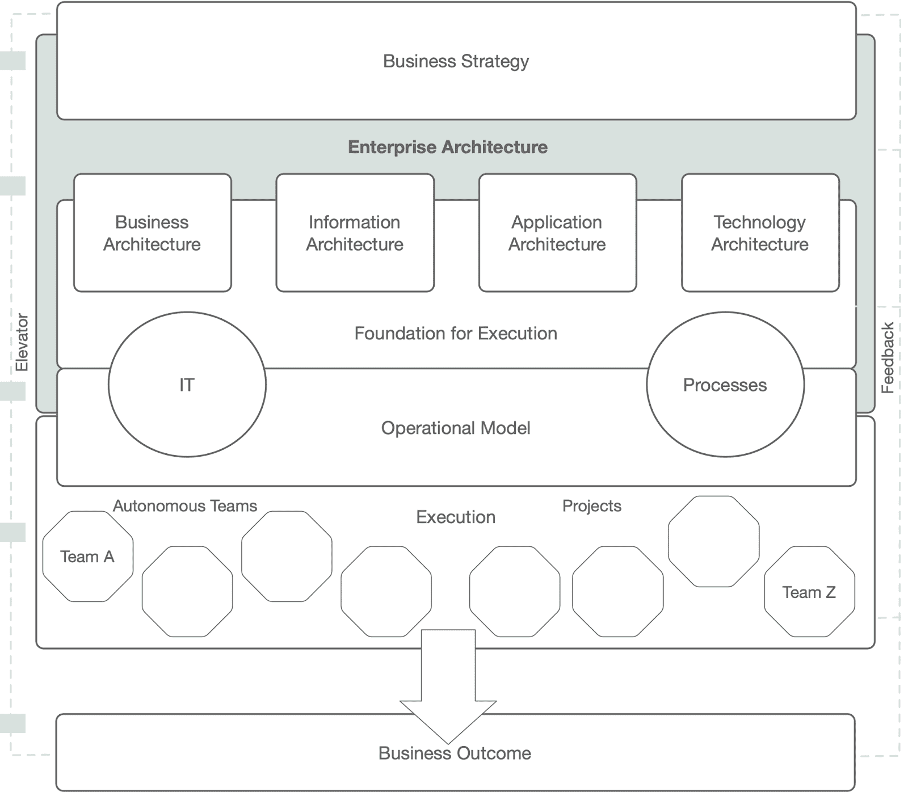
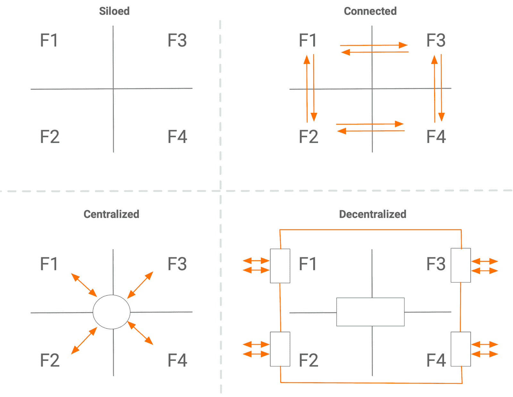
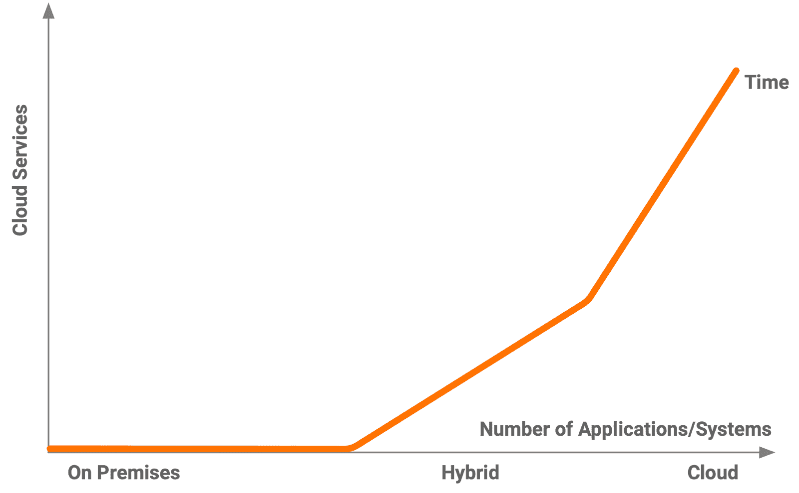

# EiPaaS 在企业架构中的作用:第 1 部分

> 原文：<https://thenewstack.io/the-role-of-eipaas-in-enterprise-architecture-part-1/>

 [阿桑卡·阿贝辛格

阿桑卡在目前的职位上，是 WSO2 技术愿景的传播者。他经常在许多全球性活动和旧金山湾区的许多技术会议上发言。](https://wso2.com/) 

*企业架构每天都在发展，组织不断关注数字化转型计划和新技术，如云和微服务。因此，集成正在成为企业架构中越来越重要的一部分。*

在这个由两部分组成的系列文章中，我们将探讨企业集成平台即服务(EiPaaS)如何帮助组织构建面向未来的企业架构。在本文中，我们将讨论业务、信息、应用程序和技术领域，以及一个示例企业架构的四个发展阶段。让我们开始吧。

## 企业架构:架构师的观点

当讨论企业架构时，脑海中会浮现出一幅 IT 前景图，因为这是定义架构的标准方法。然而，在我们与世界范围内的许多企业架构团队合作的过程中，我们发现企业架构具有比典型的 IT 图表所捕获的更大的战略范围。

从根本上说，企业架构通过创建执行各种 IT 计划和流程的基础，将业务战略转化为价值生成的结果。它是关于获得组织的长期观点，包括业务中涉及的各种元素的**整合**和**标准化**。

企业架构

企业架构涉及四个架构领域:业务、信息、应用和技术。

 [拉克马尔·瓦鲁萨威塔纳

Lakmal Warusawithana 是 WSO2 开发者关系高级主管。Lakmal 在开源、云和 DevOps 技术领域有着悠久的工作历史。他出席了许多活动，包括 ApacheCon、CloudOpen、QCon 和 JaxLondon。](https://wso2.com/) 

*   **业务架构**是将战略转化为可执行单元的第一步，我们称之为“项目”以前，业务分析师推动这项工作；然而，随着时间的推移，业务架构师已经认识到这一点。业务架构着眼于内部组织目标、消费者需求、合作伙伴和生态系统行为，同时构建业务蓝图。业务蓝图包括战略、成果、计划、目标和关键成果(okr)以及价值流生成。最重要的是，业务架构为技术团队制定决策提供了“为什么”因素。
*   **信息架构**定义了组织中信息的交换、存储和处理。一些架构师称之为数据架构，但是数据架构是信息架构的子集。数据架构定义新的数据集或标识数据源，以从记录系统(s or)层获取数据，并满足业务服务的数据需求。一旦基本特征得到满足，信息架构就可以扩展到各种高级数据科学技术，如机器学习(ML)和人工智能(AI)。
*   **应用架构**使用各种渠道将业务能力转移给最终用户(内部和外部)，例如桌面、web 和移动应用以及物联网(IoT)兼容接入点。应用程序架构将包括应用程序(无论是由组织构建、购买还是租赁)、应用程序接口(API)、服务(宏/迷你/微)和软件开发工具包(SDK)。组织定义的各种策略和业务逻辑控制着应用程序的行为和使用。
*   **技术架构**定义了促进业务、信息和应用程序架构需求所需的硬件、系统软件和中间件。技术架构着眼于通过采用面向服务(SOA)、事件驱动(EDA)和微服务架构(MSA)模式来实现现有 IT 环境的现代化。它还着眼于横切关注点，如安全性、自动化和可观察性。除了企业架构师，各种技术和非技术团队定义技术架构；它们包括基础设施工程、数据库管理(DBA)、中间件工程和采购。

企业架构的角色正在从一个集中的治理框架转变为一个价值流生成器——它连接业务和 it。这种转变不会在一夜之间发生—组织采取不同的途径来实现它，但我们将其概括为四个阶段。我们将在下一节中研究这种演变。

## 企业架构的四个阶段

> “进化发生在跳跃中，非常迅速”
> 
> 玛丽莲·弗格森

下图显示了一个示例企业架构作为一个拓扑的演变，其中一个组织有四个功能单元或业务线(F1..F4)。每个职能部门使用许多系统和子系统，并订购日常运营所需的云服务(即软件即服务[SaaS])。

企业架构的演变

在初始阶段，企业架构将定义每个组织的功能所需的系统和子系统。它从购买核心系统开始，如基于组织业务领域的人力资源管理(HRM)、客户关系管理(CRM)和/或企业资源规划(ERP)。此外，子系统将由内部或外包开发团队围绕核心系统构建。属于每个功能的系统和子系统独立运行，信息交换有限或没有信息交换。任何信息交换都将手动进行或在系统边界之外进行。电子表格是这种数据交换方法的一个很好的例子。因此，我们将这一阶段称为*孤岛*。

第二阶段(即连接)是关于标准化技术使用和跨功能连接系统和子系统。由于个人职能和最高管理层的需求，组织发展到这一阶段。然而，在这个阶段建立的连接是点对点的。基于文件和数据库的同步技术，如提取、转换、加载(ETL)和主数据管理(MDM)是点对点集成中常用的方法。然而，标准化集中在本地业务线(lob)之间；因此，跨功能访问和安全性是这种方法的一个挑战，导致功能之间的连接性最低。

企业架构的下一阶段转移到卓越中心(COE)运营模型。第三阶段主要关注优化内核。这种方法主要侧重于克服连接阶段产生的挑战，并增加跨职能整合(这就是为什么我们称之为**集中化**阶段)。使用集成中心或企业服务总线(ESB)来实现集成。特征包括为组织建立和管理集成逻辑的集中集成团队。此外，通过利用改进的连接性，可以产生集中的安全性、治理、门户和仪表板。在内部和外部使用 API 重用业务功能(随着集成的进步而引入)成为这一级企业架构的重点领域。

企业架构的第四个阶段是内部组织变化和外部市场前景的结果，主要是分散的架构风格(微服务和云原生)和敏捷流程。每个职能部门或 LoB 都在寻找自主权，招募自己的技术团队，并拥有他们制造或购买的系统和子系统的整个生命周期(计划、构建、测试、运行、管理)。企业架构利用运行在内部和外部云基础设施上的平台来实现这一点。多租户和分段是用于为每个 LoB 提供平台功能的一些技术。因此，集成逻辑和实现责任也转移到了每个 LoB。

然而，第四阶段的平台方法包含了技术和模式的集中治理、安全性、监控和标准化。在这样的环境下使用平台很重要；否则，业务线将开始构建该职能专用的[影子 IT](https://en.wikipedia.org/wiki/Shadow_IT) 应用程序，而 IT 团队将失去对这些应用程序的控制。分散化和自治允许每个 LoB 公开 API，这些 API 覆盖了扩展的业务功能。因此，组织开始通过促进内部和外部应用程序开发人员构建应用程序并为最终用户提供数字体验来提供更多价值。

无论组织是设计一个还是简单地观察他们现有的，企业架构通常都遵循这些发展阶段。

与企业架构的四步发展并行的是，每个 LoB 中使用的应用程序类型、使用的应用程序数量以及支持集成和其他开发需求的平台都有变化。

申请和时间表

趋势是通过订阅软件即服务(SaaS)和平台即服务(PaaS)产品向云转移。通常，这一过程分为三步:内部、混合和云。

总体而言，三个趋势——云服务采用的快速增长、企业文化日益敏捷和分散的本质以及业务问题日益复杂——推动了对基于云的解决方案和企业架构内集成的需求。

## 关键要点

*   **企业架构**通过创建执行各种 IT 计划和流程的基础，将业务战略转化为价值流生成成果。
*   **集成(和 API)**是企业架构中的一个关键特性，它与运营变化和技术进步同步发展(云系统和云应用越来越多地被采用)。

在下一篇文章中，我们将研究企业 iPaaS 参考架构，并重点介绍一些关键组件。我们还将了解混合企业 iPaaS 架构，展示为什么应该考虑将服务网格用于面向未来的实施，并强调利用 EiPaaS 的企业架构的优势。

<svg xmlns:xlink="http://www.w3.org/1999/xlink" viewBox="0 0 68 31" version="1.1"><title>Group</title> <desc>Created with Sketch.</desc></svg>