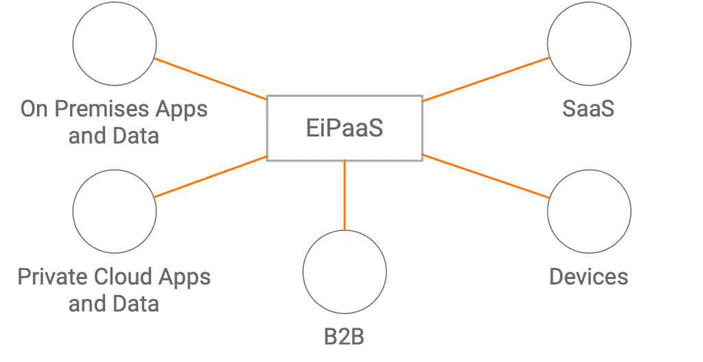
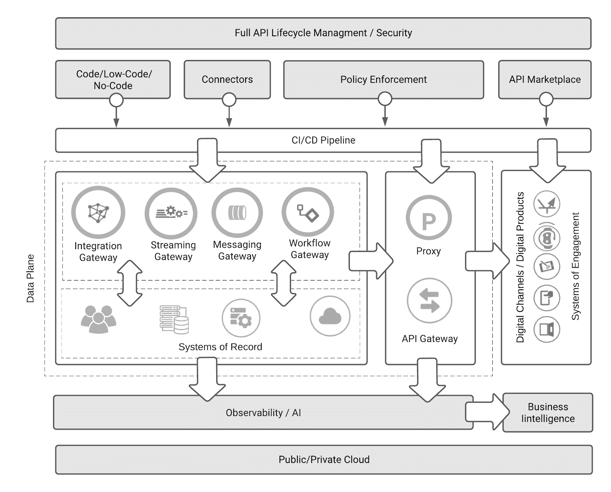
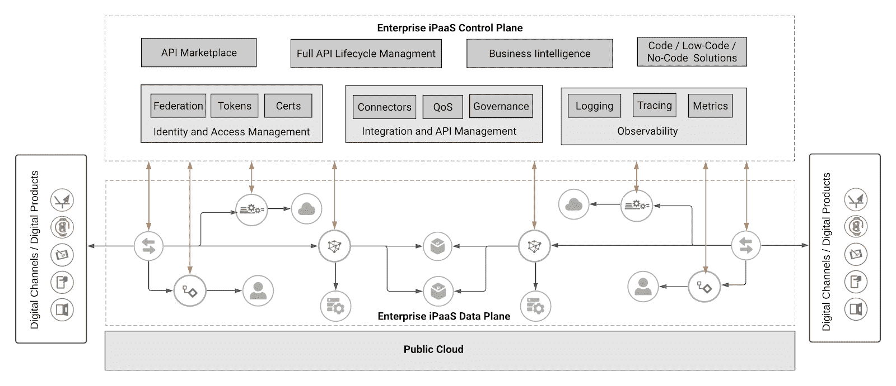
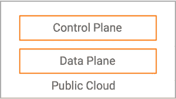
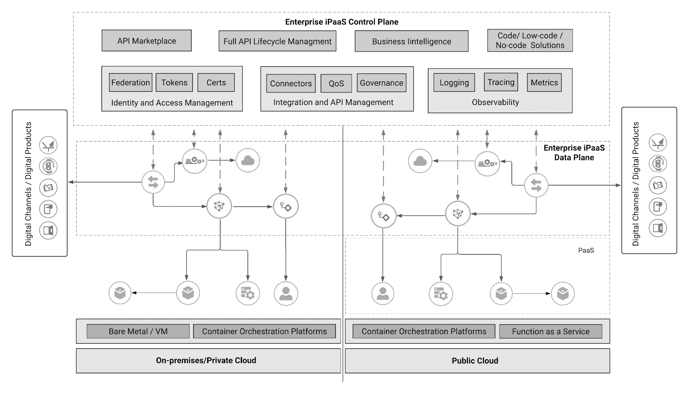
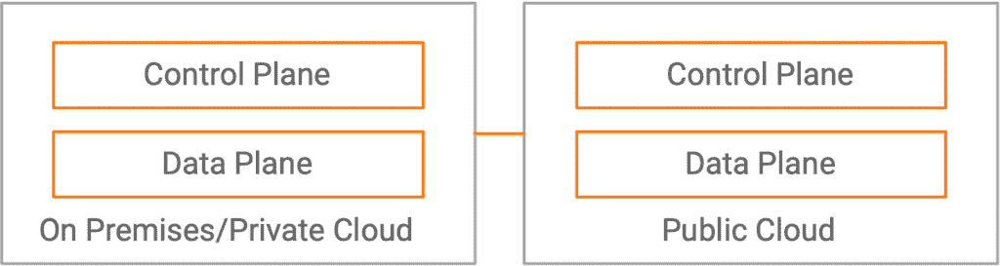
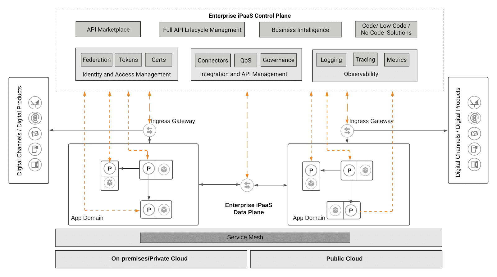
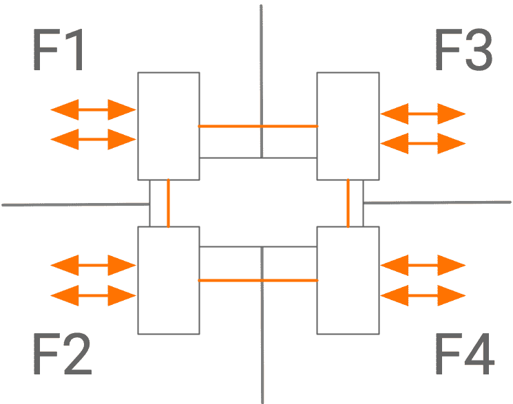

# EiPaaS 在企业架构中的作用:第 2 部分

> 原文：<https://thenewstack.io/the-role-of-eipaas-in-enterprise-architecture-part-2/>

[Asanka Abeysinghe](https://wso2.com/)

[Asanka 目前担任首席技术传播者，负责引领 WSO2 的思想领导前景。](https://wso2.com/)

*了解现代数字驱动组织的神经系统*

在本文的第 1 部分中，我们介绍了四个架构领域以及一个示例企业架构的发展。在第 2 部分中，我们将研究企业集成平台即服务(EiPaaS)参考架构，并重点介绍其关键组件。

我们还将了解混合企业 iPaaS 架构，展示为什么应该考虑将服务网格用于面向未来的实施，并强调利用 EiPaaS 的企业架构的优势。

## 企业集成平台即服务(企业 iPaaS)

 [拉克马尔·瓦鲁萨威塔纳

Lakmal Warusawithana 是 WSO2 开发者关系高级主管。Lakmal 在开源、云和 DevOps 技术领域有着悠久的工作历史。](https://wso2.com/) 

以云为中心的集成技术和 [API 管理功能](https://thenewstack.io/6-api-marketplace-strategies-to-enable-multiparty-business-models/)的结合提供了一个重要的平台，即企业 iPaaS，通过自动化和服务实现敏捷性、灵活性和可扩展性，从而提高生产力。技术领导，包括域所有者和集成相关的利益相关者，越来越多地采用企业 iPaaS 作为完整的平台即服务，为 API 集成场景提供全面的单一商店解决方案。各种各样的协议连接、应用和数据连接器、集成工作流的构建、路由/编排、策略实施、社区管理和内置的持续集成/持续交付(CI/CD)管道是企业 iPaaS 附带的一些关键功能。

企业 iPaaS 参考架构

企业 iPaaS 架构由控制平面和数据平面组成。

*   ***控制平面*** 由几个用户门户组成，专注于完整的 API 生命周期管理、代码、无代码、低代码驱动的集成、商业智能报告、用于社区参与的 API 市场、身份和访问管理(IAM)、质量保证、治理和可观察性。控制平面可用于定义策略、配置和集成逻辑。
*   ***数据平面*** 是使用 API 网关、集成网关、流网关、工作流网关、消息网关和代理来实施策略、配置和集成逻辑的地方。数据平面组件还捕获指标、日志和跟踪数据，以观察整个系统的行为，并生成各种业务洞察报告，这对于业务决策至关重要。

***完整的 API 生命周期管理*** 是数字化转型之旅的重要组成部分，因为 API 对任何组织来说都是一项战略投资，在技术支持者和业务驱动者两方面都扮演着重要角色。API 生命周期管理帮助 API 创建者开发、记录、扩展和版本化 API，同时还促进相关任务，如发布、货币化和推广 API。

一个相关的概念，API marketplace2，是通过允许多方在一个地方列出和提供他们的 API 来构建 API 生态系统的关键。通常，我们称这种模式为企业对企业对消费者(B2B2C)。定义良好的 API 市场策略有助于组织变得更有竞争力和更敏捷，允许公司随着 API 经济的发展而领先。

***当通过 API 公开业务功能时，安全性*** 是最重要的。在 API 经济中，定义安全策略、管理令牌以及通过在数据平面中强制实施来保护 API 的能力是至关重要的。API 服务质量(QoS)和速率限制有助于 API 产品的产品化和货币化。

获得关于 API 如何工作的有意义的商业见解在每个企业中都是至关重要的。 ***内置的 API 可观察性工具和人工智能驱动的决策引擎*** 在提供重要的商业智能洞察方面发挥着重要作用。

***低代码集成*** 在大多数项目中，通过点击-拖放界面来消除编码。简单、模板驱动的集成涵盖了更广泛的集成用例以及现成的连接器(例如，Salesforce、NetSuite、Slack、Magento、Workday、Shopify 等)。).这些只需要几分钟就可以启动并运行。大多数提供程序允许用户添加代码来修改单个组件或模板。

***无代码集成*** 提供现成的、千篇一律的模板，用于通过拖放组件进行应用集成。如果组织拥有与所提供的寺庙相匹配的标准集成模式，那么无代码集成方法将会加快上市时间。然而，与代码和低代码平台不同，它们提供的高级功能和灵活性较低。低代码和无代码产品最大限度地缩小了许多用户和集成所需技能之间的技术差距——它们还提高了生产率，从而缩短了上市时间。

***CI/CD*** 对于利用客户反馈加速创新至关重要，使每天甚至每小时交付改进的产品或服务成为可能。CI/CD 管道通常由一个或多个步骤组成，在这些步骤中，源代码被转换成一个构建，该构建在一个或多个环境中被测试和部署，直到它最终到达生产中的最终用户。

大多数企业 iPaaS 供应商提供全面的以云为中心的解决方案，其中控制平面和数据平面组件都在云中运行。当组织选择将其所有应用程序和数据驻留在一个企业 iPaaS 提供商处时，他们可以提高工作效率。

## **混合企业 iPaaS 架构**

随着组织试图在快速变化的数字经济中保持相关性，他们不能忘记他们的遗留系统，这些系统将继续发挥关键作用。同时，法规和数据隐私规则通常禁止将数据移出组织、国家或地区边界。遵守这些法规、本地范围内的集成和策略实施可能需要实施混合企业 iPaaS 架构，作为克服限制的临时解决方案。

混合企业 iPaaS 架构

在混合企业 iPaaS 中，通过分离紧密的云连接，数据平面组件可以脱离公共云(内部/私有云)运行。云外数据平面组件可以与控制平面中定义的配置、集成、证书和策略同步，并在数据平面中实施它们。数据平面通过与控制平面同步来定期捕获数据，以生成必要的洞察。

私有云数据平面组件可以在虚拟机或裸机上运行。然而，为了更好的自动化和动态可伸缩性，它们需要运行在容器编排平台之上，比如 Kubernetes。此外，如果要从这些平台中获得最大收益，这些数据平台组件必须与云原生技术保持一致。

## **企业 iPaaS 服务网状架构**

将一个复杂的问题分解成一组更小的问题，将使它更容易解决，更快地开发、测试、部署和扩展——更不用说，更容易更新。这组较小的问题可以作为云原生应用程序来实现。每个微服务都可以由一个较小的团队创建和部署，可以自由选择合适的技术。所有这些好处通常都需要付费。

当将一个整体分解成微服务时，有必要将分布式计算的[谬误](https://en.wikipedia.org/wiki/Fallacies_of_distributed_computing)作为其应用逻辑的一部分。然而，这并不容易，可能会耗尽我们希望微服务架构带来的所有好处。服务网格可以通过在每个微服务附近部署边车代理来解决这些问题。侧车有助于创建受控的网络网格，以处理复杂的操作需求，如发现、负载平衡、故障恢复、指标、监控、A/B 测试、速率限制、访问控制和端到端认证。

我们观察到服务网格驱动的企业架构正在迅速出现。我们相信服务网格将在网络弹性和服务到服务管理中发挥重要作用。虽然未来的应用程序 PaaS 正在向服务网格发展，但企业 iPaaS 也应该发展为本地支持服务网格。

下图显示了企业 iPaaS 如何与服务网格架构协同工作。

企业 iPaaS 服务网状架构

服务网格主要控制东西向流量。通过截取通过侧车代理的所有流量，服务网格可以满足上面讨论的复杂操作需求。当我们向合作伙伴、消费者或企业公开这些服务(大部分是作为 API)时，南北流量流动。这种流量应该通过 API 管理系统来管理。服务网格入口网关是与控制平面同步工作的桥梁，用于实施所有必要的 API 管理策略。如果我们想要管理应用到应用的流量，最好通过入口网关控制流量，即使它是东西向流量。当将服务网格与企业 iPaaS 集成时，有必要使用特殊的入口网关。除了通用入口网关功能之外，这些网关还能够管理 API 网关功能。

## **利用 EiPaaS 的企业架构的优势**

企业 iPaaS 提供全面的 API 管理和集成功能，以处理内部和云中应用的连接和集成。一旦企业架构发展到第四阶段，组织就可以从这种方法所带来的扩展的自主性、增强的连接性、实施策略和治理中受益。

此外，利用 EiPaaS 进行内部和外部集成的企业架构可以认识到几个重要的好处。从技术角度来看，这些能力包括:

*   **连接内部和外部系统、子系统和数据:**利用集成和 API 的力量使这变得高效、有效和适应性强。
*   **优化云服务的整合:**在云端运行消除了与云生态系统连接的障碍。
*   **利用云功能:**因为 EiPasS 是为云设计的，所以它带来了内置的可伸缩性、安全性、弹性、可观察性和自动化特性，这些特性会被内置的集成流程自动继承。
*   **创建一个具有以 API 为中心的分散架构的可组合企业:**当 API 连接各个组件时，分散增加了灵活性并促进了持续开发。

同时，采用 EiPaaS 支持组织的敏捷性、创新和协作，因为它可以:

*   **促进敏捷和自治的团队，并通过删除层来提高他们的生产力:**通过使用多租户或分段来为各个单元提供自治，并使每个单元能够拥有他们所构建的产品的整个生命周期。
*   **无缝加入新的团队和项目:**环境的调配和管理由客户管理员轻松完成。
*   **通过降低复杂性，在整个组织中创建一个无摩擦的流程:**EiPaaS 封装了传统集成解决方案背后的复杂性；开发团队可以专注于构建业务问题的解决方案。
*   **支持远程工作人员:**这是现代组织需求的额外优势。从任何地方都可以安全地访问云服务；因此，远程工作人员可以从中获得最大利益。

## **关闭**思绪

企业架构与组织运营方式的变化和技术的进步同步发展——它是技术领域的核心，是业务和技术之间的纽带，也是创造价值流的驱动力。然而，为了实现这些目标，企业架构需要一个面向未来的集成平台，这就是 EiPaaS 成为数字化驱动组织的神经系统的原因。

<svg xmlns:xlink="http://www.w3.org/1999/xlink" viewBox="0 0 68 31" version="1.1"><title>Group</title> <desc>Created with Sketch.</desc></svg>