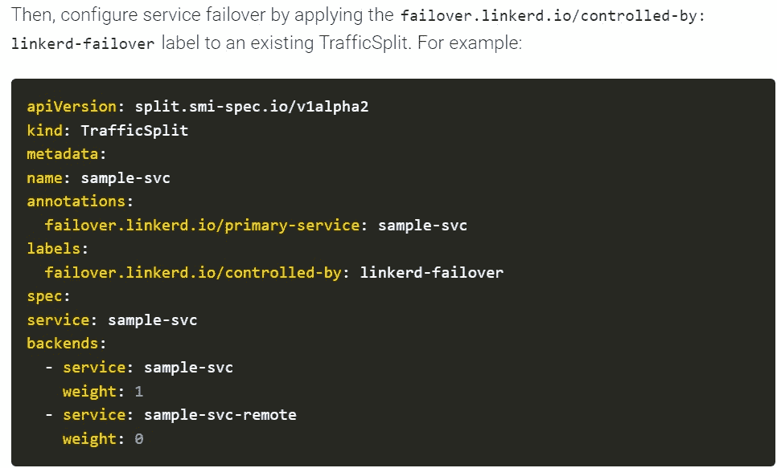
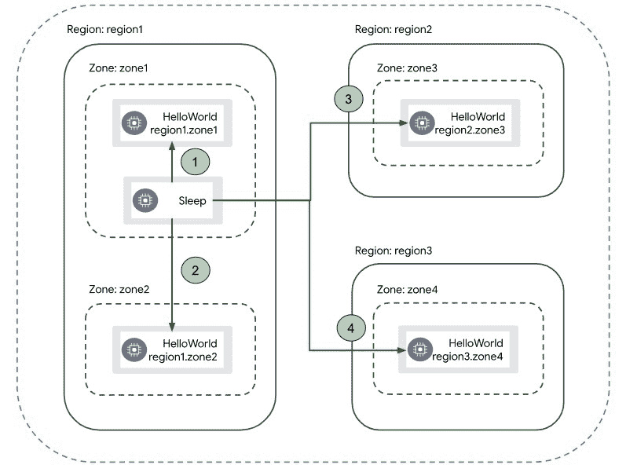
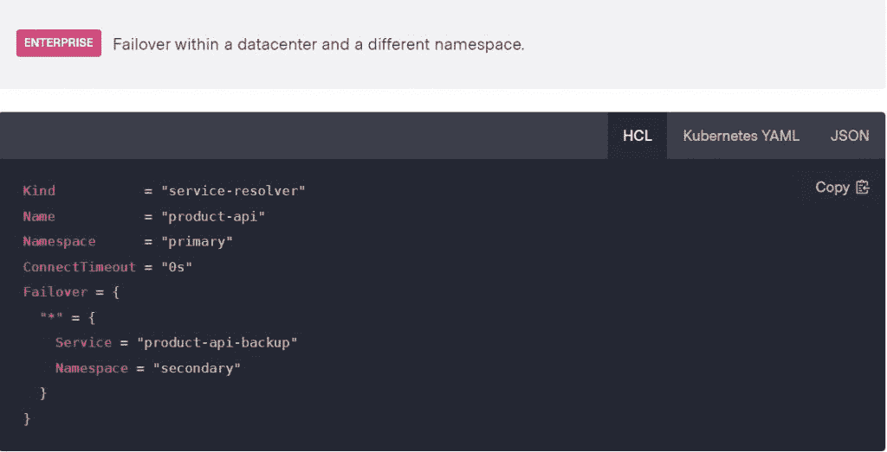

# 急于解决 Kubernetes 故障转移问题

> 原文：<https://thenewstack.io/the-rush-to-fix-the-kubernetes-failover-problem/>

Kubernetes 上的服务和集群肯定会失败，不幸的 SRE 或运营人员经常会在半夜接到电话，要求手动修复。虽然 Kubernetes 确实提供了故障转移机制，但它并不是以这样一种方式自动化的，即在发生集群或服务故障时，服务会立即转移到副本集群配置，在那里它们恢复功能。

高级软件开发人员 Alejandro Pedraza 在[的博客文章](https://linkerd.io/2022/03/09/announcing-automated-multi-cluster-failover-for-kubernetes/)中写道， [Linkerd](https://linkerd.io/) 的新自动故障转移功能使 Linkerd 能够自动将所有流量从失败或不可访问的服务重定向到该服务的一个或多个副本——包括其他集群上的副本。Pedraza 说:“正如你所料，任何重定向的流量都保持了 Linkerd 对应用程序的安全性、可靠性和透明性的所有保证，即使是跨越由开放互联网分隔的集群边界。

其他领先的服务网格提供商也为 Kubernetes 的故障转移缺点提供了类似的解决方案，Istio 和 HashiCorp 也提供了类似的解决方案(下文将详细介绍)。

## 如释重负的叹息

对于 Linkerd 用户来说，这个故障功能应该会让在 Kubernetes 环境中工作的操作团队松一口气。这是因为它避免了运营团队“不得不在半夜匆忙修复 Kubernetes 集群，只是通过自动重新路由应用流量，而不需要任何代码更改或重新配置，”[企业管理协会(EMA)](https://www.enterprisemanagement.com/) 的分析师 [Torsten Volk](https://www.linkedin.com/in/torstenvolk/) 告诉新堆栈。

Linkerd 的联合创始人[威廉·摩根](https://www.linkedin.com/in/wmorgan/)(他也是[buppy](https://thenewstack.io/buoyant-cloud-beta-brings-simplified-linkerd/)的首席执行官)告诉新的堆栈，借助 Linkerd 新的自动化故障转移功能，集群运营商可以以完全自动化且对应用程序透明的方式在服务级别配置故障转移。这意味着，如果一个组件发生故障，该组件的所有流量都将自动路由到一个副本，“而应用程序并不知道，”摩根说。

“如果该副本在不同地区的不同集群中，甚至在不同的云中，Linkerd 的 mutual TLS 实施意味着即使它现在穿越开放的互联网，流量也保持完全安全，”Morgan 说。“这是 Linkerd 用户长期以来一直要求的，我们很高兴今天向他们提供这一服务。”

在 Istio 的案例中，Istio 已经“在一段时间内”支持 Kubernetes 的自动化故障转移，Solo.io 的全球现场首席技术官副总裁 Christian Posta 告诉新的堆栈，并补充说“我们通过 Solo.io Gloo Mesh 自动化了所有的配置”。

“这很大程度上源于特使拥有的[位置和优先级感知负载平衡](https://istio.io/latest/docs/tasks/traffic-management/locality-load-balancing)，”Posta 说。

带 Istio 的局部性故障转移序列。

[HashiCorp](https://www.hashicorp.com/?utm_content=inline-mention) 一段时间以来也实现了故障转移功能的自动化，这在其[文档](https://www.consul.io/docs/connect/config-entries/service-resolver)中有所描述。

Volk 说，推动 Kubernetes 的故障转移功能自动化支持了策略驱动的应用放置的最初概念。通过这种方式，“DevOps 团队不再需要根据应用程序需求准确定义特定的应用程序环境，相反，开发人员可以在应用程序代码中声明应用程序需求，然后服务网格进行匹配，”Volk 说。

## 简单的概念

主要问题是 Kubernetes 在出现故障时不提供自动故障转移功能。Volk 说，当 Kubernetes 上的服务和集群失败时。“DevOps 团队通常必须对应用程序代码进行更改，以特定于底层云基础设施的方式更改流量路由，”Volk 说。“这意味着，你需要编写不同的代码，以便在 [AWS](https://aws.amazon.com/?utm_content=inline-mention) 、Azure、谷歌云或其他特定平台上的集群之间路由工作负载。”

事实上，故障转移的概念很简单，摩根说。“如果一个组件发生故障，将所有发往该组件的流量发送到其他地方的副本，通常是在另一个群集中。对于希望使用故障转移来提高其应用程序的弹性的 DevOps 团队来说，最大的挑战之一就是 Kubernetes 本身没有提供任何自动化，”Morgan 说。“因此，您可以跨地区和区域部署应用程序组件的副本，但它们之间的故障切换则由您决定。更糟糕的是，如果您希望能够对单个服务进行故障转移，应用程序需要知道如何在出现故障时将流量发送到不同的副本。这将应用程序问题与平台问题混为一谈，并导致维护问题。”

摩根说，Linkerd 中的新故障转移功能建立在现有 Kubernetes 和 Linkerd 功能的基础上，如健康探测和 SMI 流量分割，并引入了最少的新机器和配置表面积。“这是同样的设计原则，它使 Linkerd 成为操作最简单的服务网络，并大幅领先，”Morgan 说。“这是我们对用户承诺的一部分:Kubernetes 足够复杂；你的服务网不一定是。”

<svg xmlns:xlink="http://www.w3.org/1999/xlink" viewBox="0 0 68 31" version="1.1"><title>Group</title> <desc>Created with Sketch.</desc></svg>