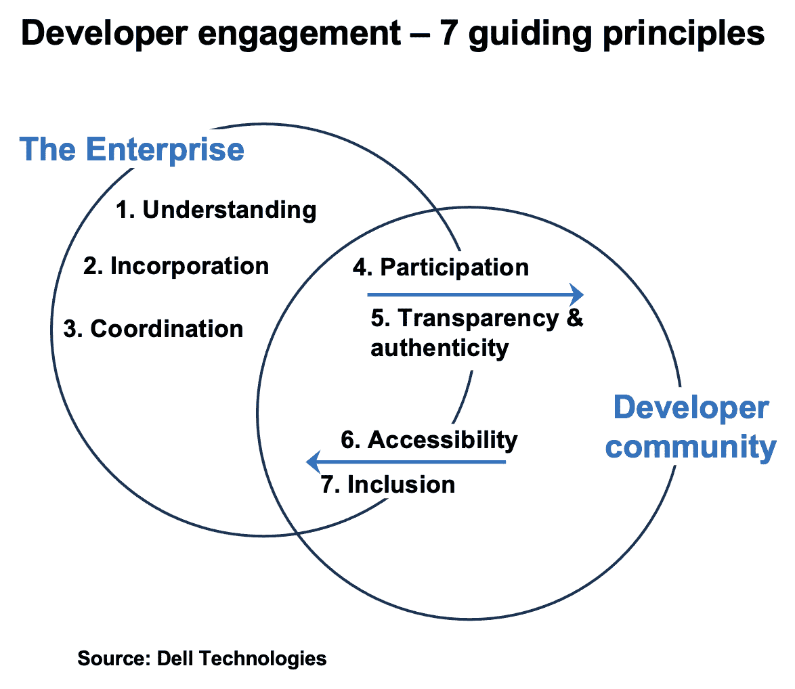

# 开发人员参与的 7 项指导原则

> 原文：<https://thenewstack.io/the-seven-guiding-principles-for-developer-engagement/>

 [巴顿乔治

巴顿领导创建了戴尔技术公司的首个协调开发人员计划。他从事过各种专注于开源和开发者的工作。他还是 Sputnik 项目的创始人，该项目是一系列基于 Ubuntu 的开发人员笔记本电脑和工作站。](https://www.linkedin.com/in/barton808/) 

2013 年，斯蒂芬·奥格雷迪[出版了](https://www.oreilly.com/library/view/the-new-kingmakers/9781449368036/)他的论文《新的拥王者，开发者如何征服世界》O'Grady 解释了使开发人员从依赖者发展成为“当今商业中最重要、最有价值的支持者，不管是哪个行业”的力量和条件。在本书的“最后的想法”中，读者得到的警告是，未来 10 年将取得成功的企业将是那些不仅意识到开发人员的重要性，而且拥有吸引和吸引开发人员的具体战略的企业。

自从 O'Grady 的书出版以来，随着 IT 领域的发展，开发人员的影响力不断增加。

## **应用开发者的崛起:从规避到现代 IT**

在我们开始开发人员参与的七个指导原则之前，让我们快速回顾一下从 21 世纪初到现在开发人员的崛起。

它始于公共云的出现和开源的流行。通过秘密地利用这些资源和规避操作，开发人员明显变得更有生产力和创新性；反过来，生产力的提高导致了对云和开源的认可。鉴于开发人员在将云和开源引入企业的过程中所扮演的核心角色，开发人员现在发现他们自己在购买和供应商决策中被咨询。随着这些新批准的资源的使用增加，开发者的影响力也增加了。

随着云的出现，一个新的应用开发者群体开始出现。这些新的“云原生”开发人员是那些专门为云环境设计和构建应用程序的人。他们构建的这些应用程序成为现代 IT 环境的关键组成部分之一，进一步提高了开发人员的影响力。此外，在这种新环境中，尽管应用程序开发人员和运营人员作为一个集成的产品团队一起工作，但领导团队的是开发人员，支持他们是运营人员的责任。

## 那么你会怎么做呢？

八年前，奥格雷迪在《新的拥王者》一书中提出警告:如果一个企业想要成功，仅仅承认开发者的重要性是不够的。企业需要建立和执行吸引和吸引开发人员的策略。

正如我们在上面看到的，开发者影响力的增长在 2013 年并没有停滞，而是继续增长，这使得吸引和吸引开发者变得比以前更加重要。

接下来的问题是，吸引和吸引这一强大群体的战略是什么样的？接下来是一组七个原则，它们将作为一个指南针，通过吸引和吸引开发人员以及建立一个广泛的开发人员战略来指导一个组织。

【T2

## **开发人员参与的七项指导原则**

1.  **了解**:对于很多员工来说，开发者和开源软件是陌生的概念。为了奠定广泛策略的基础，您必须向团队成员提供开发人员世界的介绍性概述，并解释它如何影响他们和他们的角色。该材料应包括应用程序开发人员、基础设施开发人员和开源社区在当今现代 IT 环境中所扮演的规范、责任和核心角色的高级概述。
2.  **合并**:开发人员的需求需要被整合到你公司的总体业务流程中。此外，这些需求需要包含在单个团队的工作中，例如从事产品开发、营销策略、销售材料、目标产品等工作的团队。
3.  协调:为了获得和保持开发者的信任，让他们看到你的组织的努力是协调的而不是矛盾的是很重要的。为了确保这一点，您需要建立一个中央开发人员支持团队，该团队除了处理与开发人员社区的关系之外，还充当内部顾问并协调您的企业与开发人员相关的工作。
4.  **参与**:开发者参与不是一项观赏性运动。所有员工都应该以某种方式参与到开发者社区中来。除了贡献代码之外，社区参与可以采取多种形式，从文档和治理模型，到推广项目，参加行业会议或聚会，以及通过论坛或 Twitter 参与对话。
5.  **透明和真实**:当与开发者社区交流时，必须是一个公开的对话，以坦率和透明为特征。与社区成员的对话应该比与传统客户的对话更加亲密和直接。当交流更广泛的新闻时，不要大张旗鼓地宣布，否则会被人怀疑，要采取敏捷的方法:尽早开始对话，并在有细节时补充。记住，真实性胜过预算，透明度建立信任。
6.  可访问性:在推荐任何软件技术之前，开发人员都想先了解一下代码。他们希望能够在白天或晚上的任何时候无障碍地访问这些代码。要求他们首先填写在线表格或联系销售代表肯定会失去他们。除了代码之外，这适用于开发人员的所有材料，例如 API、SDK、思想领导资产、论文和入门指南。
7.  **包容**:群体意见是帮助设定产品、项目和战略方向的关键。虽然几乎所有公司都从现有或潜在客户那里征求意见，但来自社区的意见应通过社交媒体公开征求，而不是通过保密协议涵盖的秘密谈话。包含社区意见有助于您交付更好的产品，在社区中建立信任和意识，并提供一种主人翁感。

## **将原则付诸实践**

上述原则简单明了，可以写在一张纸上。不过，毫不奇怪，让它们在您的组织中被接受和采用需要时间。开发者信任也是如此。

当你前进时，记住:从小处着手，从现在开始，并坚持下去！

*要了解有关 DevOps 和其他云原生技术的更多信息，请考虑参加 5 月 4 日至 7 日举行的[kube con+CloudNativeCon Europe 2021–Virtual](https://events.linuxfoundation.org/kubecon-cloudnativecon-europe/)。*

<svg xmlns:xlink="http://www.w3.org/1999/xlink" viewBox="0 0 68 31" version="1.1"><title>Group</title> <desc>Created with Sketch.</desc></svg>