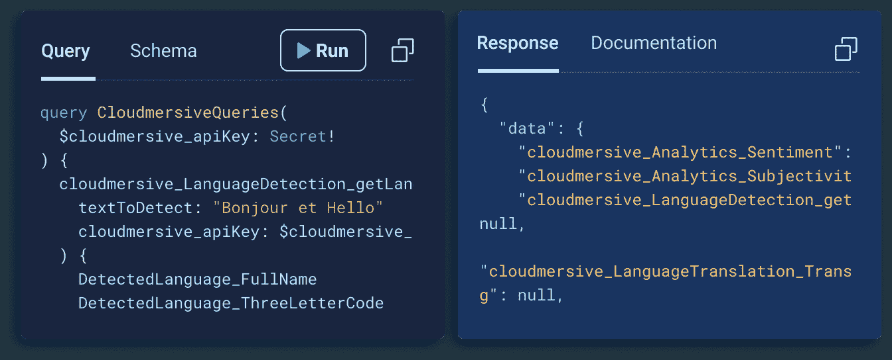

# 未来事物的形状:GraphQL 和 API 网络

> 原文：<https://thenewstack.io/the-shape-of-things-to-come-graphql-and-the-web-of-apis/>

API 管理行业正在经历另一场变革，GraphQL 越来越被视为一个新兴的行业标准——不仅适用于传统的 Web 2.0 业务，如 Shopify，也适用于新的 Web3 协议，如 Graph。虽然 REST(表述性状态转移)仍然是目前提供 API 的主要格式，但一些业内人士认为 GraphQL 在未来几年将会迅速普及。

一家通过帮助开发人员采用 GraphQL 来驾驭这股浪潮的创业公司是 [StepZen](https://stepzen.com/?utm_content=inline-mention) 。其创始人兼首席执行官 Anant Jhingran 在 API 成为 Web 2.0 生态系统的关键部分方面发挥了重要作用——他曾是 Apigee 的正式首席技术官，API gee 是一家 API 管理公司，于 2016 年被谷歌收购。为了找出 API 自他的巅峰时代(REST 的光辉岁月)以来是如何发展的，以及为什么他现在全身心投入 GraphQL，我通过 Zoom 采访了 Jhingran。

## 2010 年代原料药的发展

我一开始问 API 管理行业自 2010 年代初以来是如何发展的，当时 Apigee 正在管理 REST APIs。Jhingran 回答说，从 2010 年左右开始，API 开始更多地在第三方系统之间使用。“可能是企业内部的第三方，”他说，“也可能是企业外部和后端服务中的第三方。”REST 成为了这类第三方接口的标准。但是，他补充说，像 Apigee 这样的公司仍然需要向企业解释 API 是什么以及它可以实现什么。

但是到了 2015 年左右，API 变得非常流行 REST 的简单性是一个很大的原因。

关于 REST 的使用，Jhingran 解释说:“你只需要做一个 curl 调用，就能得到 JSON 响应。“所以这只是:我打电话，我得到回应。[他们]可以用他们想要的任何方式解析响应。所以这实际上是后端服务人员和前端之间的一个非常非常简单的合同，这就是它变得非常受欢迎的原因。”

然而，尽管消费 API 对企业来说变得越来越容易，但在 2015 年*创建*API 并不一定简单。

“仅仅因为前端团队[…]或应用程序开发人员很容易使用它，并不意味着某人很容易实际构建一个特定的 API，”Jhingran 说。“当时的后端团队必须解决这样的问题:有哪些安全问题？他们实际上给了对方什么样的结构？他们如何围绕它提供文档，等等。”

根据 Jhingran 的说法，企业中的后端团队花了 15 年时间才“适应部署安全、可伸缩的可消费 API”。但是，当他们最终在 2010 年代中期达到休息的舒适水平时，API 的“形状”(正如 Jhingran 所说)开始发生变化。输入 GraphQL。

## API 不断变化的形状

GraphQL 在 2015 年 9 月由脸书发布后，立即吸引了前端开发人员。它允许开发者精确地定义他们想要的数据，按照 Jhingran 的说法，这种方式“更加直观”。然而，他说，后端开发者又开始追赶了。

“但基本问题仍然存在，”他说，关于 GraphQL 后端团队的挑战。“有什么技巧？您实际上如何保护它呢？如何连接到后端？您如何确保不会泄露一些不应该泄露的数据？在网络规模上你是怎么做到的？有了这个新的 jam stack[架构]？”

Jhingran 说，他不希望后端开发人员再花 15 年时间熟悉 GraphQL。这就是他创办 StepZen 的原因，他说 step Zen 旨在通过为后端开发人员提供一个构建和部署 GraphQL APIs 的平台来“加速这一拐点”。

StepZen 上的 GraphQL。

## GraphQL 的拐点

然而，GraphQL 的拐点还有很长的路要走。虽然有一些大公司使用 GraphQL，如 Shopify，但 REST 仍然是许多其他公司使用最多的 API 格式，包括著名的基于 API 的上市公司 Stripe 和 Twilio。我问 Jhingran，随着时间的推移，他是否认为这些类型的公司会转向 GraphQL？

他首先指出，他没有看到 GraphQL 篡夺 REST。

“我们通常会发现，企业构建的 REST 层中嵌入了业务逻辑。一般来说，GraphQL 将是一个组合层——而不是包含深层业务逻辑。因此，两者实际上将共存。”

然而，Jhingran 确实认为越来越多的公司将开始使用 GraphQL 进行外部服务，这一趋势将分阶段发生。

他说，“后端团队对团队构建的*应用程序的 GraphQL 越来越适应了，”这意味着内部开发的应用程序。后端开发人员将需要更多时间来适应使用第三方公司的 graph QL API，尽管 Jhingran 指出 GitHub 和 Shopify 的 graph QL API 是早期的例子。*

## 知人善任

去年五月[我与约翰·穆瑟](https://thenewstack.io/the-state-of-apis-in-2021/)交谈，他是长期 API 目录 [ProgrammableWeb](https://www.programmableweb.com/) 的创始人，现在是福特自动驾驶汽车部门的数据和分析总监。他指出，“在过去五年左右的时间里，真正发生的是其他合适的非 REST APIs 的激增”，其中包括 GraphQL，但也有其他选项，如 gRPC、WebSocket 和 webhooks。

于是我问 jhin gran 不适合什么 GraphQL *？*

“GraphQL 不适合我所说的长时间运行的流程，”他回答道。例如，大量分析性工作负载不适合 GraphQL。他解释说，在这种工作负载下，“后端系统只是在缓慢运行，你在等待数据返回。而 GraphQL 通常被设计为大约一秒或两秒或三秒，以便从多个子系统获得一些响应。”

## API 网络

最后，我们讨论了 API 的未来。考虑到现在可供 API 开发者选择的选项越来越多，这个行业在未来几年将会如何继续发展？

Jhingran 认为，正如网络的前 30 年是关于网页和应用程序的互联，在未来几年“一个 API 的网络将变得互联。”他的灵感来自于谷歌为网页所做的事情。

“谷歌搜索在后台做了很多复杂的事情，”他说，并以 PageRank 为例。"他们让搜索栏变得极具消费性."

同样，他想让开发人员更容易使用 GraphQL 为后端和前端开发人员隐藏复杂性。

这与当今软件领域中大多数“无服务器”公司的理念相似——例如，Vercel 旨在为开发人员抽象出复杂性。但是，这也是中间件公司为企业提供 API 管理平台的趋势的延续——就像 Apigee 和 MuleSoft 从 web APIs 的第一个时代开始。

2022 年 API 的关键区别在于，现在有几种可行的 REST 替代方案，其中 GraphQL 是最有前途的。

<svg xmlns:xlink="http://www.w3.org/1999/xlink" viewBox="0 0 68 31" version="1.1"><title>Group</title> <desc>Created with Sketch.</desc></svg>