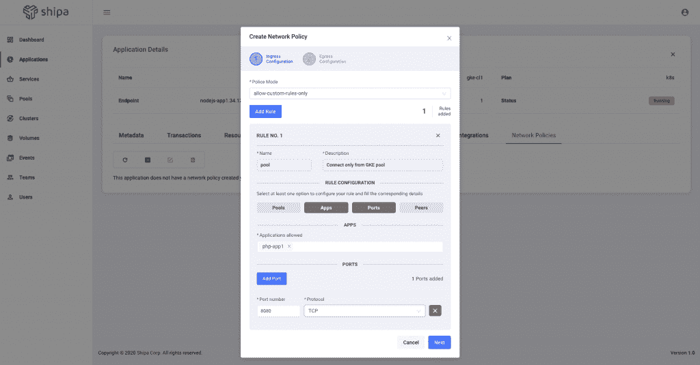

# Shipa 应用程序框架为开发人员打包了 Kubernetes

> 原文：<https://thenewstack.io/the-shipa-application-framework-packages-kubernetes-for-developers/>

解决复杂的问题通常涉及到一定程度的复杂性，Kubernetes 也不例外。为了处理这种复杂性，近年来出现了一些托管的 Kubernetes 服务，如谷歌 Kubernetes 引擎(GKE)、Azure Kubernetes 服务(AKS)和亚马逊弹性 Kubernetes 服务(EKS)等，以抽象出一些复杂性。

尽管如此，这些服务的中心焦点仍然是 Kubernetes 本身，现在一种新的抽象已经开始出现，它比这些托管的 Kubernetes 产品更进一步，将焦点带回应用程序本身。最近推出的一家公司 [Shipa](https://www.shipa.io/) 提供了一个云原生应用管理框架，旨在以应用为中心的方式管理整个应用生命周期。

根据 Shipa 创始人兼首席执行官 [Bruno Andrade](https://twitter.com/bandradeto) 的说法，他们看到的问题来自两个方向，首先是开发人员，然后是平台工程团队。

对于部署 Kubernetes 应用程序的开发人员来说，“他们必须了解什么是有状态集，如何设置入口控制器，他们必须了解 Istio 和 YAML 是如何工作的。它增加了很多复杂性，因为 Kubernetes 最终将开发人员拖到了基础设施层，”Andrade 说。“栅栏的另一边是平台工程团队，他们试图将 Kubernetes 抽象化，为他们的开发人员提供一种更好的自动化方式来部署他们的应用程序。为此，组织正在疯狂地扩充平台工程团队。他们花了大量时间来构建一堆自定义脚本、自动化舵图的方法，而集群中的对象数量简直快疯了。”

Shipa 解决这个问题的方法是为平台工程团队提供一种定义框架的方法，开发人员可以在这个框架内部署他们的应用程序，而不必担心 Kubernetes 的配置文件。工程团队定义了应用程序级的需求和基础设施级的组件，比如存储、跟踪、日志记录，甚至是 Kubernetes 的风格，让开发人员再次关注应用程序而不是 Kubernetes。

“您看到的所有解决方案都非常注重从集群的角度解决问题，而不是应用程序。因此，我们开始以不同的方式看待它，我们考虑在这些多个 Kubernetes 集群的基础上创建一个应用管理框架，”Andrade 说。“你的开发者可能不太关心它是库伯内特、GKE、EKS，还是 1.15、1.17。他们不需要关心和了解这些，因为现在他们不需要创建一个单独的 Kubernetes 对象文件。他们只需部署他们的应用，CI 运行其流程，并将应用直接交付给平台工程团队创建的框架。”

在那里，框架负责实施策略、修补资源、为应用程序创建所有对象，以及在集群上部署应用程序。Shipa 本身，像许多云原生工具一样，是用 Go 编写的，目前提供了 30 多个与 Prometheus、New Relic、Jaeger、Longhorn、OpenEBS、Envoy、Traefik、Istio 等工具的集成，还有更多正在开发中。除了现有的集成，Shipa 还提供了一个开放的 API，因此用户可以将 Shipa 框架与他们喜欢的外部平台集成在一起。作为 Kubernetes 的一个抽象，Andrade 说交换这些不同的云原生工具的灵活性是平台工程团队的主要特性之一

安德拉德说:“我们构建 Shipa 的方式是，如果明天你进来说‘我想从 GKE 转移到 AKS’，作为一个平台工程团队，你有很多控制，你可以交换下面的那些组件，但这不会影响用户、开发者或应用程序。”“我们希望构建一些东西，最终打破平台工程团队的恶性循环，每次有新的集群或新技术或其他东西，他们都必须重建整个平台。这就是目标。”

<svg xmlns:xlink="http://www.w3.org/1999/xlink" viewBox="0 0 68 31" version="1.1"><title>Group</title> <desc>Created with Sketch.</desc></svg>