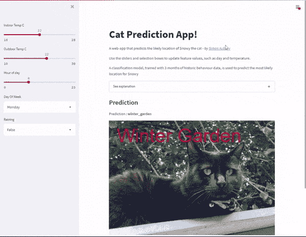

# 打破分布式系统的无声语义故障

> 原文：<https://thenewstack.io/the-silent-semantic-failures-that-break-distributed-systems/>

当事情出错时，调试复杂的分布式系统已经够难的了，但是当事情没有出错时，就更难了。系统管理员需要注意的正是这些无声的错误。

一组约翰·霍普斯金的研究人员，研究了九个广泛使用的分布式系统，得出了十几个“信息丰富的发现”，或者说是 ops 人员可能想要考虑的潜在问题。

根据一篇由[常楼](https://www.cs.jhu.edu/~chlou/about/)、[俞卓静](https://osdi.dev/)和[黄鹏](https://www.cs.jhu.edu/~huang/)撰写的论文，他们还开发了[工具](https://github.com/OrderLab/OathKeeper)，“自动从过去的故障中推断语义规则，并在运行时执行这些规则以检测新的故障”。伴随着上周在加利福尼亚州卡尔斯巴德举行的 USENIX 操作系统设计和实现研讨会上的发言。

分布式系统中的大多数故障是显而易见的:崩溃、超时、错误代码、异常。这些都是可以补救的。但是，还有一组错误可能不会立即导致中断，反而会给最终用户带来麻烦。例如，分布式文件系统制作的数据副本可能没有它的目标数量多。

用研究人员的话说，这些错误违反了系统的语义。它们可能是由不正确实现的 API 调用和公共方法、错误的命令行接口命令甚至不正确的配置设置引起的。它们可能是毁灭性的。一个没有完成预期任务的组件可能会破坏所有依赖它的组件。“由于侵犯是无声的，损害会随着时间的推移而加剧，”研究人员写道。损坏的文件系统运行的时间越长，生成的损坏文件就越多。

大多数名副其实的分布式系统都被定期测试(甚至[混沌测试](https://thenewstack.io/chaos-engineering-can-give-distributed-systems-stability/)也是如此)，所以许多管理员觉得他们的系统基本上没有这样的错误。然而，研究人员发现事实并非如此。他们发现，在他们研究的 36%的系统中，甚至是那些经过良好测试的系统中，都存在隐性错误。随着越来越多的功能被添加到系统中，这种错误就越有可能出现。通常故障可能发生在单个组件内。日常维护操作经常会将它们带出来。

要想全面了解可能出现的问题，请查阅论文。

## 本周的节目中

*   我们还需要另一种不安全的编程语言吗？本周，一名谷歌工程师介绍了一个从头开始构建编程语言的新项目，[名为 Carbon](https://thenewstack.io/google-launches-carbon-an-experimental-replacement-for-c/) 。正如微软建立 Typescript 来更新 JavaScript 的缺点，Kotlin 被创建来简化 Java 一样，Carbon 可以作为 C++的后继语言，它为开发人员提供了一个简单的起点，使他们可以转向一种解决现代开发概念(如内存安全和泛型)的新语言。在随后的讨论中，许多人想知道我们是否需要一种全新的语言来解决这些问题。虽然碳工程师承诺将确保内存安全的功能，但他们还没有到位。这是一些人的症结所在，包括 Swift 联合设计师 Doug Gregor，他[在 Twitter](https://twitter.com/dgregor79/status/1549931907214819328) 上写道，“将一种新语言带入世界并使其有用，移植代码，重新实现核心库，需要付出巨大的努力。如果你不能从中得到安全，为什么要承担这个费用呢？最终结果是真的更好，还是只是更漂亮？”

*   **工程师利用机器学习来预测他的猫**的位置:如果[机器学习](https://thenewstack.io/category/machine-learning/)继续与[预测人类行为](https://twitter.com/MelMitchell1/status/1548053405658099714)斗争，那么它可能有更好的运气来预测其他生物的行动。正如 TowardsDataScience 所捕捉到的，威尔士工程师 Simon Aubury 建立了一个基于 ML 的系统[来预测他的猫在一天中在房子里四处走动时的位置](https://towardsdatascience.com/can-ml-predict-where-my-cat-is-now-part-2-7efaec267339)。他使用一个蓝牙追踪器和六个安装在家里的接收节点(斯诺“对数据隐私问题的矛盾态度”很有帮助)来捕捉斯诺的行踪的每小时更新。[家庭助理](https://www.home-assistant.io/)捕捉温度、湿度和降雨量观测值，并使用 [dbt](https://www.getdbt.com/) 将这些信息移入数据库。他用 [Python](https://thenewstack.io/an-introduction-to-python-a-language-for-the-ages/) 的 [scikit-learn](https://scikit-learn.org/stable/) 创建了一个模型，并用 [Streamlit](https://docs.streamlit.io/) 构建了这个应用。该应用程序将预测下雪的位置，给定一天中的时间，以及该时间段的室内和室外平均温度。

*   **Golang 终于有了一个合适的内存模型**:据 InfoWorld [报道](https://www.infoworld.com/article/3667273/go-language-revises-memory-model.html)，Go 编程语言的内存模型已经被修改，以适应 C、C++、Java、JavaScript 和 Swift 使用的内存模型。迄今为止，Go 只映射了“顺序一致的原子”。它缺少一些同步操作的描述，比如原子提交。在 Golang 1.19 中首次亮相的新模型“指定了一些条件，在这些条件下，在一个 goroutine 中读取变量可以保证观察到在不同 goroutine 中写入相同变量所产生的值。”新模型“给出了 Go 存储器模型的更正式的总体描述，增加了多字竞争状态、运行时的更正式的描述。SetFinalizer、更多的同步类型、原子操作和编译器优化，”[添加了](https://www.sobyte.net/about/)SoByte dev 新闻站点。

<svg xmlns:xlink="http://www.w3.org/1999/xlink" viewBox="0 0 68 31" version="1.1"><title>Group</title> <desc>Created with Sketch.</desc></svg>