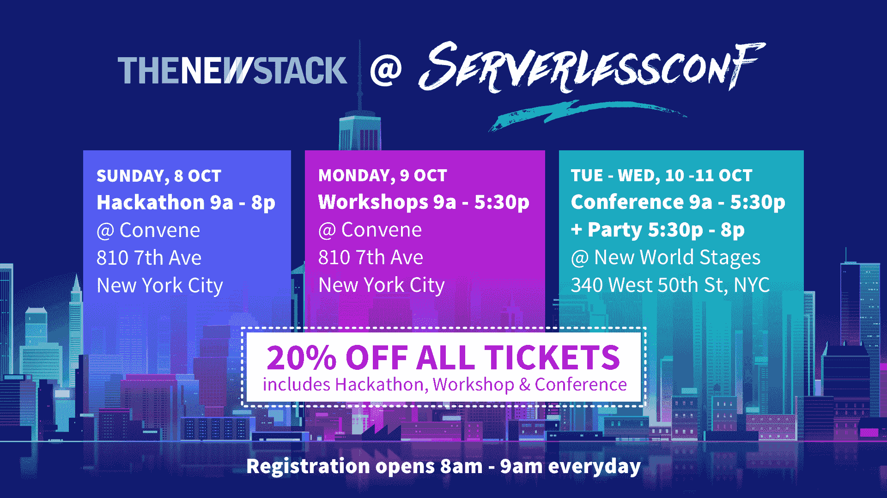

# Mesosphere 的 DC/操作系统上的 SMACK 堆栈为零售商提供了一条离开亚马逊的途径

> 原文：<https://thenewstack.io/the-smack-stack-on-mesospheres-dcos-gives-retailers-a-path-to-leave-amazon/>

想象自己是一名软件工程师，在辛辛那提一家名为[天文学家](https://www.astronomer.io/)的新兴 IT 提供商工作。您已经为您的运营配备了一流的配置工具，让您的客户能够使用最新的 Amazon 云服务。特别是，您将重点放在 AWS Lambda 的功能上，放在 [CloudWatch](https://aws.amazon.com/cloudwatch/) 的资源监控上，放在 [Kinesis](https://aws.amazon.com/kinesis/) 的实时数据流上，放在 Elastic Beanstalk 的自动伸缩上。

你带领只有五个人的团队在几个月的时间里就让你的公司全面运转起来。事情应该进展顺利。但是接下来你会意识到一些事情:首先，你加到 Lambda 上的 API 网关每月处理超过 10 亿个事件。当您处理多个具有各自独特需求的客户时，Beanstalk 的可伸缩性是有限的。你一直在阅读开源的 Kafka 生态系统，它似乎更加丰富，让你想知道 Kinesis 是否只能运行你梦想的一部分。

“我们也有产品障碍，”数据服务平台提供商天文学家的工程副总裁 Aaron Brongersma 解释道——你一直在想象他的鞋子。

9 月中旬在洛杉矶举行的 2017 年中尺度大会上，Brongersma 说:“我们的客户在访问他们所有的数据时遇到了问题。因此，如果您是一家 SaaS 提供商，并且您希望运营其他人的数据仓库，这将成为一个非常定制的 VPN 解决方案—他们必须向公众开放端口，他们必须将 IP 地址列入白名单。因此，我们发现，我们真的需要开始在防火墙或私有网络内部开展工作。”

除此之外，天文学家发现自己在处理这些非常经典的问题:位置，位置，位置。

俄亥俄州辛辛那提市——天文学家的总部所在地——处于零售和消费品行业结构性转变的中心。“在我们所处的位置，我们就在 Kroger 这样的公司附近，这些公司正在与亚马逊打一场数据战，”Brongersma 说。这里也是梅西百货公司的总部，也是消费零售商最值得信赖的品牌供应商宝洁公司的母公司。

像天文学家一样，Kroger 在 AWS 上托管了许多资产。上个月，亚马逊以 140 亿美元的价格收购了全美食品杂货商全食超市(Whole Foods ),而 T2 也表示不会就此打住(T3 ),克罗格发现自己的处境岌岌可危。

“我们发现，人们对采用基于亚马逊的服务有一定程度的担忧，”Brongersma 后来告诉 The New Stack。“他们现在可以很容易地进入几乎任何人的空间，扰乱你。从来没有人想到亚马逊会收购一家杂货店，后来他们真的这么做了。我们有宝洁、克罗格和 GE Digital 这样的公司，它们开始感受到被云锁定的痛苦。

“当你的云也成为你的竞争对手时，那会增加很多摩擦，”他告诉我们。“你不再中立了。”

## 叉车的时代

天文学家意识到必须扭转其业务模式，而不是帮助大型企业继续执行他们的公共云迁移，就像带领角马越过悬崖一样。具体来说，它需要“铲车”，正如 Brongersma 所说，他自己公司的数据工程平台*进入*客户的现有场所，将它们转化为自己的云，并使它们在自己的领域内具有竞争力。

“我们不想受到任何一家云服务提供商的限制。因此，这使我们降落在[*中间层[*]DC/OS，”他告诉观众。DC/OS(数据中心操作系统)是一个基于 Apache Mesos 分布式系统内核的分布式操作系统，它将多台服务器作为一台计算机进行管理。

“我们知道我们在天文学家使用的许多组件——如 Cassandra 和 Spark——是介子中的一等公民，”Brongersma 继续说道。“但我们不知道如何快速启动和运行 Mesos。我们是一个小型工程团队，以前从未真正在 SMACK 堆栈上工作过。”

所谓“SMACK stack”，Brongersma 指的是 Spark、Mesos、Akka、Cassandra 和 Kafka(不一定是这个顺序，但肯定是为了缩写)。SMACK 栈使用松散耦合的开源工具，这些工具被证明可以大规模工作。简而言之，正如中间层的 Edward Hsu 在中间层博客上关于 SMACK 栈的[帖子中所描述的，Spark 提供了大规模数据处理的框架；Mesos 充当分布式系统内核，提供跨所有其他 SMACK 栈组件的资源和隔离；Akka 是“轻松创建响应消息的并发和分布式应用的工具包和运行时；Cassandra 是分布式数据库管理系统，Kafka 是“高吞吐量、低延迟的平台，用于处理无数据丢失的实时馈送。"](https://mesosphere.com/blog/smack-stack-new-lamp-stack/)

图片由中间层提供。

他说，Mesosphere 在 DC 操作系统上部署 SMACK 的经验“让我们能够在相对较短的时间内，使用亚马逊组件提供与亚马逊相同的功能。引入 DC 操作系统带来了大量强烈的意见，这些强烈的意见帮助我们不必重新发明轮子。”

几年前，当 DC 操作系统首次进入开发者领域时， [Mesosphere 与亚马逊](https://thenewstack.io/mesosphere-community-edition-now-on-aws-google-and-azure-up-next/)以及云开发领域的大多数其他初创公司建立了合作伙伴关系。但从那时起，Mesosphere 的首席营销官彼得·瓜根蒂(Peter Guagenti)就一直在指责亚马逊的行为，包括在 MesosCon，至少，这是一种少于分享的行为。在最近为 Re/code 撰写的一篇文章中，Guagenti [将 AWS 为其基础云服务收取的每小时费用与一种“税”](https://www.recode.net/2017/6/19/15832958/amazon-whole-foods-jeff-bezos-acquisition-aws-vendor-tips-cloud-open-source)进行了比较:

*“AWS 很久以前就不再是开发者购买服务器了。现在，它提供了数百种服务——通常是从公共回购中窃取的开源工具，有着花哨的名字，隐藏在专有的 API 后面——这些按需提供的按小时计费的组件可以插入到你的应用程序中……如果你决定移动你的应用程序(例如，当亚马逊成为竞争对手时，就像他们对网飞等其他客户所做的那样)，你就是不能。”*

虽然天文学家的客户可能不愿意相信亚马逊是一家全球云服务提供商——刚刚表明自己是市场上最糟糕的噩梦——但他们也不太愿意相信其竞争对手之一(谷歌、微软 Azure)的相同云平台。此外，拥有自己的[数据湖](https://thenewstack.io/data-is-the-new-stack/)(跨越存储卷的大量尚未提炼的数据)的组织发现，他们从基于云的存储中节省的成本已经降到了零以下。

“我们需要快速启动 Spark 的能力，所以 Spark 确实是我们的尖端方法，”正如 Brongersma 所描述的那样。“那是为了取代亚马逊的弹性 MapReduce 服务。紧接着 Spark 之后的是 Apache Airflow，这是一个开源工具，我们已经采用并正在培育。这是 Airbnb 的一个组件，我们发现它是出于替换亚马逊工具[简单工作流](https://aws.amazon.com/swf/)的需要。

“不是所有的亚马逊服务都是平等的，”他继续说道。“这些产品线的成熟度并不总是相同的。例如，像 S3 这样的服务可能久经沙场，久经考验，但当你回头看看一些更新、更有前途的服务时，你不一定能保证这种耐用性。”

简单工作流旨在使开发人员能够构建高可用性作业，以便并行划分和分配与这些作业相关的任务，并跟踪和记录这些作业的状态。但是，当 Spark 是您的数据引擎时，您需要一些东西来启用工作流模型，然而，最终它并不那么简单。

Airflow 支持一个调度模型，该模型能够更充分地将现实世界的任务映射到 Spark 执行的并行任务。由于这种调度方式更多的是针对数据的需求，而不是应用程序，因此平台需要一个调度程序，而不是像 Kubernetes 那样，为了应用程序而控制整个虚拟基础架构。这就是为什么从天文学家的角度来看， [Apache Mesos](http://mesos.apache.org/) 调度程序以及围绕它的工具生态系统更适合这种情况。

“我们真正需要气流的下一件事是进行智能[红移](https://aws.amazon.com/redshift/)加载的能力，”Brongersma 在 MesosCon 告诉观众(揭示了天文学家如何仍然使用 AWS 进行存储)。“所以我们保证数据进来。这也触发了一个执行 Spark 流作业的任务，然后我们可以确保我们可以进行我们的模式推断[ *通过输入表的组织*来“猜测”模式的能力]。因此，当我们进入数据仓库时，我们会得到定义更好的表。”

[https://www.youtube.com/embed/Lwn1UA6K0co?feature=oembed](https://www.youtube.com/embed/Lwn1UA6K0co?feature=oembed)

视频

## 可防卫性

Brongersma 拥有丰富的 Ruby on Rails 开发经验。他认为这个与 DC/操作系统共享的平台的优势来自一系列强大的默认设置。一个有经验的 Ruby on Rails 开发人员会随着时间的推移了解何时何地适合覆盖这些默认值。他说，类似地，DC/操作系统很快实现了 SMACK，限制了操作员手动配置的需求，除非在异常情况下。例如，堆栈如何与 DNS 服务进行互操作，如何解决服务发现，以及如何调度容器等问题都没有成为问题。

“我们可以改变船的方向，让它成为我们自己的，”布朗格斯玛说。

天文学家的 Brongersma 解释说，在满足大型企业客户的需求时，IT 提供商需要提供*防御能力*的方法，即在必要时为其做出的设计和实现选择辩护的方法。当然，天文学家在中间层现有信任模型之外做出选择可能是站不住脚的，甚至是不合规的。但该公司确实发现自己在进行必要的、非随意的调整，尤其是对那些仍在 AWS 上部署部分资产的客户。

“但我们只是抽象出了所有的亚马逊层，”Brongersma 说。“我们只是在愚蠢的虚拟机上运行。这为我们的客户增加了一层信心。移动云提供商有大量的工作要做。但是，如果我们将虚拟机视为哑虚拟机，我可以使用 Azure 或 Google Compute，或者他们可以使用数据中心，我们可以在该数据中心内运行，底层组件不会消失或改变，他们也不必重新构建整个应用程序。”

正如 Mesosphere 首席执行官 Florian Leibert 告诉新堆栈的那样，现代客户希望他们基于云的平台将他们的服务和数据缝合成一个有凝聚力的整体。然而，这里的危险是，云平台提供商可以利用这种凝聚力来推动更多的产品和服务，加强对客户的控制，并将他们锁定在他们可能没有意识到的选择上。

微软和谷歌的母公司 Alphabet 在零售行业都没有竞争性的股份。对于某些客户来说，这是亚马逊不再像以前那样受欢迎的原因之一。这些顾客中的一部分人住在辛辛那提天文学家街上。随着亚马逊的商业利益变得更加明显，一条新的战线正在俄亥俄河沿岸开辟。

【T2

中间层赞助了这个故事。

<svg xmlns:xlink="http://www.w3.org/1999/xlink" viewBox="0 0 68 31" version="1.1"><title>Group</title> <desc>Created with Sketch.</desc></svg>