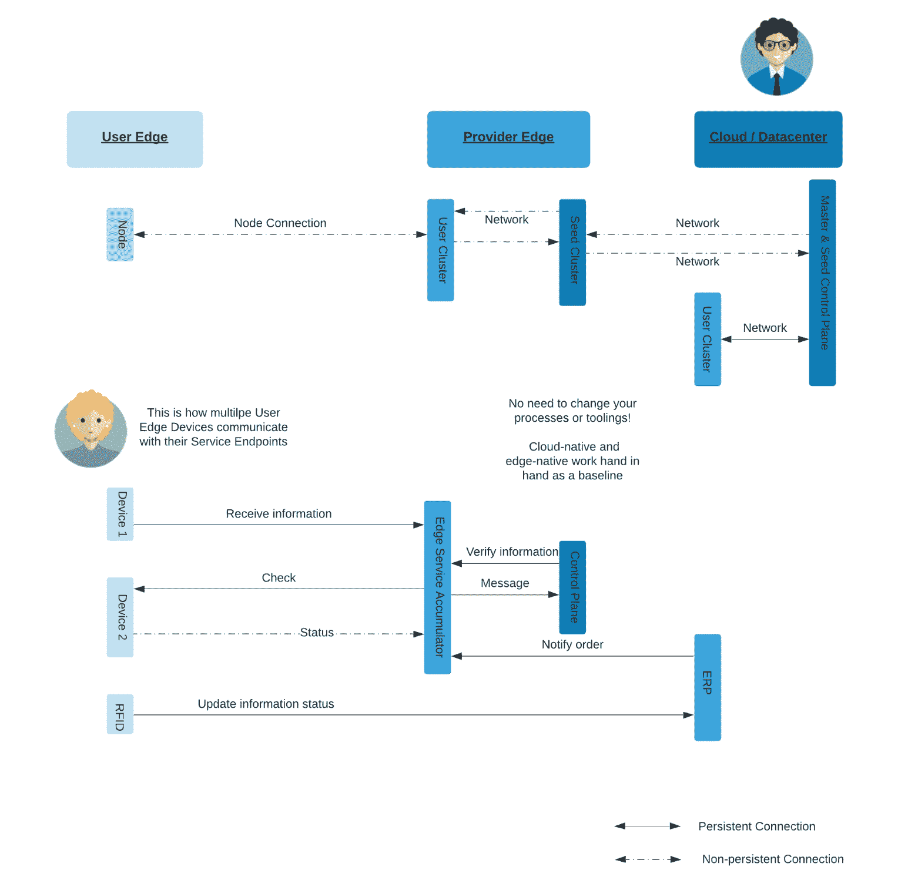
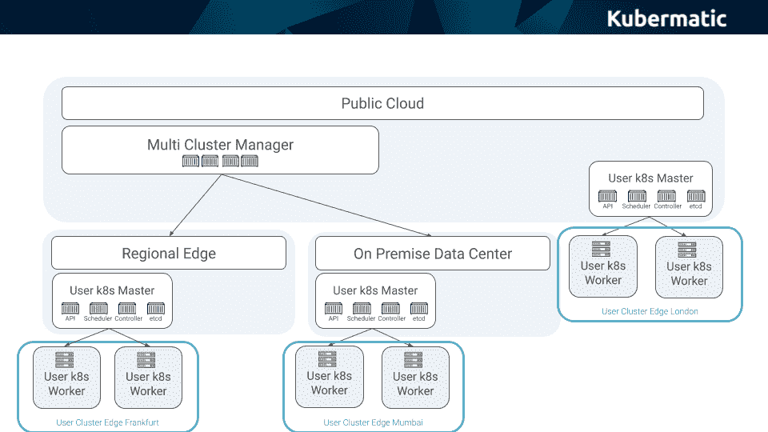

# 最小的 Kubernetes 集群:缩小到边缘

> 原文：<https://thenewstack.io/the-smallest-kubernetes-cluster-scaling-down-to-the-edge/>

 [萨沙哈斯

萨沙哈斯是 Kubermatic 的副总裁 Edge。他的职业生涯专注于通过正确的技术和正确的人带来价值。在加入 Kubermatic 之前，他曾在不同的云服务提供商处从事 Kubermatic Kubernetes 平台的工作，并建立了一家不断为其市场增值的公司。Sascha 在柏林工作和生活。](https://www.linkedin.com/in/haasesascha/) 

边缘计算正在创造一个新的互联网。在这个时代，消费者和企业要求在提出问题和获得答案之间尽可能缩短延迟，边缘计算是减少提供这种洞察力所需时间的唯一方法。边缘计算通过降低延迟、即使在带宽不足时也能处理数据、降低成本以及处理数据主权和合规性来缩小差距。

虽然集中式云计算将持续存在，但我们在网络边缘创建和处理数据的完全不同的方式将会——并且已经——创造出新的市场。到 2024 年，全球边缘计算市场的价值预计将超过 90 亿美元，年复合增长率为 30%。

关键问题是:什么样的运营模式和技术能够有效地释放这种潜力？

## **Kubernetes 开启边缘计算**

作为一个新领域，边缘计算目前还是一片空白，最佳实践仍在不断涌现。即使该领域没有任何标准，许多公司也开始转向 Kubernetes 来满足他们的边缘计算需求。

Kubernetes 已经席卷了企业 IT，根据 2019 年云本地计算基金会(CNCF) [调查](https://www.cncf.io/blog/2020/03/04/2019-cncf-survey-results-are-here-deployments-are-growing-in-size-and-speed-as-cloud-native-adoption-becomes-mainstream/)，86%的公司都在使用 Kubernetes。虽然 Kubernetes 诞生在云中，但它提供的好处也延伸到了快速崛起的边缘计算市场。

由于硬件和软件分布在成百上千个位置，管理这些分布式系统的唯一可行方法是通过云原生技术实现标准化和自动化。

然而，如果公司真的想使用 Kubernetes 来管理他们的边缘计算部署，他们必须仔细考虑边缘带来的其他挑战。

最令人担忧的是资源限制。Kubernetes 构建在云中，具有几乎无限的扩展能力。相比之下，边缘计算的资源通常非常有限。当我们从区域边缘移动到设备边缘时，实际的限制可能会有很大的不同，从几台服务器到几百兆内存。然而，它们都有一个共同的限制，即运行实际应用程序的每一点开销都会受到限制。

考虑到这一点，现在的问题是:我们如何减少 Kubernetes 的占用空间，以便为客户应用程序留出更多空间？

## **最小的 Kubernetes 星团**

Kubernetes 集群由控制平面和工作节点组成。为了缩小这个足迹，一些项目试图从 Kubernetes 中剥离不必要的元素，以创建一个精简的版本。

然而，这产生了一个 Kubernetes 分支，需要独立于 Kubernetes 堆栈的其余部分进行维护和管理。我们可以重新设想我们如何设计我们的集群，以考虑边缘计算是如何设计的，而不是试图删减一些东西。

库伯内特边缘建筑

边缘计算不是一个精确的位置或设备类型，而是远离集中式云计算的位置的连续体。远离云通常意味着设备和带宽更加受限。

然而，边缘计算的每一个级别通常都连接到至少一个高于它的级别，并在某种程度上受其控制。边缘是工作负载运行的地方，但它仍然连接回更高级别的功能的更集中的计算。

实际上，我们可以用同样的方式将 Kubernetes 视为两个独立的部分:一个集中用于控制，一个分布式用于计算。工作节点运行应用程序，而控制平面只负责安装和维护集群中运行的工作负载。

要让工作负载正常工作，不需要控制平面，因为它只进行生命周期管理。如果工作节点失去与控制平面的连接，工作负载可以继续运行，只是无法更新。

考虑到这一点，我们可以将 Kubernetes 集群的功能单元想象成带有 kubelet 的 worker 节点。不需要始终对控制平面进行集中管理，因为工作负载处于正常工作状态。

有了这个 Kubernetes 集群的新概念，我们可以开始重新思考如何为资源有限的环境构建 Kubernetes 集群。工作节点可以在受限制的设备上运行，而控制平面可以在具有额外资源的更集中的位置运行，无论是本地数据中心，还是延伸回公共云。这使得运营团队可以在边缘计算上运行 Kubernetes，而无需进行修改或维护另一个技术堆栈，同时将开销降至最低。

Kubernetes 集群的控制计划与工作节点分离

## **集群管理混乱**

价值数十亿美元的边缘计算市场将由运行数百万个集群的数万亿台设备组成。因此，它回避了如何管理它们并保持控制平面和工作节点同步的问题，即使它们在不同的位置运行。

我们构建开源的 [Kubermatic Kubernetes 平台](https://www.kubermatic.com/products/kubermatic/)就是为了这个用例。它在 Kubernetes 架构中的[Kubernetes](https://thenewstack.io/running-kubernetes-kubernetes/)已经将控制平面从工作节点中分离出来，并独立管理它们。控制平面作为另一个集群中的一组容器运行，该集群可以在资源约束较少的环境中运行，而工作节点只需运行一个 kubelet，从而从根本上减少了 Kubernetes 集群在边缘的占用空间。此外，Kubermatic Kubernetes 平台可实现集群生命周期管理的自动化，这对于边缘计算业务和运营模式尤为重要。

## **如何试用**

Kubermatic Kubernetes 平台允许用户分离控制平面和工作节点，以便为边缘计算和受限设备运行最小的“Kubernetes 集群”。

你可以自己尝试一下，也可以在 [GitHub](https://github.com/kubermatic/kubermatic) 上为这个项目做贡献。

*要了解更多关于 Kubernetes 和其他云原生技术的信息，请考虑参加 11 月 17 日至 20 日举行的 [KubeCon + CloudNativeCon 北美 2020](https://events.linuxfoundation.org/kubecon-cloudnativecon-north-america/) 。*

<svg xmlns:xlink="http://www.w3.org/1999/xlink" viewBox="0 0 68 31" version="1.1"><title>Group</title> <desc>Created with Sketch.</desc></svg>