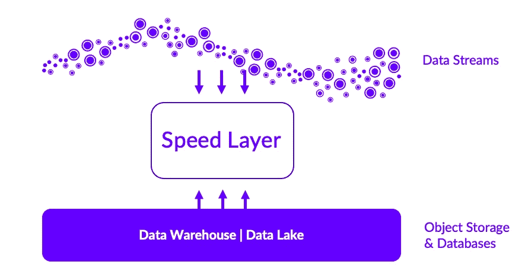

# 用于分析的速度层设计模式

> 原文：<https://thenewstack.io/the-speed-layer-design-pattern-for-analytics/>

需要实时洞察和深入分析的组织经常会遇到这样的难题:使用流工具进行基本分析的实时数据处理，或者使用具有高级分析但延迟较高的数据仓库。

历史上，数据平台的构建者和用户被迫在基本的实时分析洞察和事件发生后的全面分析洞察之间做出选择。在许多情况下，这些选项中的一个非常好。

然而，越来越多的组织希望对更大的数据资料库做出接近实时的决策。这导致更好的欺诈预防、威胁检测、车队管理和其他由传感器和机器数据激增引起的使用案例。最近，出现了一种称为“速度层”的新架构设计模式，它克服了高级分析和实时洞察之间的权衡。

## **流媒体**

Kafka、NiFi 和 Kinesis 等流工具用于构建实时数据管道和流应用程序。它们旨在处理高吞吐量、低延迟的数据移动。它们用于收集和处理来自传感器、日志和社交媒体源等各种来源的数据，并将这些数据同时交付给多个应用程序和数据库。

虽然流工具提供了一些基本的分析功能，但重点是将数据从一个系统移动到另一个系统并实时处理数据，而不是对数据执行复杂的分析。它们可以执行一些基本形式的分析，例如通过内置的轻量级流处理库在一个狭窄的窗口内实时过滤和聚合数据。例如，金融机构可以使用流工具来快速检测异常，并立即采取措施来防止损失或降低风险。

但是，它们并没有针对复杂的历史数据查询或分析进行优化。使用流工具执行分析的一个关键限制是它们缺乏上下文数据。它们不存储历史数据或了解全局所需的上下文信息。它们不提供更高级的分析功能，如高基数连接、跨大型事实表的 n 向连接、跨更大历史窗口的时序函数，或者高级机器学习中使用的其他特征生成和推理技术。

如果无法访问上下文数据或高级分析功能，流媒体工具在提供见解和推动有意义的业务决策方面的能力就会受到限制。因此，需要对大型数据集进行深入分析或查询的组织可能需要使用通常与数据仓库和数据湖相关联的其他工具。

## **数据仓库和数据湖**

数据仓库和数据湖旨在存储和分析跨多个主题领域的大量历史数据，这允许更高级的分析和建模。上下文可能是关键，这些环境集成了来自不同来源的数据，以构建一个复合视图，并对不同的记录系统进行三角测量。结果比来自流工具的结果更全面。

然而，数据仓库通常具有更高的延迟，这意味着洞察和分析可能需要更长的时间才能产生。由于 ETL(提取、转换和加载)或 ELT(提取、加载和转换)以及查询复杂性，数据仓库和数据湖在提供洞察时会产生延迟。ETL/ELT 涉及数据的批量加载、摄取过程中的表锁定和数据工程，以便通过反规范化更快、更容易地查询数据。数据仓库和数据湖查询可能涉及多个表、聚合和连接，这些都需要时间。

当然，有各种各样的技术来优化这一点，但不可回避的事实是，一旦问题的复杂性增加，与流相比，有更多的时间来洞察。

## **速度层**

在现代数据架构中，速度层结合了批处理和实时处理方法，以处理大型和快速移动的数据集。速度层填补了传统数据仓库或湖泊与流媒体工具之间的空白。它旨在处理连续生成的高速数据流，并要求在集成历史数据的上下文中进行即时处理，以提取洞察力并推动实时决策。

“速度层”是一种架构模式，它将实时处理与数据仓库或湖的上下文和历史数据相结合。速度层架构充当移动数据和静止数据之间的桥梁，提供实时和历史数据的统一视图。这种方法提供了一种混合解决方案，兼具实时处理和上下文分析的优势。

为了实现其承诺，速度层通常包括两个组件:

**极端接收:**速度层必须能够实时接收来自多个来源的数据，包括流源、数据仓库和湖泊。这涉及到流工具的本机连接器、消除中央瓶颈的分布式无头接收和无锁架构，该架构确保数据以流的速度可供查询。

为了快速查询，数据通常从速度较慢的对象存储或磁盘(数据仓库和湖数据保存在其中)移动到内存中。这里需要注意的一点是，当数据保存在速度层时，它是短暂的。长期记录仍然是数据仓库和湖。

**极限查询速度:**速度层必须提供实时查询和分析实时数据的方法，通常使用矢量化等查询加速方面的新突破。在矢量化查询引擎中，数据存储在称为矢量的固定大小的块中，查询操作并行地在这些矢量上执行，而不是在单个数据元素上执行。

这允许查询引擎同时处理多个数据元素，从而使查询执行速度提高几个数量级。这与传统的分布式分析数据库形成对比，传统的分布式分析数据库逐行处理数据，这要慢得多，并且需要更多的计算资源。除了提高查询性能，这种方法还可以减少所需的计算和数据工程的数量，使它们更加高效和经济。

您可以在 [Kinetica Cloud](https://cloud.kinetica.com/trynow/) 上免费体验速度层的好处，使用易于使用的工作簿，其中包含预构建的 Kafka 主题。

<svg xmlns:xlink="http://www.w3.org/1999/xlink" viewBox="0 0 68 31" version="1.1"><title>Group</title> <desc>Created with Sketch.</desc></svg>