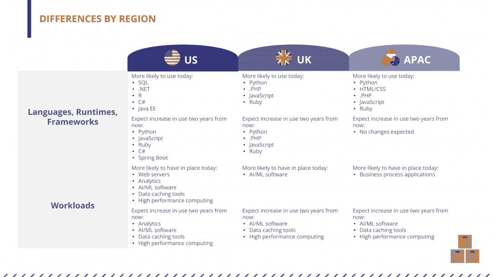
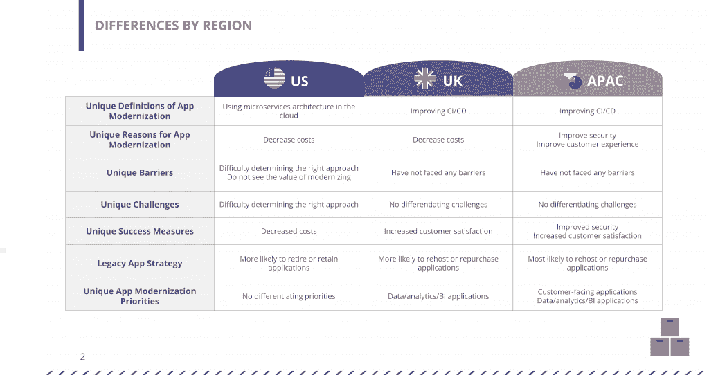
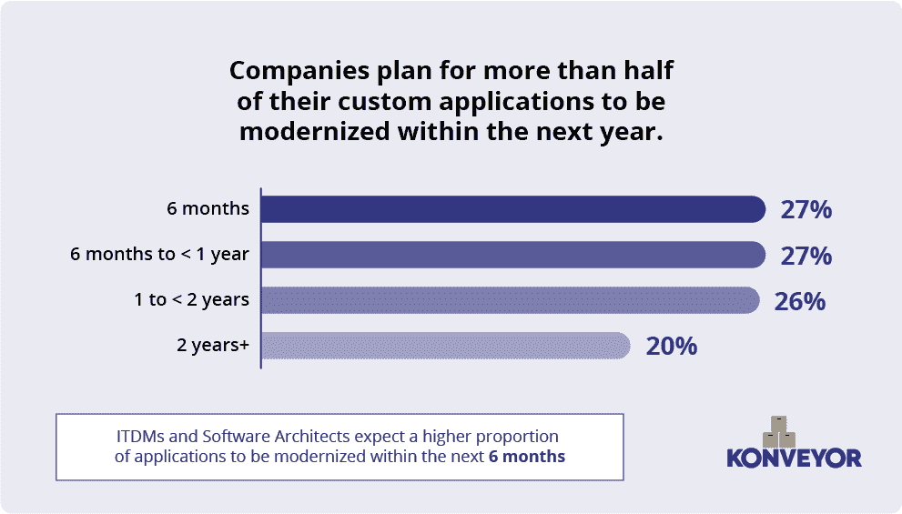
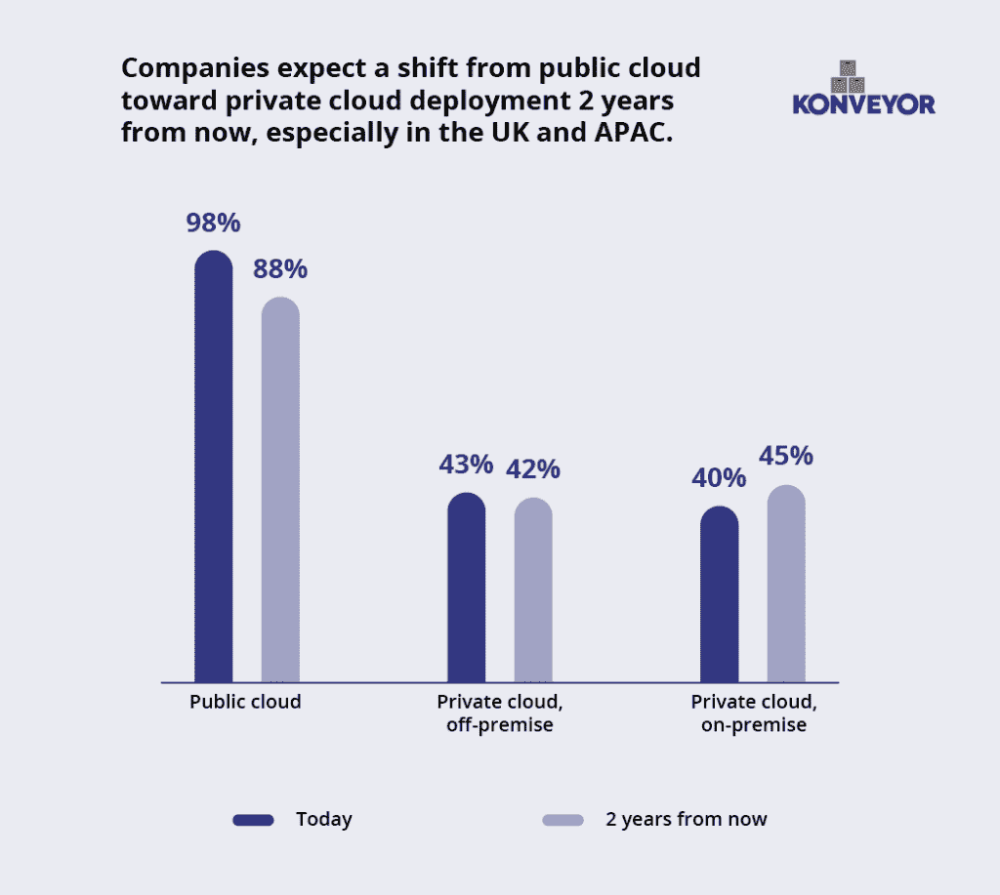
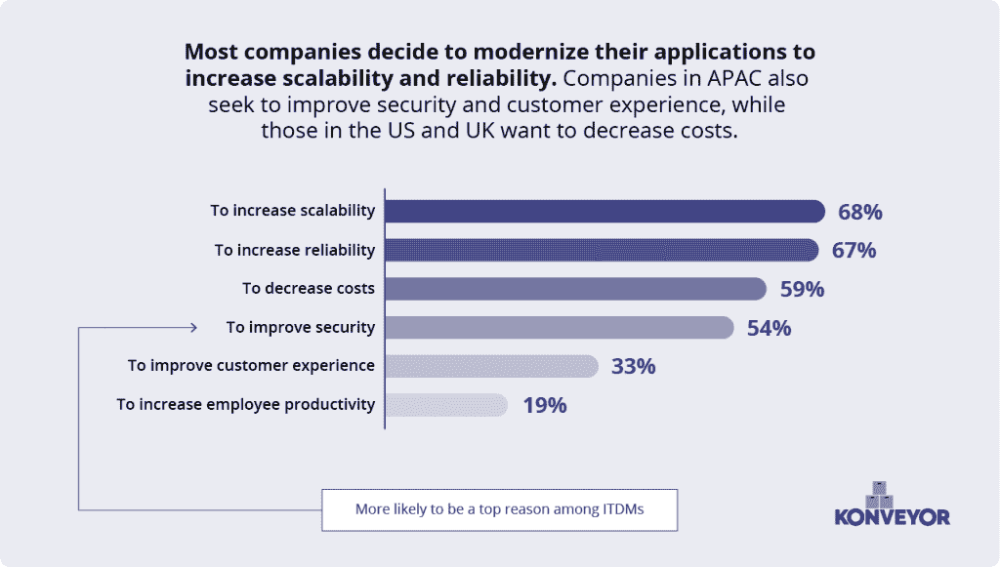
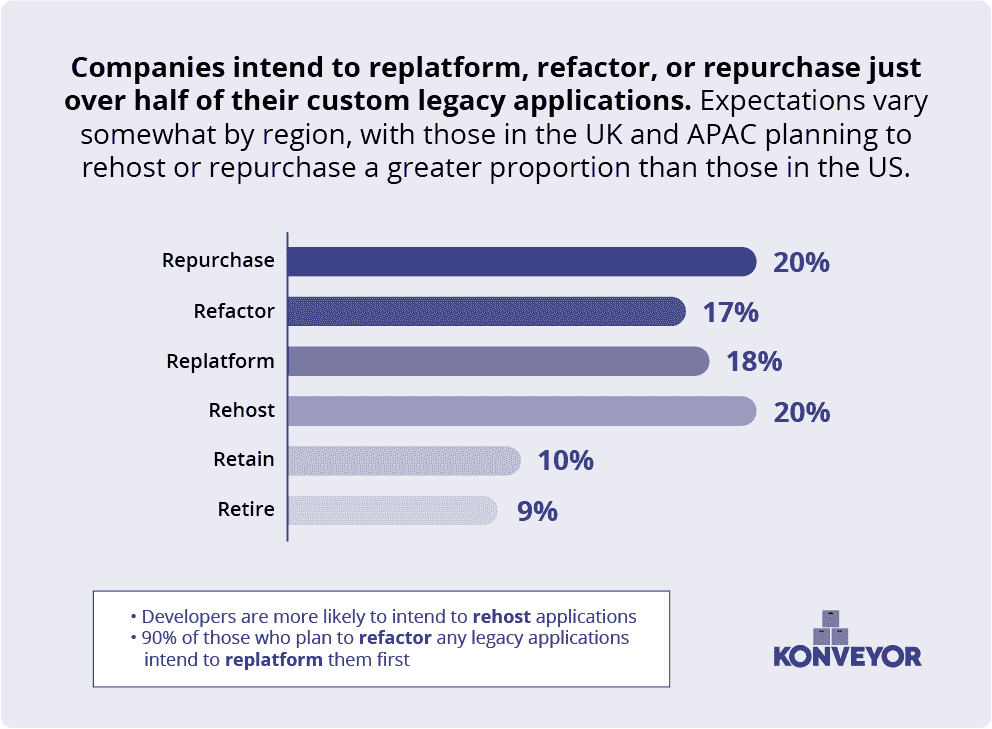
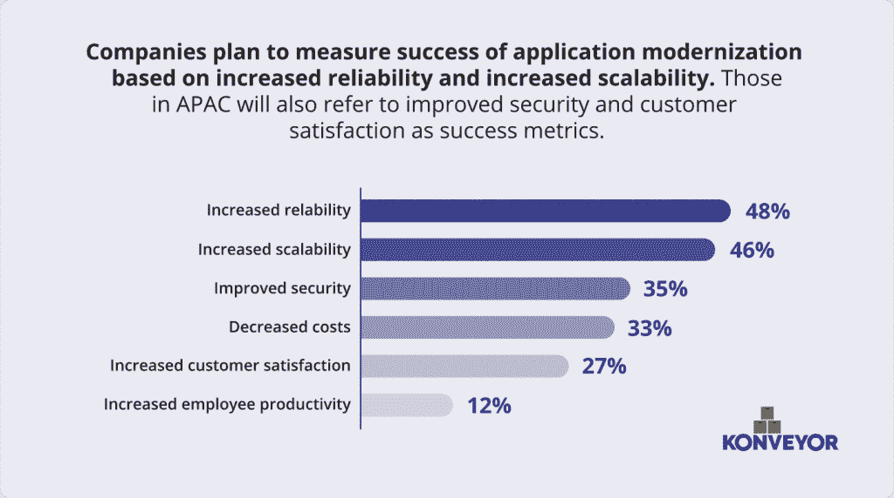

# 2022 年应用现代化状况

> 原文：<https://thenewstack.io/the-state-of-application-modernization-2022/>

 [戈登·哈夫

戈登是红帽公司的技术倡导者，从事新兴技术战略的研究，并撰写关于技术、趋势及其商业影响的文章。他经常在客户和行业活动中发言。他从事的主题包括 edge、区块链、人工智能、量子、云原生平台和下一代应用架构。他的著作包括《从锅和桶到程序和应用程序》*和《开源如何吃掉软件》*](https://www.linkedin.com/in/gordon-haff-a10114/) 

*[Konveyor](https://www.konveyor.io/) 在开源社区中拥有独特的地位，因为它专注于构建和支持工具，以帮助应用迁移到混合云。Konveyor 包括了像 trough、Move2Kube 和 Crane 这样的工具，所有这些工具都是为了帮助重新托管、重新平台化和重构应用程序而构建的，以便它们能够在云中舒适地运行。*

 *最近，在项目成员 Red Hat 的帮助下，Konveyor 社区对计划或已经采用 Kuberenetes 的企业进行了调查，了解它们的活动、想法和计划。结果是 2022 年[应用程序现代化状态报告](https://www.konveyor.io/modernization-report/)。

我们通过电话调查了 600 人，其中 300 人来自美国，150 人来自英国，150 人来自亚太地区(澳大利亚、新西兰、香港、新加坡)。

质询发生在 2021 年 10 月和 11 月。一半的受访者是 IT 决策者(ITDM)，25%是后端开发人员，25%是软件架构师。

在本文中，我们将深入调查的关键结果，并深入探究其中的一些原因。如果你更喜欢看关于这些结果的视频，下面是 Illuminas 首席执行官杰伊·舒特和红帽公司的乔纳森·雷西诺斯对结果的讨论:

[https://www.youtube.com/embed/ntCoasNIRZk?feature=oembed](https://www.youtube.com/embed/ntCoasNIRZk?feature=oembed)

视频

## 他们为什么要现代化，他们在现代化什么？

我们的受访者在其企业中有各种各样的动机和应用需要处理。但是他们决定背后的潜在原因和技术动机因地区而异。美国很大程度上是由 SQL 驱动的。NET，R，C#和 Java EE。然而，英国和 APAC 地区偏爱 Python、PHP、JavaScript 和 Ruby。

对现代化确切含义的定义也因地区而异。在美国，应用程序现代化往往意味着转向基于微服务的云架构。在英国和 APAC 地区，这往往意味着转向基于云的 CI/CD 模型。

## 现代化正在发生

很明显，推出迁移工具迫在眉睫。在那些正在迁移或计划迁移的客户中，我们发现他们计划在接下来的一年中实现 54%的定制应用的现代化，在接下来的六个月中实现超过四分之一的现代化。只有 20%的人预计现代化需要两年以上的时间。很明显这正在发生。

也就是说，这并不是一帆风顺的，也不是一蹴而就的。虽然有些地区在应用程序现代化的道路上还没有取得足够大的进展，没有遇到严重的障碍，但其他地区(特别是美国)报告说，选择一种简单的方法具有挑战性。组织有许多选项可供选择，每个选项都呈现不同的复杂程度。

## 公司预计在未来两年内转向混合动力

根据对我们的调查作出回应的人的说法，未来两年应该会看到从纯粹的公共云使用到更混合的方法的转变，这种方法还包括私有云托管。目前，98%的受访者表示他们的应用程序托管在公共云中，而 43%的受访者表示他们也托管在异地私有云。

受访者还被问及他们认为自己的应用程序两年后会托管在哪里。那些将在外部私有云中托管的人增加到 55%，而公共云预测下降了 10 个百分点，达到 88%，这表明一些公司可能正计划撤出。

## Kubernetes 现有应用程序现代化的激励因素

该调查告诉我们，对可靠性、可扩展性和安全性的需求是推动现代化的主要因素。降低成本也在名单上，但正如我们在其他关于技术采用或变革的调查中经常看到的那样，这不是驱动因素。

## 迁移可能非常昂贵

将应用程序迁移到云中需要时间和精力。那就是钱，当开发者时间被垄断的时候。但在我们的调查中，20%的受访者表示打算重新购买软件或工具以进行迁移。

Konveyor 的开源工具，最著名的是[叉车](https://forklift.konveyor.io/)和[起重机](https://crane.konveyor.io/)，可以帮助这些方面的重组。叉车专注于将虚拟机迁移到 Kubernetes，并提供在最短停机时间内将多个虚拟机迁移到 KubeVirt 的能力。

Crane 是一个满足不同用例的再集成工具。开发人员和运营团队可能经常希望在新旧版本的 Kubernetes 之间进行迁移，撤出集群或者迁移到不同的底层基础设施。Crane 可以帮助组织在 Kubernetes 集群之间迁移应用程序。

当您看到组织优先考虑的是什么时，组织希望花费资金来解决迁移问题这一事实就不足为奇了。

## 可扩展性和可靠性是迁移的首要原因

公司将如何衡量其应用程序现代化的成功？降低成本是一个因素。成本在某种程度上总是重要的；问问任何有过预算的人。但是总体而言，增加可靠性(尤其是在美国)和可伸缩性排在首位，安全性也排在首位。

这是一个地区差异很大的问题。APAC 在提高安全性方面的排名明显高于其他地区，甚至在可扩展性方面也有所下降。APAC 也更有可能衡量客户满意度的提高，尤其是相对于美国而言。

## 美国比其他国家走得更远

我们通常不会发现地区之间的显著差异，但我们有时确实会看到形成一种模式的更微妙的差异，就像这里的情况一样。

在这种情况下，我们看到美国唯一将应用现代化定义为在云中使用微服务架构，而其他两个地区将其定义为改善 CI/CD。这表明美国在应用程序现代化方面走得更远。拥有完善的 CI/CD 管道是微服务和其他云原生技术方法的基础。

我们看到在障碍和挑战方面出现了类似的情况。英国和 APAC 没有面临很多障碍。有理由认为这是因为他们还没有深入到这个过程中。相比之下，美国专注于确定正确方法的困难，这表明他们正在积极寻找最佳方法，以在其应用程序组合中实施现代化战略。

## 混合动力是未来

我们的调查受访者都有一个共同点:他们认为基于容器、云托管的微服务是他们应用领域的未来。虽然将遗留应用程序迁移到云的方式、方法和时间表因公司而异，但基本需求和愿望在各地区都是相同的。

每个公司都将云视为提高应用程序可伸缩性和可靠性的一种方式。对于每个公司来说，通往这个新的多云世界的道路是不同的，但是他们可以使用的工具是相同的。 [Konveyor 社区](https://www.konveyor.io/)邀请您阅读[完整报告](https://www.konveyor.io/modernization-report/)并查看其免费开源工具以帮助迁移。

<svg xmlns:xlink="http://www.w3.org/1999/xlink" viewBox="0 0 68 31" version="1.1"><title>Group</title> <desc>Created with Sketch.</desc></svg>*