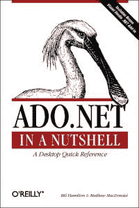
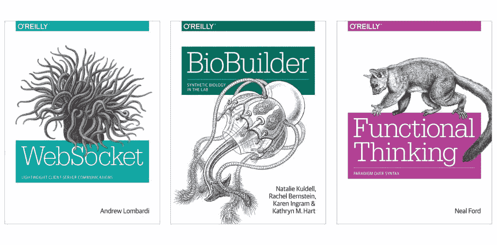

# 奥莱利书封面上所有动物背后的故事

> 原文：<https://thenewstack.io/the-story-behind-all-the-animals-on-oreillys-book-covers/>

3 月，在国际妇女节，奥赖利媒体总裁劳拉·鲍德温指出，公司 50%的行政和管理职位[由女性担任](https://www.linkedin.com/pulse/international-womens-day-oreilly-laura-baldwin/)。(女性也占了他们劳动力的 47%。)但有趣的是，看看女性对这家出版公司最具标志性(也是长期的)决策之一的影响:通过使用动物插图来区分他们技术书籍的封面。

近三十年来，这些动物几乎已经成为极客文化本身的一部分。这个倡议背后的女人？[伊迪·弗里德曼](https://twitter.com/ediefr)，在出版公司担任创意总监。

在 Oreilly.com 的一个页面上，你可以按照封面上动物名称的字母顺序对书籍进行排序——从《ADO。NET 简介”到“Toad Pocket Reference for Oracle”(其中当然包括 Toad)。它提供了 1222 本动物封面的书籍。

在网站上的一篇文章“奥赖利动物简史”中，弗里德曼记得奥赖利的第一本书是在 20 世纪 80 年代中期通过邮件出售的，是普通的棕色封面的小册子，用订书钉装订在一起。但是奥莱利的创始人蒂姆·奥莱利对在书店销售的前两本书的设计并不满意。

这就是弗里德曼进入故事的地方。当时，她和一个参与公司营销的人是邻居。一件事接着一件事，“她给我看了他们设计的封面，想知道我是否有更好的主意，”弗里德曼回忆道。

“我听说过 Unix，但我对它的概念非常模糊。我从未遇到过 Unix 程序员或试图用 vi 编辑文档。甚至与 Unix 相关的术语——*VI、sed* 和 *awk、uucp、lex、yacc、curses、*等等——也很奇怪。在我听来，这些话就像是从《龙与地下城》里冒出来的，这是一款在极客(主要是男性)亚文化中流行的游戏。”

弗里德曼在文章中记得，在一个漫长的周末后，她第一次将几幅素描带给她的邻居带到办公室。有些人认为这些动物很奇怪——甚至有点可怕——但奥赖利回应了它们的古怪，并认为这可能有助于它们从其他技术书籍中脱颖而出。“感觉就是对的，”弗里德曼的文章回忆道，并补充道，“就这样开始了。”

很难量化一个设计决策的影响。偶尔仍会有不喜欢蜘蛛或蛇的购书者抱怨。但是 2005 年《连线》杂志指出，奥赖利图书的销售[占了 4 亿美元计算机图书市场的 15%](https://www.wired.com/2005/10/oreilly) :“奥赖利图书倾向于开拓 Borders 和 Barnes & Noble 的整个区域，它们独特的封面设计就像洗涤剂盒上的潮圈或 PowerBook 盖子上的苹果标志一样容易辨认。”

## **物种的起源**

据报道，弗里德曼[曾经说过](https://medium.com/the-awl/interpreting-the-animal-choices-on-the-worlds-most-popular-programming-books-dd89c3a27e01)，“我从不透露我的选择背后的原因，但我可以向所有感兴趣的人保证，总有一个原因。”根据洛里·休斯顿的一篇 2000 字的文章，这些图片最初来自多佛画报档案馆，该档案馆提供 18 世纪和 19 世纪动物木刻和铜版版画的无版权收藏。但她也透露了一个令人惊讶的变化:“现在越来越多的动物图像是手工绘制的。”

其中许多是由拥有动物科学学位的自由艺术家罗莉·勒琼(Lorrie LeJeune)绘制的。到 2000 年，她已经为 20 多本奥赖利的书画了动物封面。根据这篇文章，她研究这种动物，定期参观博物馆的动物展览。“从头到尾，一只奥赖利动物需要 8 到 20 个小时的体力劳动，”她说。

首先，会有粗略的钢笔画草图——有几种姿势，设计师从中选择。最终的图像是在一张涂有粘土的叫做 scratchboard 的纸板上完成的，其中的线条是用小刀小心翼翼地刻掉一层墨水而形成的。这种技术创建了一个鲜明的雕刻风格的图像，然后转换成高分辨率的扫描。“我实际上是在倒退，”罗莉在文章中说。她总是从动物的眼睛开始。

2016 年，当奥赖利媒体出版了“奥赖利动物:成人涂色书”时，一些动物得到了他们自己的书，这给了他们一个承认他们悠久传统的机会。“奥莱利传媒因其标志性的动物封面而在科技图书出版商中独树一帜，”该书的[在线描述](http://shop.oreilly.com/product/0636920050223.do)解释道，并承诺这是一本高质量的漫画，“你可以在这组经典印刷品上加入自己的观点……放松，享受乐趣，创造你自己的彩色动物动物园。”奥赖利的设计师卡伦·蒙哥马利改编了“奥赖利动物图像档案”中的 12 幅图像

## 逃离动物园

但是这项工作有更大的意义吗？弗里德曼的“短暂历史”表明，她感受到了她几十年来管理动物图像的影响。封面设计师卡伦·蒙哥马利(Karen Montgomery)对动物的研究让她意识到有多少动物濒临灭绝——包括《sed & awk》封面上那些可爱的懒猴，《学习 vi & Vim 编辑器》上的眼镜猴，甚至《Hadoop:权威指南》上的非洲象。她写道，“当大部分版画创作于 19 世纪时，这些动物非常丰富。”

弗里德曼的文章承认便利的子域收集了 animals.oreilly.com[的所有动物，并尖锐地提出希望它能激励“像你这样聪明、懂技术的人想出拯救和保护世界野生动物的新方法。”](http://animals.oreilly.com)

这似乎是一份特别令人满意的遗产——也是这些年来隐藏在众目睽睽之下的又一份极客式的善意。如果你在网上搜索足够长的时间，你最终会发现奥莱利的原版动物书籍封面的创作者在 2011 年提出的一些好的生活建议。

“我目前给每个人的建议是:爱上你的生活，”弗里德曼写道。“追求给你带来快乐的事情。放下那些不重要的事情。知道区别。”

<svg xmlns:xlink="http://www.w3.org/1999/xlink" viewBox="0 0 68 31" version="1.1"><title>Group</title> <desc>Created with Sketch.</desc></svg>