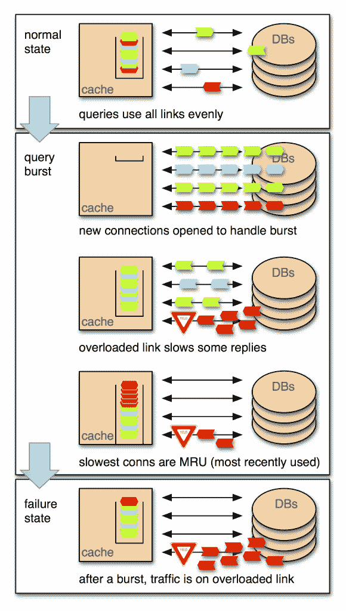

# 脸书亚稳态失效的奇怪行为

> 原文：<https://thenewstack.io/the-strange-behaviors-of-facebooks-metastable-failures/>

如果云真的像惠普最近所说的那样成为了计算机，那么困扰第一代和第二代计算机的工程问题可能会在第一代和第二代云数据中心中出现。我们手中的设备的行为动态将会扩展，转化为遍布全球的设备。

亚稳态故障是一个术语，脸书工程师 Nathan Bronson 刚刚将其重新引入数据中心工程师的词汇中，特别是那些在互联网规模的系统上工作的工程师。它是一种不可预测的结果状态，由状态实际上处于转变中的事物引起——在二进制系统中，如开关，这意味着一种状态和另一种状态之间的中间状态。

## 重拍

对于许多类型的电子设备，为了使逻辑运算的结果遵循预测的顺序，它们必须同步发生。时钟控制着事件的节奏，可能会发生变化的状态会一直保持到下一个“时钟边缘”，就像知道管弦乐队的指挥何时将手放在“向下”的节拍上。这对实时传感器来说是一个挑战，因为它不能在每一个事件发生时都绝对可靠地发出信号；它必须等待时钟边沿，以便设置正常。

一些最初的计算机，尤其是在 20 世纪 50 年代和 60 年代初，很难实现这种完美的同步。因此，工程师会看到异常的结果——不仅如此，还会看到一连串的后续结果和奇怪行为的持续模式，这需要完全关闭并重新启动。原因最终被归结为工程师所谓的亚稳定性:一个电路触发的一系列操作的结果，该电路的逻辑状态在 0 和 1 之间，而它不应该在 0 和 1 之间。

你可以想象，当工程师们考虑阿波罗任务中制导计算机可能的亚稳态时，他们有多么恐惧。

在微处理器设计中，由于亚稳态可能发生，工程师已经建立了仲裁器来检测这种情况，并预先阻止其可能的后果。这种仲裁自 20 世纪 70 年代以来一直在成功地进行，在整个 x86 时代都是如此，所以我们从来没有把亚稳定性作为一个感兴趣的随意话题公开讨论过。

直到现在。云数据中心和互联网规模的系统是现代的电子设备。我们有服务器，而不是逻辑电路。但是这些系统的工程师必须处理时间问题，确保某些事件同步发生。他们使用的有线传输协议并不特别适合这项任务:TCP/IP 是一种最佳猜测系统，用于向下游转发数据包，并让接收者在接收端整理混乱。关于信息将如何或何时被接收，这并不比铜线关于它所携带的任何电子的命运更智能。

因此，正面面对亚稳态新浪潮的不是英特尔或 ARM，而是脸书、谷歌和亚马逊。他们是第一次面对新行为问题的人。可以理解的是，他们中很少有人认识到某种特殊的历史相似性。

## 简单的心理模型

除了内森·布朗森。布朗森毕业于斯坦福大学，曾于 90 年代初在国防分析研究所实习，他在 LinkedIn 上的个人资料反映了他的精神状态:

我相信，要解决大问题，我们必须将复杂性分解成每个都适合某人大脑的部分，而这种分解的关键是创造将复杂性隐藏在简单心智模型背后的抽象概念。

布朗森适应手头任务的模型是亚稳态。在上个月的一篇脸书公司的博客文章中，他描述了脸书在其系统试图排除交通瓶颈的可能性时所目睹的行为。像许多大规模网络一样，它求助于链路聚合——并行使用多条链路实现更广泛的交换机到交换机连接，就像开辟额外的通道一样。正如您所想象的，要使并行操作可靠地发生，它们需要一点同步性。但他们并不总是能做到这一点，因为在 TCP/IP 中——这是一种异步设计——没有模拟时钟电路，这是一个小型设备中充当导体的部分。

Bronson 报告说，在两年多的时间里，脸书的聚合链路趋于过载，这时散列会将数据包聚合成一条链路。不可避免地，数据包会被丢弃。布朗森认为这种行为是亚稳态的一种形式，它产生的异常结果与简单的同步逻辑器件产生的异常结果相同。

具体来说，当脸书的 MySQL 数据库之间的流量与其社交图缓存服务器(脸书称之为“道”)交换时，就会观察到这些结果。[你有没有可能觉得这个看起来很熟悉](https://thenewstack.io/an-amazon-anomaly-that-metastasized-into-a-server-eating-monster/)？

月复一月的停滞不前让布朗森和其他脸书工程师不得不假装这个异常是精心策划的恶意利用的产物。他们推断，如果这种行为不是巧合，而是有意为之，那么它是出于什么目的而精心制作的呢？一个真正的恶意利用会产生关于他们攻击的系统的信息行为，并且利用的核心会以同样的方式响应它所学到的东西。

正如布朗森所讲述的那样，道的“利用”所产生的是潜伏，其模式充当了信号。寻找这种延迟模式的恶意利用可以研究它们模式中的规律性，不仅确定产生它们的链路是否拥塞，而且确定拥塞的程度。对于有意导致他们所目睹的结果的利用，可以想象得出的结论是，不生成相同信号的任何其他链路都不拥塞，因此将其关闭，以增加拥塞链路的负担。

## 触发器

工程师们随后意识到，他们自己的程序正是这样做的。出于好意，它被设计为在之前的 10 秒内打开尽可能多的链接。如果用户的个人图表数据不在缓存中，可能需要对数据库进行大约 100 次查询来刷新缓存。

布朗森写道:“这引发了一场查询竞赛。经过拥塞链路的查询将可靠地输掉竞争，即使只差几毫秒。这种损失使得它们在被放回池中时是最近使用的。其效果是，在查询突发期间，我们将所有的连接放在最上面。”

解决方案简单而有效:团队从最近使用的连接池(MRU)切换到最近最少使用的连接池(LRU)。试图用 LRU 方案重现异常行为没有成功。

随着今天的通信网络继续展现出昨天的电子设备的奇怪行为特征，这是互联网规模的开发人员将发现他们自己从这一点开始不断进行的重新设计工作。这是我们希望与脸书直接谈论更多的工作类型。脸书拒绝了我们对这个话题进行更深入的采访…展示的模式也让我们想起了过去的工程师，他们在意识到率先向市场推出真正的解决方案给了他们竞争优势后，对自己的工作变得更加沉默。这种沉默最终会催生个人电脑时代，工程师们可以更加自由地公开交流。

特征图片:[苏里安·索赛](https://www.flickr.com/photos/ssoosay/)的《大脑中的连接》由 [CC 授权 2.0](https://creativecommons.org/licenses/by/2.0/) 。

<svg xmlns:xlink="http://www.w3.org/1999/xlink" viewBox="0 0 68 31" version="1.1"><title>Group</title> <desc>Created with Sketch.</desc></svg>