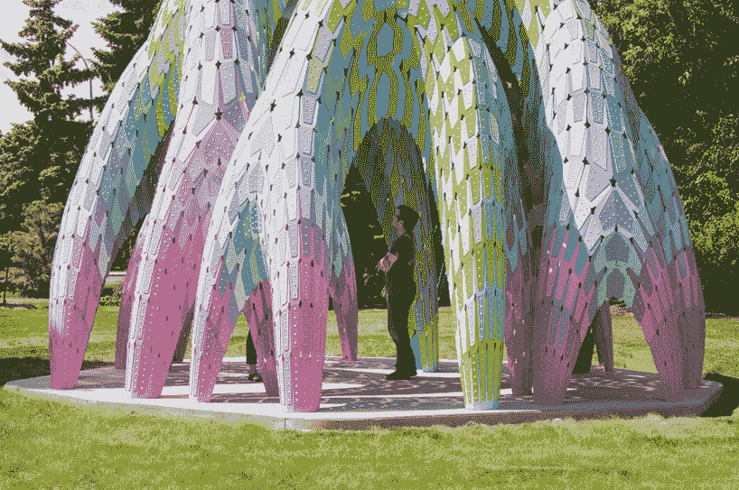
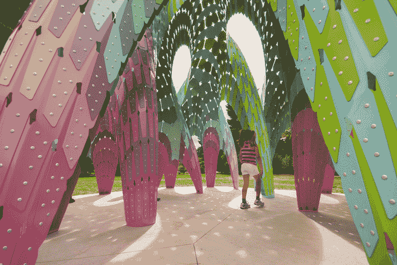
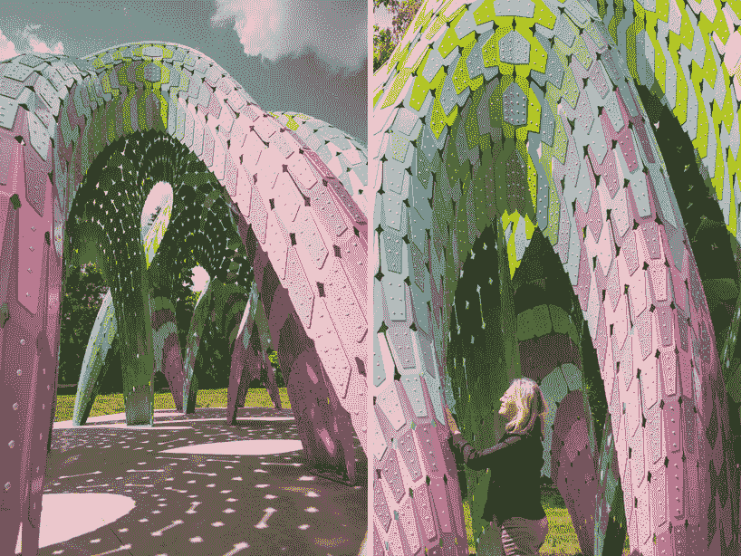
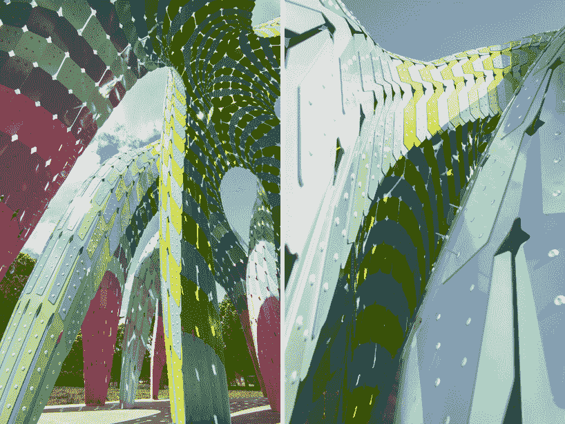
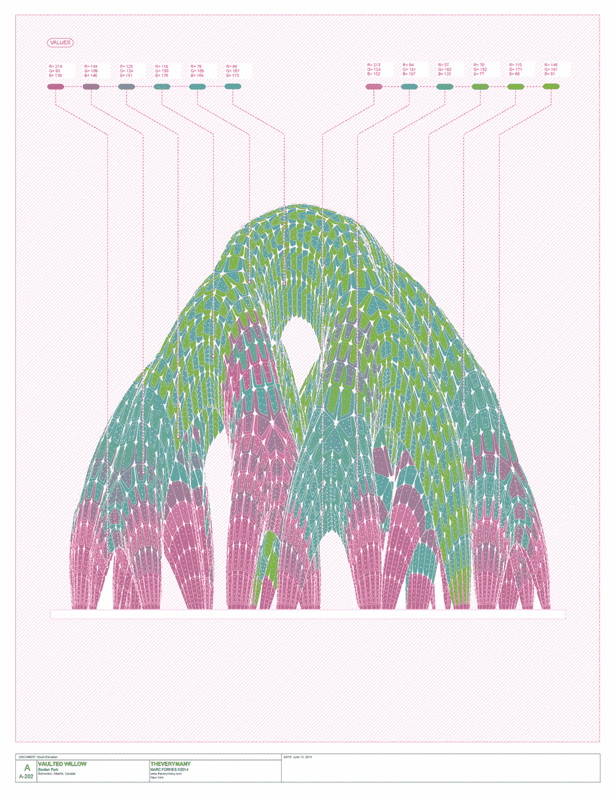
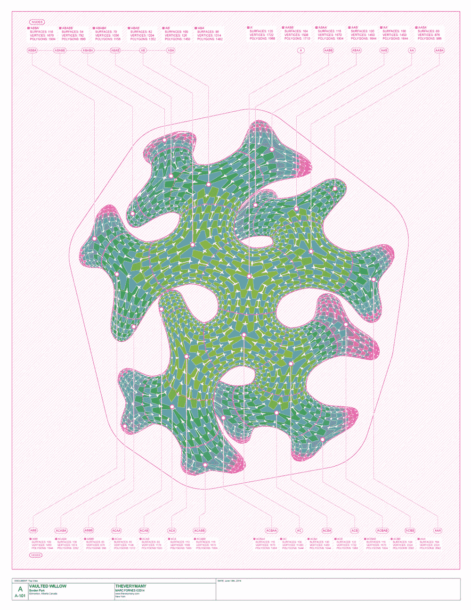
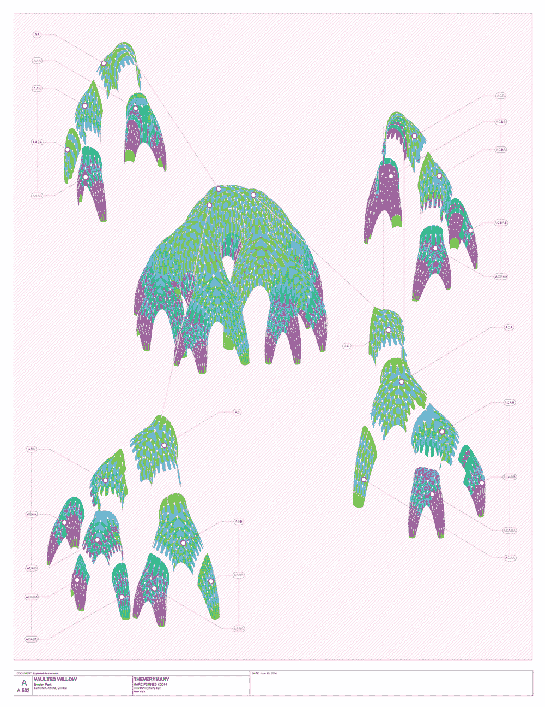

# 令人惊叹的自动更新建筑的生物形态

> 原文：<https://thenewstack.io/the-stunning-bio-forms-of-auto-updated-architecture/>

二十年前，数字生成的建筑被轻蔑地称为“[【blob itecture】](https://en.wikipedia.org/wiki/Blobitecture)”，指的是看起来几乎是由软件随机创建的有机的、类似变形虫的形式。然而今天，由于技术、制造和材料科学方面的持续创新，计算机设计正在走向成熟，这些创新正在汇聚成数字辅助设计的复兴。

参数化设计(也称为[生成设计或计算设计](http://immaginoteca.com/parametric-vs-computational-design/))正在改变建筑的制作方式以及与环境的互动方式。这[不是一个新概念](http://www.danieldavis.com/a-history-of-parametric/)，但是目前使用的[参数化设计软件](https://en.wikipedia.org/wiki/Parametric_design#Software)、算法和[数字制造](https://thenewstack.io/emerging-objects-3d-printing-pioneers-will-build-houses-salt/)现在被用来以以前不可能的速度和精度生成新的形式，或者太繁琐而无法进行。曾经有人 [说过](http://www.cadalyst.com/cad/building-design/generative-design-is-changing-face-architecture-12948) 生成式设计不是设计一个建筑，而是设计将生成这个建筑的底层系统和关系。

当软件中的一个参数发生变化时，预设的关联规则的整个系统会自动更新以作出响应，因此在构建之前，可以针对任何数量的因素快速调整整个设计，以实现所需的形式或提高声学、能效等方面的性能。各种数据集之间的复杂关系可以被操纵，从而产生自由流动的形式，看起来几乎模仿了自然界中的现象。

布鲁克林工作室 [TheVeryMany](http://theverymany.com/) 的法国出生的马克·福内斯的作品就是一个例子。这个小型设计工作室专注于几何形状复杂的自支撑结构的计算设计和数字制造，这些结构由数千个扁平部件连接在一起，形成有机弯曲的表面。工作室使用像 [Rhino3D](https://www.rhino3d.com/) 这样的软件和 Python 编程来创建定制的计算协议，在一个最终将“结构、皮肤和装饰定义为一个统一系统”的过程中玩“结构找形和描述性几何”(有趣的是，工作室的大部分作品都可以用[写成文本文件](http://www.core77.com/posts/32359/Tech-Specs-Marc-Fornes-Founder-of-THEVERYMANY)。)

在一次采访中，福内斯解释了技术是如何改变建筑的:“我认为改变的是事物的速度。十年前你可以用数控铣床加工东西，但这需要时间，因为机器性能较差。现在你可以去切割，比如说，100，000 个零件——我们有时会为我们的一些项目这样做——眨眼之间。几年前，需要六周才能完成的安装现在只需要三四天。所以这改变了你看待这个项目的方式。”

但他说，这不仅仅是一个帮助建筑师建造这些引人注目的建筑的项目。

> 另一件发生变化的事情是，在 2000 年左右，有一种试图获得无所不能的[昂贵]软件的精神。…在过去的五年或十年里，人们已经意识到这不是工具的问题，而是各种应用程序之间的相互交流。我看到现在在我们这个领域的年轻人——他们不再专注于一件事，他们只是从一个平台跳到另一个平台，他们找到了一种非常快速地完成事情的方法。

工作室的作品以实验装置的形式出现在画廊、弹出式商店和公园的亭子里。最近的一件作品，拱形柳树，是埃德蒙顿艺术委员会为当地公园委托的。展馆由 721 个单独的铝“木瓦”组成，这些木瓦被组装成一种独特的形式，具有巨大的支撑腿，这些腿向地面分叉并变窄，增强了刚度，并有效地分布向下的结构力。

拱形柳树是该工作室持续研究自立、轻质[单体](https://en.wikipedia.org/wiki/Monocoque)外壳的最新迭代，由数百到数千块组装而成。展馆的整体弯曲悬链线形式沿不同的平面“膨胀”以产生双曲率，这在本质上创造了刚度，而不需要支撑结构，同时优化了预期的力和雪和风载荷。该结构由各种类型的连接器的动态网络保持在一起，由长度、角度约束和强度等参数确定。

各种特征通过计算确定，如瓦片之间的间隙密度。这些开口的频率和尺寸随着高度的增加而增加，以允许光线通过，也因为靠近顶部的结构强度需要较少的材料。铆钉密度、重叠标签的大小和颜色图案等细节都是由计算协议驱动的，从而创造出一个看起来像公园本身的神游、准自然的产物。

在过去的几年里，参数化和计算化设计取得了长足的进步。建筑看起来不像无定形的斑点，更有轮廓，有时甚至是生物模仿自然的美丽形式和模式。参数化技术与设计圈的不断融合正在挑战设计师在未来将扮演的角色:他们会变得更像技术专家和程序员，而不像昨天的理想主义者、勒·柯布西耶和弗兰克·劳埃德·赖特吗？目前还不清楚，但目前看来，这种工具提供了一种更快的方法来测试，评估和完善设计，而不是取代设计师本身。

虽然我们的传统建筑不会很快消失，但像拱形柳树这样的结构正在推动一个可能被认为是避难所的信封。诚然，许多这些自由流动的有机形式仍然很难转化为封闭的空间——有分区、隔热层和功能性宜居建筑所需的所有系统的空间——但像这样的实验项目正在探索巨大的可能性，如果我们的建筑环境由数据驱动和数字制造，它可能会是什么样子。在 [TheVeryMany](http://theverymany.com/) 查看更多信息。

许多人上传的图片。

<svg xmlns:xlink="http://www.w3.org/1999/xlink" viewBox="0 0 68 31" version="1.1"><title>Group</title> <desc>Created with Sketch.</desc></svg>