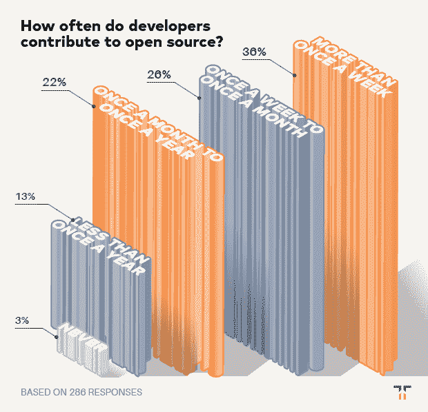
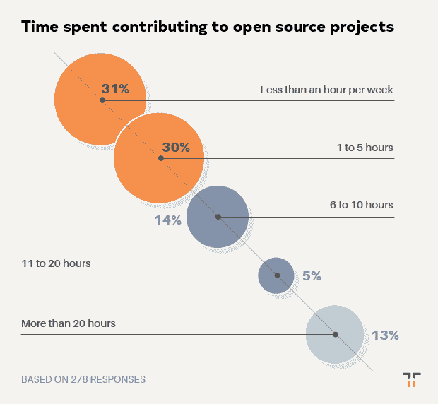

# 关于有多少开发人员对开源做出贡献的惊人事实

> 原文：<https://thenewstack.io/the-surprising-truth-about-how-many-developers-contribute-to-open-source/>

Tidelift 赞助了这篇文章。

*2019 年 6 月，Tidelift 和 New Stack 联合开展了一项专业软件开发人员调查。近 400 人回答了他们今天如何使用开源软件，是什么阻碍了他们，以及什么工具和策略可以帮助他们更有效地使用它。特别是，通过这次调查，我们有兴趣了解一个[管理的开源战略](/how-managed-open-source-boosts-developer-productivity-and-saves-money/)如何帮助开发者回收时间，加快开发，并降低风险。*

 [克里斯·格拉姆

克里斯是 Tidelift 的营销主管。Chris 在创建开源技术公司方面拥有超过 20 年的经验，包括在 Red Hat 和技术品牌代理 New Kind 各工作了 10 年，在那里他帮助创建了 Ansible、NGINX 和 Anaconda 等品牌。](https://tidelift.com/) 

在本帖中，我们分享八个关键发现中的第六个。如果你不想等待剩下的结果，你可以点击下面的链接下载完整的调查报告。

发现#6:大多数开发人员为开源项目做贡献，如果他们的工作得到合理的补偿，许多人会做得更多。

我们想通过这个调查来了解开发人员如何为开源项目做出贡献。首先，我们询问了受访者平均在开源贡献上投入了多少时间。

我们惊讶地发现，大多数受访者(84%)认为自己是积极的贡献者，只有 13%的人说他们每年为开源项目贡献不到一次，只有 3%的人说他们从不为开源项目贡献。

这一高比例是样本偏差的结果——我们最初的资格问题是问受访者是否在工作中使用开源软件构建应用程序，所以所有受访者都已经是开源用户了。

我们仍然相信，这是一个有趣而有用的发现，只存在于那些在工作中使用开源构建应用程序的开发人员中。它表明开源的用户和创造者之间没有严格的界限，而是一个连续体，大多数开发者既是创造者又是用户，有些人更接近用户-创造者的一端或另一端。

接下来，我们询问他们每周为开源贡献多少时间。正如你所料，结果差异很大。受访者平均每周花 6 个多小时投稿，尽管大多数人花的时间比这少。

其他几个问题深入探讨了这个主题的更多细节。五分之四的受访者表示，如果他们的工作得到合理补偿，他们会在工作之外花更多时间做出贡献，25%的人估计他们每周会多花 20 个小时或更多时间。很明显，如果有更好的方式来补偿贡献者，他们会更愿意为开源工作。

当被问及作为工作的一部分，他们贡献给开源的时间大约占多少时，平均回答是 40%。贡献少于这个数量的人报告说，如果他们得到公平的补偿，他们更有可能在工作之外花更多的时间参与开源项目。

这表明，为开放源码做贡献的开发人员，如果有合适的激励措施，他们可能会加强他们的开放源码工作，而这并不是他们日常工作的重要部分。我们估计，如果回答者的非工作相关的努力得到合理的补偿，每周贡献给开源的时间将增加 40%以上。

从这些数据中我们可以得出什么样的结论？现在，许多编写和维护开源组件的人都在无偿地做这项工作。然而，令人震惊的是，84%的开发人员在他们的专业工作中使用开源软件，他们认为自己是积极的开源贡献者，至少达到了每年不止一次的水平——足足有三分之一的人每周不止一次地贡献代码。如果有一种更好、更一致的方式来支付开源贡献者的工作报酬，会有更多的开发者成为项目的创造者和维护者吗？

我们相信是的。幸运的是，[管理开源模式](/how-managed-open-source-boosts-developer-productivity-and-saves-money/)很好地解决了这个问题——为开源软件的创造者和维护者提供适当的激励，让他们尽最大努力工作——甚至可能在这个过程中吸引一批新的创造者和维护者来开源！

想在一份报告中获得完整的调查结果吗？[现在就把他们带到这里](https://tidelift.com/subscription/managed-open-source-survey)。

图片由来自 Pixabay 的 Thanh Tuấn Tạ制作。

<svg xmlns:xlink="http://www.w3.org/1999/xlink" viewBox="0 0 68 31" version="1.1"><title>Group</title> <desc>Created with Sketch.</desc></svg>