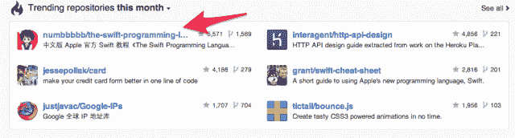
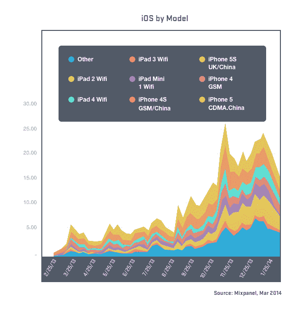

# Swift 中文编程语言是 GitHub 上最热门的回购

> 原文：<https://thenewstack.io/the-swift-programming-language-in-chinese-is-the-top-trending-repo-on-github/>

一个由北京大学学生发起的将 Swift 翻译成中文的项目现在是 GitHub 上最热门的知识库。中文的“ [Swift 编程语言](https://github.com/numbbbbb/the-swift-programming-language-in-chinese)”拥有超过 5500 颗星，仅略落后于热门在线游戏 Flappy Bird 的 [Swift 版本。](https://github.com/fullstackio/FlappySwift)

这份回购协议是由 21 岁的梁介创建的，她是北京航空航天大学的一名学生。在一次电子邮件采访中，梁说他想学 Swift，他的许多同事也想学，但他们不太懂英语。他开始开发翻译，并将项目发布到中国社交网络[新浪微博](http://us.weibo.com/gb)，人们开始加入翻译。大约有二十个人参与了这个项目，包括学生、程序员和一些小型创业公司的创始人。每一章都被一个人认领了。

翻译花了九天时间。自出版以来，该译本已被阅读 210 万次。梁说，他认为 Swift 在中国如此受欢迎有两个原因。首先，它是由苹果公司创作和出版的，在中国，苹果与卓越和美丽联系在一起。第二，Swift 看起来像很多其他语言，比如 JavaScript，Python，Ruby 等等。

> 许多人认为，在 Swift 的帮助下，我们可以更轻松地开发应用程序。没有人能否认 Swift 比 Objective-C 更容易学的事实。

对 Swift 的兴趣反映了中国 iOS 开发者群体的不断壮大以及中国开发者开发的应用数量。

苹果一直在投资中国市场。据 iMore 本月早些时候的一篇帖子称，该公司已在北京开设了一个开发商关系办公室。

现在，苹果商店中大约一半的应用程序下载来自中国，中国的应用程序只有美国的一小部分，这为苹果在中国发展市场留下了很大的空间。西方应用程序在中国也不太好翻译，这进一步推动了对本土开发的应用程序的需求。

在 WWDC，苹果首席执行官蒂姆·库克表达了他对进军中国的支持。在开发者大会上的讲话中，库克引用了他们自己的数据，据苹果内部人士称，在过去的六个月中，大约一半的 iPhone 购买者之前拥有 Android 设备。

但还不能完全确定苹果智能手机的销售情况如何。 [Mixpanel](https://mixpanel.com/blog/2013/09/10/data-snapshot-apples-world) 表示，自一月份与中国移动合作推出以来，结果喜忧参半。

截至 3 月份，中国消费者购买了更多的 iPhones，但不是最新款。然而，人们对每一个版本的兴趣都在增长。

Swift 可能会给苹果在中国带来关键的变化，尤其是在像姜和他的开发伙伴们创造的这种向导的帮助下，翻译变得更加普遍。

Flickr 图片[通过](https://www.flickr.com/photos/jon_skilling/8371382097/in/photolist-8Nqdiv-aFi4Pn-8Uo5m4-bjiKEa-8eozhu-8s61tF-92h7Am-88Jmvj-dNUQND-92dZVD-9Fy7Ag-9Fy8Dg-9FB44U-aEJ7Re-dRERQ5-dP28nE-9GvJeN-aDiyfh-9FiNN1-aEQCvX-dMV8eA-8iut3D-92e11D-aEb1nR-dKKwf6-dKR1tQ-aEeQH1-8UpNSw-8NqdAc-e4SKDe-aEfHpC-8U57co-e4GM8N-e5e7F7-8NqdKe-eDhmpu-dKKwuT-dKR2fU-dKR1eh-dKKwXc-dKR17E-dNkR5x-dPKPfY-8Nqajn-8NtiZq-8NtiNW-8Nqdez-aufjCE-9WKvVu-bNPdnM)知识共享

<svg xmlns:xlink="http://www.w3.org/1999/xlink" viewBox="0 0 68 31" version="1.1"><title>Group</title> <desc>Created with Sketch.</desc></svg>