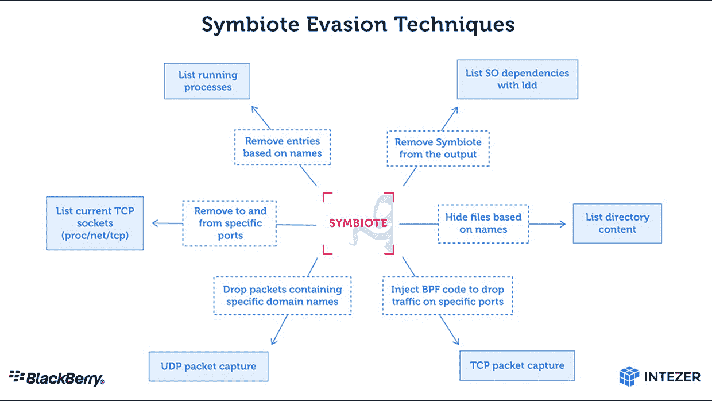

# 共生体恶意软件:我们目前所知的

> 原文：<https://thenewstack.io/the-symbiote-malware-what-we-know-so-far/>

更广为人知的是，扩展的 Berkeley 包过滤器或 eBPF 被认为是 T2 可观测性的瑞士军刀。eBPF 是一种 Linux 内核技术，它允许程序在不改变内核源代码的情况下运行，并为一系列云原生工具提供动力，如 [Falco、Inspektor Gadget、Hubble 和 Cilium](https://thenewstack.io/ebpf-tools-an-overview-of-falco-inspektor-gadget-hubble-and-cilium/) 。

几个月前，英特尔公司的安全研究员 Joakim Kennedy 和黑莓研究和情报团队[发现了一种寄生恶意软件](https://blogs.blackberry.com/en/2022/06/symbiote-a-new-nearly-impossible-to-detect-linux-threat)，它会影响 Linux 操作系统，并使用 eBPF 隐藏受感染机器上的恶意网络流量。这是我们目前所知的。

## 名称又能代表什么呢

这种恶意软件被恰当地命名为 Symbiote，它需要感染其他正在运行的进程才能对被感染的机器造成任何损害。不同于其他形式的恶意软件，它们通常以可执行文件的形式出现，Symbiote 是一个共享的对象库。

一旦它感染了正在运行的进程，就会为恶意参与者提供 rootkit 功能、获取凭据的能力以及对机器的远程访问能力。

## Symbiote 恶意软件是如何工作的？

Symbiote 用来感染机器的攻击技术被称为[动态链接器劫持](https://attack.mitre.org/techniques/T1574/006/)。在这种技术中，恶意软件劫持动态链接器用来加载共享库的环境变量。这考虑到了加载期间的优先级，因为在环境变量中指定的库在具有相同函数名的系统库之前被加载。

然后，恶意软件能够挂钩 **libc** 和 **libpcap** 函数，并改变或增强操作系统和其上运行的应用程序的行为。这是通过截取各种组件之间传递的函数调用、消息或事件来实现的。[挂钩](https://en.wikipedia.org/wiki/Hooking)还使其能够执行各种操作来隐藏其存在，如隐藏寄生进程、隐藏与恶意软件一起部署的文件等等。

一旦与 eBPF 连接，共生体是如何逃避检测的。资料来源:英特尔和黑莓研究和智能团队。

## eBPF 是如何参与的？

Berkeley 包过滤技术最初是作为一种手段引入的，通过在 BSD Unix 系统中实现内核包过滤来最大限度地减少用户空间中不需要的网络包拷贝。eBPF 通常用于网络分析，与其他机制相比，它提供了性能优势，因为它通过让内核直接执行过滤操作，避免了用户空间和 Linux 内核之间的上下文切换。

Symbiote 通过劫持注入的包过滤字节码来利用 eBPF。它挂钩 libc 函数 setsockopt，然后在应用程序提供的 eBPF 代码之前添加自己的字节码，以过滤掉可能暴露其活动的结果。作为所进行的研究的一部分而分析的字节码表明，它要么是手写的，要么是通过修补编译器生成的字节码而获得的。

## 共生体影响谁？

对 Symbiote 的最早检测可以追溯到 11 月，它似乎是针对拉丁美洲的金融部门而设计的。由于恶意软件的高度隐蔽性，感染不容易被检测到，并且很可能在雷达下飞行。

肯尼迪和黑莓团队的研究还指出，没有足够的证据来确定该恶意软件是否被用于广谱和高度针对性的攻击。

随着大型且有价值的企业网络中技术使用的增加，攻击媒介的数量必然会增加。一个典型的例子是普华永道的研究人员在 5 月份发现的 BPFDoor 恶意软件，它使用 BPF 来监听进出的流量。

## 如何修复共生体

虽然检测可能很困难，但研究建议使用网络遥测来发现任何异常。作为预防性最佳实践，它还提出了安全工具(如防病毒软件和端点检测和响应)的静态链接。

<svg xmlns:xlink="http://www.w3.org/1999/xlink" viewBox="0 0 68 31" version="1.1"><title>Group</title> <desc>Created with Sketch.</desc></svg>