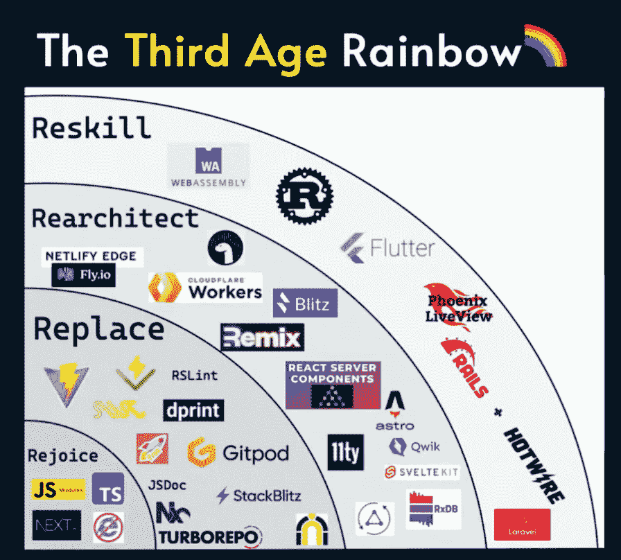

# JavaScript 的第三个时代:Reactathon 的更新

> 原文：<https://thenewstack.io/the-third-age-of-javascript-an-update-from-reactathon/>

本周，会议在旧金山户外举行。其中一个亮点是 [Shawn Swyx Wang](https://twitter.com/swyx) 的快速演示，继续他的论点，我们正处于 JavaScript 的第三个时代。他在 2020 年开始写关于这个[的博客，这一年他精确地指出是“第三时代”的开始今年，第三时代的第三年，他在 Reactathon 提供了一个更新。](https://www.swyx.io/js-third-age/)

来源:Shawn Swyx Wang

王的观点之一是，静态端生成(SSG)是“基本死亡”，现在有一个“服务器端渲染的巨大需求。”他还注意到了一种向增量渲染和边缘路由发展的趋势。并非巧合的是，他指出“Next.js 赢得如此艰难”是支持这些趋势的框架。

展望未来，王预测，到 21 世纪 20 年代末，JavaScript 将出现“再技能化”。虽然他没有具体说明什么可能取代 JavaScript，但他确实提到 WebAssembly 目前正处于“第一个时代”。

他还评论说，这十年的一个“登月”项目可能是收回“开放网络”，他说在过去十年里，开放网络已经让位于本地移动应用程序。

[https://www.youtube.com/embed/Ck-e3hd3pKw?start=19813&feature=oembed](https://www.youtube.com/embed/Ck-e3hd3pKw?start=19813&feature=oembed)

视频

你可以在上面的活动视频中看到王对自己的完整介绍(他在大约 5:30 分左右上台)。

## 本周发展

### 不使用 React 的理由

谷歌工程师杰克·富兰克林(Jack Franklin)写了一篇名为“[为什么我不会错过 React:一个关于使用平台](https://www.jackfranklin.co.uk/blog/working-with-react-and-the-web-platform/)的故事”的博客文章。他所指的“平台”当然是网络浏览器。撇开富兰克林在谷歌 Chrome DevTools 团队工作时的偏见不谈，他为“使用该平台”提出了一些令人信服的论点。

Franklin 提到的一个例子是，您不再需要使用 React 来构建表单。他说“这曾经是 React 的一个合理的理由，因为除了原始的功能之外，浏览器几乎没有提供给我们什么。”然而，他继续说，“在最近的一个兼职项目中，我能够使用 100%的原生功能来构建具有可靠用户体验的表单。”富兰克林承认，这“比使用 npm 的库为我完成所有这些工作要稍微多一点”，但“我能够获得相同的结果，自己编写了几行额外的代码，但没有因为额外的依赖而拖累我的应用程序。”

总之，Franklin 认识到对他来说抛弃 React 很容易，因为他在工作中只需要担心一个浏览器。许多其他开发人员必须确保他们工作中的跨浏览器兼容性，React 有助于实现这一点。尽管如此，他还是希望我们很快能够“将框架之外的东西视为默认的起点”

不服气？读读威廉·肯尼迪的这篇反驳，自己决定吧(一定要点击链接！):

### Babylon.js 5.0 发布

微软宣布了其基于网络的 3D 引擎 Babylon.js 的最新版本，称其“为每个人带来了下一代网络渲染技术。”在[我自己写的 Babylon.js](https://thenewstack.io/babylon-js-hints-that-microsoft-metaverse-will-be-web-based/) 中，我注意到它让 3D 开发变得出奇的简单——我把 [Babylon Playground](https://playground.babylonjs.com/) 工具比作微软的 FrontPage，但是没有元宇宙。

也许 5.0 中最令人印象深刻的新特性是它对 WebGPU 的支持，这是一种新兴的 web 到 GPU 通信的 web 标准。Babylon.js 团队写道:“我们从一开始就积极参与 WebGPU 工作组，并自豪地宣布 Babylon.js 5.0 提供对 WebGPU 的全面支持。”

[https://www.youtube.com/embed/zELYw2qEUjI?feature=oembed](https://www.youtube.com/embed/zELYw2qEUjI?feature=oembed)

视频

### Firefox 达到 100.0 版本

历史悠久的开源浏览器 Firefox [本周发布了第 100 个版本](https://www.mozilla.org/en-US/firefox/100.0/releasenotes/)，距离 1.0 于 2004 年 11 月推出已经过去了将近 18 年。

虽然 Firefox 的持续存在值得称赞，但近年来其功能和整体覆盖范围已经远远落后于谷歌的开源 Chromium 浏览器。此外，新的浏览器已经出现，具有吸引现代用户的特定功能，如 JavaScript 发明者 Brendan Eich 的 Brave browser——一种基于 Chromium 的加密货币和注重隐私的网络浏览器。

关于第 100 个版本的 [Slashdot 线程](https://news.slashdot.org/story/22/05/03/1720240/mozilla-celebrates-the-release-of-firefox-100#comments)充满了微小的批评，尽管[这位用户](https://news.slashdot.org/comments.pl?sid=21266454&cid=62499748)很好地总结了为什么 Firefox 仍然存在的重要性:“Firefox 是我在桌面和移动设备上的主要浏览器。我们需要有一个可行的 Chrome 竞争对手，以避免单一文化，避免谷歌完全控制网络标准。”

### 本周推特

如何适应即将到来的元宇宙…

<svg xmlns:xlink="http://www.w3.org/1999/xlink" viewBox="0 0 68 31" version="1.1"><title>Group</title> <desc>Created with Sketch.</desc></svg>