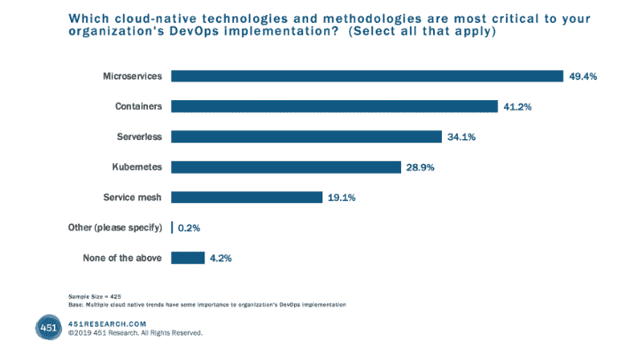
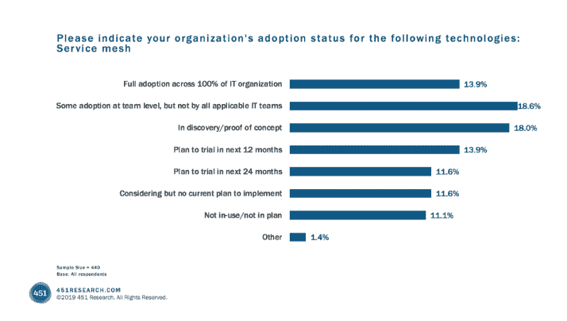

# 2020 年三大服务网格发展

> 原文：<https://thenewstack.io/the-top-3-service-mesh-developments-in-2020/>

 [扎克·乔里

扎克是一名营销领导者，擅长技术、SaaS 和开源。在加入 Aspen Mesh 担任营销主管之前，他曾在 IBM 技术部门担任不同的产品和营销职务。当他不考虑服务网格如何解决微服务运行时的挑战时，他的思维通常会转向满是鳟鱼的蓝色小线。](https://aspenmesh.io/) 

2019 年，我们看到服务网格超越了实验性技术，成为一种解决方案，组织开始了解到这是任何成功的 Kubernetes 部署的基本构建模块。大大小小的公司开始大规模采用服务网格。随着第二波采纳者看到前沿采纳者试用服务网格技术并取得成功，他们也开始评估服务网格，以解决 Kubernetes 留下的挑战。

随着服务网格的日益普及，2019 年提供了一个蓬勃发展的服务网格市场。Istio[和](https://istio.io/) [Linkerd](https://linkerd.io/) 继续向前发展，围绕 Istio 的工具和供应商生态系统在一年中几乎增长了两倍。但是也有许多新的参与者进入市场，提供了解决第七层网络挑战的替代方法。网格，如库马和梅什提供的网格，已经出现，以提供不同的方法来服务网格，以解决各种边缘用例。我们还看到了像[服务网格接口规范](https://smi-spec.io/)和[网格网](https://layer5.io/meshery/)这样的工具的引入，试图参与一个由于巨大的机会而蓬勃发展的早期市场，但尚未收缩，而主要参与者正在等待市场首先选择赢家。类似[网络服务网格](https://networkservicemesh.io/)的相邻项目将服务网格原则带到了堆栈的较低层。

虽然在服务网格领域仍有许多问题有待解决，但服务网格作为一种技术模式的价值是显而易见的，正如最近发布的由 [451 Research](https://451research.com/) 进行的调查“企业之声:DevOps”所证明的那样。

虽然仍是一个新兴市场，但对采用服务网格作为关键基础设施的兴趣和计划正在迅速赶上 Kubernetes 和 containers。

## **2020 年服务网格:三大发展**

1.  **对服务网络的需求快速增长**

Kubernetes 正在爆炸。它已经成为企业和绿地部署中容器编排的首选。确实存在导致棕色地带落后的挑战，但这些挑战正在被探索和解决。是的，Kubernetes 是一项新兴技术。是的，世界大部分地区还需要数年时间才能采用它。但是很明显，Kubernetes 已经成为——并将继续成为——软件世界的主导力量。

如果 Kubernetes 获胜，并且基于 Kubernetes 的应用程序的规模和复杂性将会增加，那么服务网格将成为有效管理这些应用程序所必需的一个转折点。

2.  **Istio 将很难被击败**

市场上可能还有一些其他竞争者，但我们将在 2020 年看到市场整合开始。从长远来看，我们很可能会看到一个类似 Kubernetes 的情况，一个赢家出现，公司开始围绕这个赢家进行标准化。可以想象，服务网格可能不是解决第 7 层网络问题的技术模式。但是如果真的发生了，Istio 很有可能成为事实上的服务网。对此有许多支持和反对的观点，但最有说服力的因素是围绕 Istio 发展的生态系统。几乎每个主要的软件供应商都有一个 Istio 解决方案或集成，并且 Istio 开源社区在[活动和贡献](https://github.com/istio/istio)方面远远超过任何其他社区。

3.  **用例，用例，用例**

2019 年是服务网格解决问题的一年。早期采用者从服务网格中选择他们想要的前两到三项功能，然后一头扎进去。在过去的一年中，三个最常见的解决方案是:

*   mTLS。
*   可观察性。
*   交通管理。

2020 年将是核心服务网格用例出现的一年，并被用作下一波采用者实现服务网格解决方案的模型。

我们的客户要求的前三种使用情形是:

*   可观察性，以更好地了解集群状态，快速调试和更深入地了解系统，从而构建更具弹性和稳定性的系统向前发展。
*   利用服务网格策略来驱动预期的应用程序行为。
*   实施和证明安全和合规的环境。
*   WebAssembly 等技术使得将现有功能分发到数据平面侧柜以及构建新的智能和可编程性成为可能。

如果您已经在使用服务网格，那么您会理解它带来的价值。如果您正在考虑服务网格，请密切关注这一领域，用例的数量将使现实世界的价值主张在未来一年更加清晰。在 Aspen Mesh，我们总是乐于谈论服务网格、实施的最佳途径以及我们的客户如何解决问题。请随意[伸出](mailto:%20hello@aspenmesh.io)！

<svg xmlns:xlink="http://www.w3.org/1999/xlink" viewBox="0 0 68 31" version="1.1"><title>Group</title> <desc>Created with Sketch.</desc></svg>