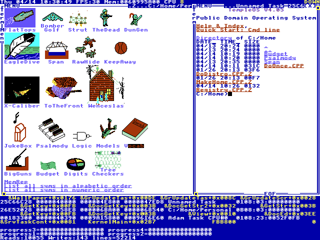
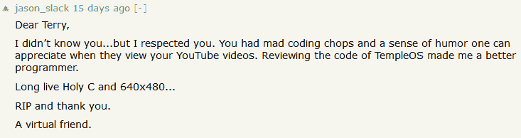

# 特里·戴维斯的麻烦遗产，“上帝的孤独程序员”

> 原文：<https://thenewstack.io/the-troubled-legacy-of-terry-davis-gods-lonely-programmer/>

他过着奇特而又鼓舞人心的生活。26 年前，年轻的特里·戴维斯以 3.63 的平均绩点从亚利桑那州立大学毕业。他的 SAT 成绩是 1440 分。他于 1990 年在 Ticketmaster 开始了他的 IT 职业生涯，在该公司的 VAX 操作系统上工作，但[开始与精神健康问题](https://motherboard.vice.com/en_us/article/wnj43x/gods-lonely-programmer)作斗争，这导致他去了精神病医院——短暂地，进了监狱——直到他最终被诊断患有精神分裂症。很快他就和父母住在一起，领取社会保障金。

在接下来的 12 年里，他建立了自己的操作系统，写了超过 100，000 行代码，因为他相信上帝让他这么做。

“它有一个飞行模拟器，一个编译器，内核，编辑器，”戴维斯在他的许多关于 LoseThos(他后来改名为 TempleOS)的在线视频中吹嘘道。“它甚至还有`grep`。它有一个精灵编辑器，一个 3D 网格创建器……”作为项目的一部分，戴维斯甚至创造了一种原始的编程语言——一种他命名为“HolyC”的 C 语言变体

当他在网上公布他的创作时，反应大多是同情的。TechRepublic 称他的操作系统“证明了一个展示其技术实力的人的奉献和热情。[不需要再多什么了](https://www.techrepublic.com/blog/software-engineer/templeos-an-educational-tool-for-programming-experiments/)。

他们指出，这是为了教育，特里记得他的老准将 64 的方式。

戴维斯可能很难相处，他的精神分裂症似乎会在他的许多在线评论中夹杂种族主义和恐同的绰号。OSNews 称他为“[一个有争议的人物](http://www.osnews.com/story/30710/Creator_of_TempleOS_Terry_Davis_has_passed_away)……因为他对 OSNews 的读者和工作人员难以理解的咆哮和粗鲁的风格。我们最终不得不禁止他，但我们当时的编辑克罗克·卡门在 2010 年与他合作，不顾他的禁令发表了一篇关于他的操作系统的文章。

“我很高兴 LoseThos 这样的操作系统仍然存在，”卡门写道，“因为它表明计算仍然可以是一种爱好；为什么现在每个人都这么严肃？如果我想编写一个使用解释性舞蹈作为输入法的操作系统，我应该被允许这样做，让苹果这样的公司见鬼去吧。”

这是一个编程网站如何试图找到必要的耐心和理解来适应戴维斯的例子——也许是因为他们认为他是自己人。Motherboard 称之为 Terry " [上帝的孤独程序员](https://motherboard.vice.com/en_us/article/wnj43x/gods-lonely-programmer)"，描述了这个项目是如何出现在创建它的人面前的。“特里·戴维斯为这个世界提供了一座圣殿，供奉着一位只对他说话的神，但他仍在等待其他人聆听。”

这篇文笔优美的文章在黑客新闻上吸引了超过 800 张[的赞成票，以及许多同情的评论。“因为这场病，他的生活很不如意。我希望他保持安全，并得到他需要的所有照顾。”](https://news.ycombinator.com/item?id=8658283)

另一个人描述了受到启发去了解更多关于戴维斯的故事，然后是关于精神分裂症，他写道“我也开始更好地理解一个朋友的精神分裂症亲属。我读过关于精神分裂症和艺术交叉的报道，但不明白它是什么，它是什么样的，直到我目睹了精神分裂症与它的交叉，在这一点上，同情、钦佩和着迷的大门突然敞开了。”

八个月前，他的在线观众注意到[戴维斯变得](https://www.reddit.com/r/Drama/comments/7218gh/templeos_creator_is_now_homeless/) [无家可归](https://news.ycombinator.com/item?id=16105043)。

一位朋友后来告诉当地一家报纸，戴维斯拒绝药物治疗，因为他认为这会扼杀他的创造力。一位临床心理学家甚至说戴维斯宁愿无家可归也不愿住院。

“在他无家可归期间，他的粉丝帮助了他，给他带来了生活用品，”报纸报道。"但是他拒绝了包括亚特兰大和休斯顿的粉丝提供的住房."当地警方表示，他们从未对戴维斯有过任何投诉——直到他在铁轨上行走时被火车撞了的那个晚上。

他们把他描述为一个过客。

## 波特兰以东 90 英里

内塔·塞西尔为达拉斯纪事报报道了这条新闻，达拉斯纪事报是俄勒冈州达拉斯小镇的报纸。她周四告诉我们，这是一个与众不同的故事。“事实上，接到一个电话，然后是另一个电话，然后是更多的电话，然后是来自澳大利亚的某个家伙的消息，这真是太不可思议了。这就像，'哦，我的上帝。这家伙在全世界都有追随者！“人们还称她为编辑。他们甚至给当地警察局打了电话。

他们希望关于戴维斯死亡的报道只是网上的谣言。他们确定真的是他吗？内塔说毫无疑问。“我看过警方的报告——他的名字、年龄、家乡等等。我几乎认为我应该发布一个截图，让人们相信它，但我们没有走那么远。”

接下来发生的事情有些感人。“我回了电话，和一些人聊了聊。他们中的一些人在计算机领域，所以他们非常清楚他在那里的成就。另一个家伙不一定是电脑专家，但他就是*喜欢*这个家伙。他只是喜欢这个男人。有趣的是，有人出于不同的原因跟踪他。”

“我和三四个人谈过，他们每个人都对他的成就提供了一些信息，”她说。

塞西尔说，她“直到一个来自澳大利亚的家伙打电话给约翰·麦科尔，才意识到他的成就。他把这比作一个人独自建造摩天大楼。这是我作为一个外行人欣赏他的成就的一种方式…

“有趣的是，那个来自澳大利亚的家伙说他和他谈论工作——他和他谈论电脑——当他谈论电脑时，他总是很清晰。他只是从来没有表现出精神分裂的一面，不稳定的一面——他被批评使用种族诽谤的一面。

"当他谈论电脑时，他不是这样的."

她开始写一个后续故事，尽管这带来了一些独特的挑战。“一些与我交谈的人不希望自己的名字被使用，因为这对他们的职业生涯没有好处，因为这会引起争议……他们足够关心拿起电话找到我并给我打电话，他们想真正知道他已经离开了，但他们也不希望自己的名字被使用。”

她在谷歌上搜索“特里·戴维斯”，发现了他一生中录制的在线视频。"他有相当多的追随者。"

最后两分钟的视频是在他死前几个小时录制的，显示了憔悴的戴维斯描述他如何“无家可归”和在当地图书馆使用电脑。鸟儿在背景中啁啾。

“我看了他制作的最后一个视频，我知道它来自我们当地的图书馆。”

## 回忆特里

随着戴维斯去世的消息传遍网络，戴维斯的粉丝们开始记住这个人。纽约的计算机科学爱好者戴夫·埃迪创作了自己的作品，在钢琴上缓慢播放戴维斯视频中的音乐。

[https://www.youtube.com/embed/oY33uoBSw3w?feature=oembed](https://www.youtube.com/embed/oY33uoBSw3w?feature=oembed)

视频

“TempleOS 是一个工程奇迹，Terry A. Davis 是很多人的灵感，包括我自己，”他在视频的描述中写道。

其他粉丝在 Reddit 的 TempleOS 官方论坛上分享了他们自制的颂词——不仅是对这位杰出的程序员，也是对他本人。“我不敢相信他走了，”[在 Reddit](https://www.reddit.com/r/TempleOS_Official/comments/9h8wmq/i_cant_believe_hes_gone/?st=jma1jnhv&sh=1dc96a9b) 上发布了一个粉丝的帖子，链接到一个由 22 秒戴维斯跳舞组成的致敬视频。

[https://www.youtube.com/embed/wFQAIzzjyPc?feature=oembed](https://www.youtube.com/embed/wFQAIzzjyPc?feature=oembed)

视频

另一个[修改了戴维斯最后一个视频](https://www.reddit.com/r/TempleOS_Official/comments/9ezrim/i_made_this_terry_says_goodbye/%20)的截图。

甚至有人[贴出了一组 10 张照片](https://www.reddit.com/r/TempleOS_Official/comments/9gfe2g/posted_during_the_meeting_pictures_from_where/)，他们说是在戴维斯的死亡现场拍摄的:

尽管戴维斯在网上有很多视频，但《达拉斯纪事报》报道说，“因为他相信上帝的第 11 条戒律是不要乱扔垃圾，所以他在去世前删除了很多他在网上‘乱扔垃圾’的视频。”但他的粉丝希望戴维斯被记住，并收集他的视频副本，保存在网上。

尽管他患有精神分裂症，但一些视频捕捉到了简单快乐的时刻。戴维斯一边唱着重金属歌曲，一边敲着鼓，还有一名吉他手在街角唱歌。

我会永远记得他戴着那顶反着的棒球帽，用兴奋的眼神炫耀他的创作。“我是有史以来最聪明的程序员，”他说了好几次。随着视频转向脏话连篇的捶胸，他展示了他刚刚编码好的 3D 图形，以便在命令行上旋转。他称 Unix 为“最后的战争”,并对麻省理工学院持批评态度。

戴维斯的工作可能会继续，因为有一个分支的 TempleOS“为异教徒。”它叫做神社。

在黑客新闻上，其他粉丝[分享了他们自己的哀悼](https://news.ycombinator.com/item?id=17912618)。

*“人们常说‘被折磨的艺术家’，但他真的是一个被折磨的艺术家……对于一个因为超出他或任何人控制的原因而偏离正轨的人生来说，这是一个可悲的结局。”*

他需要很多帮助，但是一个伟大的黑客已经去世了，我们应该记住他的工作

“我无法想象这么多年来一直过着如此富有挑战性的生活有多困难。”

*“我一直认为特里有点像黑客社区的反英雄。我们大多数人都知道走进兔子洞去建造一些技术上令人印象深刻，但最终毫无用处的东西是什么感觉，因为我们头脑中的声音告诉我们这样做。”*

超过 600 人投票支持这个故事，为戴维斯留下的记忆提供了又一个证明。最终，该帖子增加了近 200 条评论。

这种喜爱的感觉似乎很普遍，遍及一个再次停下来表达敬意的社区。作为众多人中的一员，开发者 Jason Slack 发帖称戴维斯是一个真正的灵感来源。“这些年来看着他，我开始为许多事情编写自己的工具，而不仅仅是接受一个应用程序提供什么功能以及他们选择如何提供这些功能。”

在另一条评论中，Slack 发表了他最后的敬意——只是一个广泛的赞赏社区中的又一个粉丝。

*来自 [TempleOS](http://www.templeos.org/) 网站:在特里·a·戴维斯去世后，他的家人请求支持者向“致力于减轻精神疾病造成的痛苦和折磨的组织”捐款，例如:*

<svg xmlns:xlink="http://www.w3.org/1999/xlink" viewBox="0 0 68 31" version="1.1"><title>Group</title> <desc>Created with Sketch.</desc></svg>