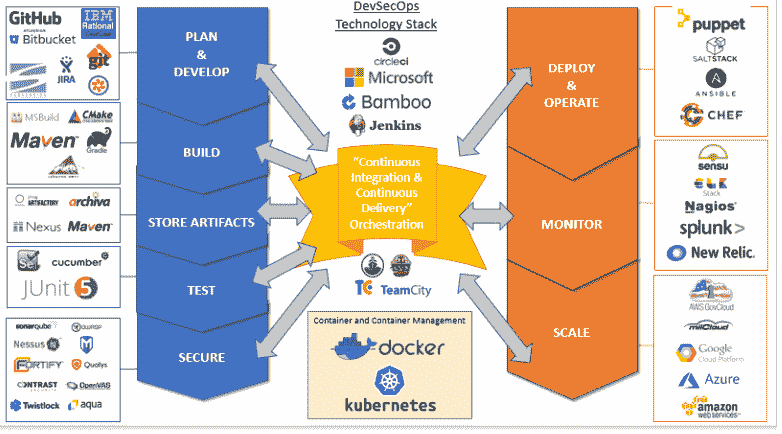

# 美国国防部如何检测“敏捷 BS”

> 原文：<https://thenewstack.io/the-u-s-department-of-defense-on-how-to-detect-agile-bs/>

敏捷是最常见的开发方法之一，也是最常被误用的方法之一。因此，毫不奇怪，在线程序员对美国国防部发布的一份信息丰富的新文件反应强烈，该文件为经理们提供了如何微调项目的建议。

国防部的“预发布和安全审查办公室”已经批准了这份名为“检测敏捷 BS”的文件在 10 月份发布，但它终于在上周疯传，在 Reddit 上吸引了【2,975 张赞成票，以及来自世界各地极客的数百条评论。

“这是我读过的最好的政府文件之一，”一名用户写道，并补充道，“随你便吧。”

## 问题的范围

它的第一句话警告说，因为敏捷是一个流行的时髦词，“几乎默认地，所有国防部软件开发项目现在都被宣布为‘敏捷’。”"

董事会成员 Richard Murray，加州理工学院的教授，分享了一些对试图猜测他们的团队是否真的使用敏捷的项目经理的同情想法。“他们说他们在使用敏捷，那里有一堆我不认识的单词，也许他们真的在使用敏捷，也许没有，”他[告诉 FedScoop](https://www.fedscoop.com/defense-innovation-board-wants-help-military-recognize-agile-bs/) 。

“我们希望这将是有用的…”

该委员会的文件称，其目标是帮助项目主管和采购专业人员发现项目“只是敏捷服装中的瀑布或螺旋开发”一个尝试将瀑布和敏捷开发混合的项目被称为“water-Scrum-fall”，但是该文件警告不要冒名顶替者试图声称这是敏捷开发，使用讽刺的绰号“agile-scrum-fall”。

它指出了项目没有真正使用敏捷开发方法的六个标志——例如，缺乏协作，甚至最终用户“在整个开发过程中没有行动”它建议在工作中观察用户，如果不是真的和他们交谈，或者给他们原型以获得反馈。"至少，他们应该出现在发布计划和用户验收测试中."

注意:“在程序开始时谈一次验证需求不算数！”

此外，项目执行办公室“不算实际用户，指挥官也不算，除非她使用代码。”

非敏捷项目的其他标志包括容忍应该自动化的手动过程(例如，测试和持续集成和部署)。或许是最大的警告信号？未能优先考虑“尽快将有用的东西投入使用”

“作为一个努力的敏捷-scrum-fall 团队的成员，我对准确性的水平感到愤怒，”[一位读者在 Reddit](https://www.reddit.com/r/programming/comments/ag7vh4/detecting_agile_bullshit_from_the_us_department/ee50ogu/) 上评论道。

“作为另一个脆弱团队的成员，”另一个人补充道，“我笑了，因为他们真的描述了迄今为止我不得不应对的每一个工作环境。”

一位评论者似乎暗示他们自己的工作场所代表了最坏的情况。“我们正在使用‘敏捷’,但我们的上一个程序花了大约[四]年才发布，在我们完成所有验证和确认之前，用户甚至没有接触过产品。”

## 知道该问什么

该文档还提供了一个有用的问题列表，供编程团队参考。例如，“您的开发、测试、安全和部署管道的自动化程度如何？”后续问题包括针对 CI/CD、安全扫描和部署认证的特定工具套件，以及最重要的“您的基础架构是否由代码定义？”

其他一些检测敏捷基站的问题包括:

*   谁是你的用户，你如何与他们互动？
*   你的(当前和未来的)用户发布周期是多少？
*   您的开发和运营管理指标是什么？
*   在过去的三个冲刺周期中，你学到了什么，你做了什么？(“错误答案:‘什么是冲刺周期’……？”)

还有一些问题需要最终用户来确定他们是否真的能够与开发人员交流他们的需求(以及他们得到了什么样的反馈)，甚至还有一些问题需要项目负责人回答。例如，“团队是否在每次迭代(包括第一次)中向真实用户的至少一些子集交付工作软件，并收集反馈？”

该文档甚至包括敏捷开发常用工具的列表，包括版本控制和问题跟踪软件，以及持续集成服务，如 Jenkins、Circle CI 或 Travis CI，以及配置管理软件，如 Chef、Ansible 或 Puppet。此外，Docker 也被定义为“执行操作系统级虚拟化的计算机程序，也称为“容器化”，Kubernetes 或 Docker Swarm 用于容器编排。”

## 硅谷景观

这份引人注目的文件是一个叫做“国防创新委员会”的组织的产物，它的网站[将这个组织描述为“为国防部长提供建议的几个独立的联邦顾问委员会之一”——但是这忽略了它的一些明星力量。它成立于 2016 年，专门为美国军方带来硅谷的最佳实践和创新。一个网站将他们描述为“](https://innovation.defense.gov/About1/)[由杰出人士组成的五角大楼顾问委员会](https://breakingdefense.com/2018/10/dib-calls-bs-on-buzzwords-defense-innovation-board/)”由 Alphabet 首席执行官埃里克·施密特(Eric Schmidt)领导，其成员包括教授、首席执行官，甚至天体物理学家尼尔·德格拉斯·泰森(Neil deGrasse Tyson)。

这听起来像一个有趣的演出。主页[解释道:“DIB 成员相信通过前往美国境内外的军事设施、基地和司令部收集第一手数据，以听取处于战术边缘的作战人员的意见。”。“DIB 旨在了解他们面临的挑战，了解他们如何克服这些挑战，并就如何实现他们的使命提供建议。”](https://innovation.defense.gov/)

该小组将自己描述为“国防部更大的新兴创新生态系统的一部分”，并指出其建议“旨在简洁、可操作、高影响力和快速交付。”

事实上，敏捷论文长达五页。

美国 2018 年国防预算特别建议国防创新委员会(Defense Innovation Board)“就简化软件开发和采购法规”进行研究。(该组织的网站[简洁地描述了他们的使命](https://innovation.defense.gov/software/):“修正部门的软件方法。”今年早些时候发布的其他论文包括[软件开发的度量](https://media.defense.gov/2018/Jul/10/2001940937/-1/-1/0/DIB_METRICS_FOR_SOFTWARE_DEVELOPMENT_V0.9_2018.07.10.PDF)，以及“[国防创新委员会软件十诫](https://media.defense.gov/2018/Apr/22/2001906836/-1/-1/0/DEFENSEINNOVATIONBOARD_TEN_COMMANDMENTS_OF_SOFTWARE_2018.04.20.PDF)”和“[国防创新委员会软件的注意事项](https://media.defense.gov/2018/Nov/02/2002058905/-1/-1/0/DIB_DOS_DONTS_%20SOFTWARE_V2_2018.11.02.PDF)”

由于“检测敏捷 BS”是一个工作草案，DIB 正在[收集反馈](https://innovation.defense.gov/software/)以便在 2 月 2 日前进行最终修订。

* * *

## WebReduce

<svg xmlns:xlink="http://www.w3.org/1999/xlink" viewBox="0 0 68 31" version="1.1"><title>Group</title> <desc>Created with Sketch.</desc></svg>