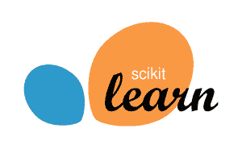
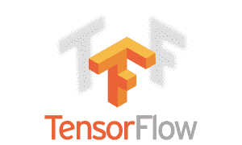
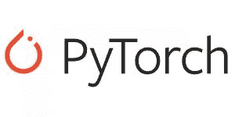
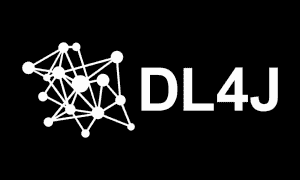
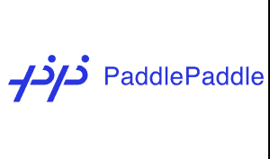

# 机器学习框架的终极指南

> 原文：<https://thenewstack.io/the-ultimate-guide-to-machine-learning-frameworks/>

在过去的几年里，我们已经看到了与机器学习和人工智能相关的开发工具和平台的爆炸式增长。从基于云的认知 API 到库，到框架，再到预训练的模型，开发人员做出了许多选择，将人工智能融入他们的应用程序。

人工智能工程师和研究人员选择一个框架来训练机器学习模型。这些框架抽象了底层硬件和软件堆栈，以 Python 和 r 等语言展示简单的 API。例如，ML 开发人员可以利用 GPU 提供的并行性来加速培训工作，而无需更改为 CPU 编写的大量代码。这些框架揭示了更简单的 API，这些 API 转化为训练机器学习模型通常需要的复杂数学计算和数值分析。

除了训练，机器学习框架还简化了推理——利用训练好的模型对实时数据进行预测或分类的过程。

[机器学习](https://thenewstack.io/category/machine-learning/)框架用于与计算机视觉、自然语言处理和时间序列预测相关的领域。它们还用于通常以表格形式表示的结构化数据，以执行线性回归和逻辑回归来预测或分类数据。

该指南旨在向开发者介绍主流的机器学习和深度学习框架，重点是它们的独特特征。

## sci kit-学习

[Scikit-learn](https://scikit-learn.org/stable/) 是最古老的机器学习框架之一，由 [David Cournapeau](https://twitter.com/cournape) 于 2007 年作为谷歌代码之夏项目开发。作为一个 Python 库，它支持监督和非监督学习算法。

Scikit-learn 构建在面向 Python 开发人员的开源科学工具包 [SciPy](https://www.scipy.org) 之上。在幕后，SciPy 使用 [NumPy](https://numpy.org/) 进行数学计算，使用 [Matplotlib](https://matplotlib.org/stable/index.html) 进行可视化，使用 [Pandas](https://pandas.pydata.org/) 进行数据操作，使用 [SymPy](https://www.sympy.org/en/index.html) 进行代数运算。Scikit-learn 通过建模和学习功能扩展了 SciPy 堆栈。

如果你是机器学习的初学者，就别再看了。Scikit-learn 是 Python 开发者学习机器学习基础的最佳框架。这个工具包可以很容易地实现流行的算法，如线性回归，逻辑回归，K 最近邻，支持向量机，随机森林和决策树。开发人员可以通过使用不同的分类器轻松地在算法之间切换。

除了有监督的学习之外，Scikit-learn 还可以用于无监督的学习，其中有监督的学习处理基于具有已识别特征和标签的历史数据的预测或分类。它支持的算法包括高斯混合模型、流形学习、聚类、双聚类、主成分分析(PCA)和异常值检测。

> 如果你是机器学习的初学者，就别再看了。Scikit-learn 是 Python 开发者学习机器学习基础的最佳框架。

Scikit-learn 最适合基于通常以表格形式表示的结构化数据来训练模型。由于它只处理不使用神经网络和深度学习进行训练的经典机器学习技术，因此 Scikit-learn 不需要 GPU。Python 开发人员可以通过安装包快速入门 Scikit-learn。

即使那些使用 TensorFlow 和 PyTorch 进行培训的开发人员也更喜欢 Scikit-learn 的辅助功能，如数据预处理、编码、交叉验证和超参数调优。

## 张量流

[TensorFlow](https://www.tensorflow.org) 是开发者和研究人员使用的最流行的机器学习和深度学习框架之一。TensorFlow 最初由谷歌大脑团队于 2007 年推出，现已发展成熟，成为一个端到端的[机器学习平台](https://thenewstack.io/category/machine-learning/)。它不仅仅是培训，还支持数据准备、特征工程和模型服务。

TensorFlow 可以在标准 CPU 和专门的人工智能加速器上运行，包括 GPU 和 TPU。它可以在 64 位 Linux、macOS、Windows 和移动计算平台上使用，包括 Android 和 iOS。在 TensorFlow 中训练的模型可以部署在桌面、浏览器、边缘计算设备甚至微控制器上。这种广泛的支持使 TensorFlow 独一无二，并可投入生产。

核心 [TensorFlow](https://www.tensorflow.org/overview) 库可以作为运行在 AMD 和 ARM 平台上的 Python 模块安装。 [TensorFlow.js](https://www.tensorflow.org/js) 是一个 JavaScript 库，用于在浏览器和 Node.js 上训练和部署模型，对于移动、物联网和边缘设备， [TensorFlow Lite](https://www.tensorflow.org/lite) 可用于模型推理。

TensorFlow Extended ( [TFX](https://www.tensorflow.org/tfx) )是一个生产级平台，用于实现跨越数据采集、数据摄取、数据验证、模型训练、模型分析、部署和推理所需的整个工作流程的 ML 管道。企业使用 TFX 实施端到端的 ML 项目。

> 在 TensorFlow 中训练的模型可以部署在桌面、浏览器、边缘计算设备甚至微控制器上。这种广泛的支持使 TensorFlow 独一无二，并可投入生产。

在 TensorFlow 1.x 中，编写了代码来定义执行后的计算图。对于实现神经网络的开发人员来说，这既麻烦又耗时。TensorFlow 2.0 的推出带来了两个显著的变化——急切的执行和与 Keras 的集成。急切执行使得在不定义计算图的情况下执行代码成为可能，这使得开发和调试过程更加简单。 [Keras](https://keras.io) ，高级机器学习 API，与 TensorFlow 2.0 原生集成，带来了定义神经网络和训练神经网络的熟悉工作流。

[TensorFlow Hub](https://www.tensorflow.org/hub) 是一个预训练模型的集合，开发人员可以使用它在不同的环境中进行推理，包括云、桌面、浏览器和 edge。

[TFServe](https://www.tensorflow.org/tfx/guide/serving) 是 TensorFlow 平台的一个组件，tensor flow 平台是一个灵活、高性能的机器学习模型服务系统，专为生产环境而设计。它可以以标准格式服务于多个模型，以提供高度可伸缩的推理服务。

无论您是在开发计算机视觉、自然语言处理还是时间序列模型，TensorFlow 都是一个成熟、健壮的机器学习平台，具有端到端的能力。

## PyTorch

[PyTorch](https://pytorch.org) 是一个开源的深度学习框架，为研究而构建，具有灵活性和模块化，具有生产部署所需的稳定性和支持。它基于 Torch，这是一个最初用 c 编写的用于执行快速计算的框架。

与其他深度学习框架相比，PyTorch 对 Python 开发者的学习曲线更短。它是在脸书人工智能和研究实验室( [FAIR](https://ai.facebook.com) 开发的，得到了开发者和研究人员的关注。尽管 Python 接口被认为是更好的开发语言，PyTorch 也有 C++接口。脸书投资了另一个名为快速特征嵌入卷积架构的框架( [Caffe2](https://caffe2.ai) )，该框架于 2018 年与 PyTorch 合并。

从第一个版本开始，PyTorch 就实现了急切执行，这启发了 TensorFlow 2.0。PyTorch 的优势之一是它与 NumPy 的兼容性。将 NumPy 对象转换为张量与 PyTorch 的核心数据结构进行了本机集成。开发人员可以轻松地在 PyTorch 张量对象和 NumPy 数组之间来回切换。

> 在 PyTorch 中实现神经网络比其他框架更简单和直观。

在 PyTorch 中实现神经网络比其他框架更简单和直观。凭借其对 CPU 和 GPU 的支持，复杂的深度神经网络可以用大型数据集进行训练。

脸书和[亚马逊网络服务](https://aws.amazon.com/?utm_content=inline-mention) (AWS)合作开发了 [TorchServe](https://github.com/pytorch/serve) ，这是一个用于 PyTorch 模型的开源推理引擎。TorchServe 提供低延迟的轻量级服务，以提供高性能的推理服务。它包括最常见应用程序的默认处理程序，如对象检测和文本分类，因此开发人员不必编写自定义代码来部署模型。

[TorchElastic](https://github.com/pytorch/elastic) 是一款开源工具，使用 Kubernetes 大规模训练深度神经网络。它使分布式 PyTorch 培训作业能够以容错和灵活的方式执行。TorchElastic Controller for Kubernetes(TECK)是 PyTorch Elastic 接口的一个本地 Kubernetes 实现，可自动管理 TorchElastic 培训所需的 Kubernetes pods 和服务的生命周期。

py torch Hub[作为一个模型动物园，探索预先训练好的模型用于实验和迁移学习。](https://pytorch.org/hub/)

## 阿帕奇 MXNet

于 2017 年推出的 [Apache MXNet](https://mxnet.apache.org/versions/1.7.0/) 是最近进入深度学习生态系统的公司之一。它的独特之处在于支持多种语言，包括 C++、Python、Java、Julia、Matlab、JavaScript、Go、R、Scala、Perl、Wolfram 语言。

Apache MXNet 是由华盛顿大学的 Carlos Guestrin 和卡内基梅隆大学的研究人员共同开发的。它被亚马逊选为构建 AWS 的商业产品和托管 ML 平台产品的首选深度学习框架。今天，[亚马逊 SageMaker](https://aws.amazon.com/sagemaker/) 上可用的大多数预建模型和算法都是用 Apache MXNet 实现的。

对于 Python 开发人员来说，MXNet 为具有不同经验水平和广泛需求的开发人员提供了全面而灵活的 API。类似于 Keras 如何为 TensorFlow 提供开发者友好的高级 API，Apache MXNet 公开了 [Gluon API](https://github.com/gluon-api/gluon-api) ，为深度学习提供了一个干净、简单的 API。胶子有专门的 API， [GluonCV](https://cv.gluon.ai) ， [GluonNLP](https://github.com/dmlc/gluon-nlp) 和 [GluonTS](https://ts.gluon.ai) 用于计算机视觉、自然语言处理和时间序列分析。

> 对于 Python 开发人员来说，MXNet 为具有不同经验水平和广泛需求的开发人员提供了全面而灵活的 API。

Apache MXNet 可以针对 CPU 和 GPU 进行训练和推理。当在云环境中使用时，它利用了 Amazon EC2 提供的可扩展 GPU 基础设施。它与优步的分布式深度学习工具包 [Horovod](https://github.com/horovod/horovod) 紧密集成，以支持高度分布式的 GPU 训练。

开源的[多模型服务器](https://github.com/awslabs/multi-model-server)可以用来服务用 Apache MXNet 训练的模型。

社区对 Apache MXNet 的支持正在增长。 [D2L.ai](http://d2l.ai) 项目提供了全面的学习资源和交互式 Jupyter 笔记本样品。

## Eclipse Deeplearning4j

Deeplearning4j 是少数几个以 Java 虚拟机(JVM)为目标的原生 Java 编写的机器学习框架之一。它是由旧金山的一群 ML 开发者开发的，并由初创公司 [Skymind](https://skymind.global) 提供商业支持。Deeplearning4j 于 2017 年 10 月捐赠给了 Eclipse 基金会。该库兼容 Clojure 和 Scala。

对于集群和分布式训练，Deeplearning4j 集成了 Apache Spark 和 Apache Hadoop。它还与 NVIDIA CUDA 运行时集成，以执行 GPU 操作和跨多个 GPU 的分布式训练。

Deeplearning4j 包括一个使用 ND4J 的 n 维数组类，允许在 Java 和 Scala 中进行科学计算，可与 NumPy 提供给 Python 的函数相媲美。它可以有效地用作执行线性代数和矩阵操作的库，用于训练和推理。

Deeplearning4j 可用于训练模型，这些模型可以执行图像分类、对象检测、图像分割、自然语言处理和时序预测。

> Deeplearning4j 是少数几个以 Java 虚拟机为目标的原生 Java 编写的机器学习框架之一。

SKIL 的免费开发者版，Skymind 智能层，可以服务于 Deeplearning4j 模型。SKIL 模型服务器还可以从 Tensorflow、Keras、Theano 和 CNTK 等 Python 框架中导入模型。

虽然 Deeplearning4j 相对来说不如 TensorFlow 和 PyTorch 受欢迎，但它正在 Java 开发人员中获得牵引力。

## XGBoost

[XGBoost](https://github.com/dmlc/xgboost) 是基于线性回归和分类的训练模型的首选库。XGBoost 代表极端梯度增强，这是一种在基于高度结构化数据集训练模型时常用于监督学习的技术。陈天琦于 2014 年 5 月在华盛顿大学创建了它。有趣的是，他也是 Apache MXNet 的共同创建者。

XGBoost 是用 C++编写的，带有 Python、R、Julia 和 Java 的接口。它与 Scikit-learn 集成在一起，成为受支持的模型算法之一。XGBoost 基于一种添加新模型的技术，这些新模型预测先前模型的残差或误差，然后将这些模型相加在一起以做出最终预测。它使用梯度下降算法来最小化添加新模型时的损失。

> 当基于带有缺失数据的较小数据集训练模型时，XGBoost 大放异彩。

虽然深度学习框架在训练计算机视觉、自然语言处理和时间序列模型时提供了更好的结果，但对于训练具有线性可分性的数据集来说，它们是一种过度杀伤。当基于带有缺失数据的较小数据集训练模型时，XGBoost 大放异彩。它隐含地执行一种称为数据插补的技术，这种技术可以弥补数据集中缺失的值。

XGBoost 可以在更便宜的多核 CPU 上训练，而不是分布式 GPU 集群。当数据量有限时，XGBoost 是训练精确模型的最有效和最经济的 ML 库。

当数据是高度结构化的，表示一维数组时，Pandas 和 XGBoost 的组合用于训练模型。转化为多维数组或张量的图像和视频，与深度学习框架(如 TensorFlow 和 PyTorch)配合使用效果最佳。

当您有一个带有缺失值的结构化、表格化的一维数据集，并且需要在 CPU 上有无与伦比的执行速度和高预测准确性时，请选择 XGBoost。不会让你失望的。

## 桨桨

[PaddlePaddle](https://github.com/PaddlePaddle/Paddle) (并行分布式深度学习)是百度于 2016 年推出的独立、开源的深度学习平台。这是一个易于使用、高效、灵活且可扩展的深度学习平台。科学家和工程师最初开发它是为了将深度学习应用于百度的许多产品，如 NLP、翻译和计算机视觉。

PaddlePaddle 支持广泛的神经网络架构和优化算法。使用 PaddlePaddle，可以利用许多 CPU/GPU 和机器来加速训练，通过优化的通信实现高吞吐量和高性能。

PaddlePaddle 提供了 146 种算法，并推出了 200 多种预训练模型，其中一些模型具有开源代码，以促进工业应用的快速发展。该平台还托管用于前沿研究目的的工具包，如用于量子计算模型的 Paddle Quantum 和用于图形学习模型的 Paddle Graph Learning。

Python 开发人员可以通过安装该模块轻松开始使用该框架。

## 开放式神经网络交换(ONNX)

开放神经网络交换( [ONNX](https://onnx.ai) )项目由 AWS、脸书、微软于 2017 年发起。2019 年在 Linux Foundation AI ( [LFAI](https://lfaidata.foundation) )中作为研究生项目被录取。

虽然 ONNX 不是 TensorFlow 或 PyTorch 这样的端到端框架，但它值得 ML 工程师和运营商的关注。ONNX 为各种深度学习框架中训练的模型带来了互操作性。比如一个在 PyTorch 中训练好的模型可以导出到 ONNX 中，ONNX 可以导入到 TensorFlow 中进行推理。

ONNX 有三个组件——针对 Intel OpenVINO Toolkit、NVIDIA TensorRT 等 AI 加速器软件优化的后端层；可以执行 ONNX 模型推理的运行时；一套将模型从一种形式导出和导入到另一种形式的工具。

关于 ONNX 的详细概述，请参考我在新栈发表的[分析](https://thenewstack.io/open-neural-network-exchange-brings-interoperability-to-machine-learning-frameworks/)和[教程系列](https://thenewstack.io/tutorial-import-an-onnx-model-into-tensorflow-for-inference/)。

微软已经开源了 ONNX 运行时并增加了对训练的支持。这种能力将 ONNX 变成了一个完整的平台，可以训练模型并执行推理。

> ONNX 为各种深度学习框架中训练的模型带来了互操作性。

ONNX 作为 Python 库提供给开发人员。安装后，很容易将模型从一种格式导出到另一种格式。PyTorch 和 Apache MXNet 拥有将模型导出为 ONNX 格式的本地工具。ONNX 模型动物园拥有来自视觉、语言和语音领域的预训练模型。

ONNX 试图通过互操作性来减少深度学习框架的碎片化。这无疑是朝着正确方向迈出的一步，将对人工智能生态系统产生积极影响。

<svg xmlns:xlink="http://www.w3.org/1999/xlink" viewBox="0 0 68 31" version="1.1"><title>Group</title> <desc>Created with Sketch.</desc></svg>