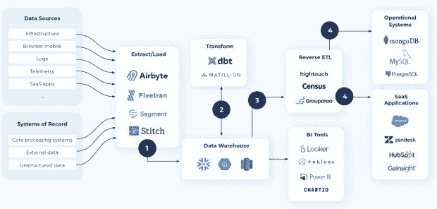
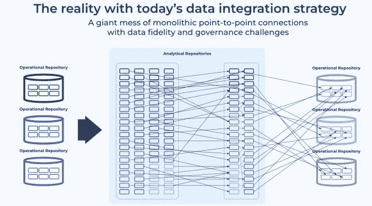
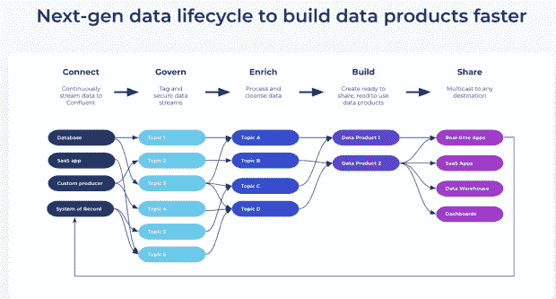

# 数据管道的不幸现实

> 原文：<https://thenewstack.io/the-unfortunate-reality-about-data-pipelines/>

Zhamak Dehghani 的 [data mesh 文章](https://martinfowler.com/articles/data-mesh-principles.html)让“数据作为一种产品”的概念变得流行起来作为四个基本原则之一，它描述了组织需要创建、存储和交流重要业务数据的方式的根本转变。虽然数据网格的概念相对较新，而且感觉简单直观，但它所强调和建议解决的问题却不是这样。

几十年来，围绕数据移动和对可靠数据的自助访问的挑战一直困扰着组织，没有一种所谓的现代方法能够为该问题提供现实的解决方案。如果有的话，它们放大了现有的数据访问挑战。

在幕后，数据管道扮演着重要的角色。他们做了大量繁重的工作，协调数据移动，提取、转换、集成和加载跨系统孤岛的数据，以服务于各种运营和分析用例。它们对于构建值得信赖的数据产品至关重要。然而，尽管数据管道至关重要，没有数据管道，现代数据驱动的组织就无法运行，但在过去几十年中，它们根本没有发展。

在本文中，我们将深入探讨数据管道的传统方法以及备受吹捧的现代数据堆栈中存在的复合数据问题。我们还将探讨如何重塑您的数据管道，构建更好的数据产品，满足您的企业和客户的实时需求。

## 传统的 ETL 管道是创新的瓶颈

ETL(提取、转换和加载)工具最初是在几十年前构建的，用于从孤立的系统中提取数据，然后定期将其转换和加载为与目标数据仓库相匹配的格式，以便进行事后分析。数据通常有一个最终目的地，即数据仓库，并且处理过程在很大程度上由集中的、与领域无关的“数据产品”团队控制，这些团队花费大量时间来修复损坏的数据管道，并使用剩余时间来发现和理解领域数据，以收集有意义的见解。这种方法在旧世界是有意义的，因为数据的应用，分析，是一个后台办公室的问题，有几周，几个月甚至几个季度的周期。这种分析以一种高度潜在的方式被用来指导公司。

2000 年代，由于互联网的出现，数据增长加速，市场出现了基于云的数据仓库，如亚马逊红移、雪花和谷歌 BigQuery，它们可以容纳任何数量的数据，并无限扩展存储和处理。不幸的是，传统的 ETL 软件无法利用新一代云数据仓库提供的本机改进。为了克服传统 ETL 工具造成的性能瓶颈，出现了这种传统范式的变体——提取、加载和转换(ELT)。

## ELT 和反向 ETL 管道强化了旧的坏习惯

ELT(提取、加载和转换)工具也侧重于将数据加载到集中式云数据仓库或数据湖中，但与传统的 ETL 工具不同，转换发生在目标系统中，从而减少了物理基础架构和中间暂存层。这允许提取数据并直接加载到数据仓库中，从而缩短了加载时间。最终目的地还是数据仓库。

然而，在现代环境中，数据并不只有一个目的地。组织中的其他系统和应用程序需要访问这些数据。这催生了一套全新的工具来扭转数据移动的模式。作为集中力量的一个症状，反向 ETL (rETL)工具已经发展到将数据的后续分析(来自数据仓库)共享回操作系统，如数据库和 SaaS 应用程序，如 CRM、财务和 ERP 系统。

虽然 ELT 和 rETL 工具的结合显示了将数据共享回运营系统和 SaaS 应用程序以支持各种用例的需求，但这些方法加剧了数据问题。Decodable 首席执行官 Eric Sammer 写了一篇关于滥用数据仓库的优秀文章，以及“将高价的分析数据库系统引入到可支持性和 ops 的反模式中”

## 数据问题随着现代数据堆栈而恶化

ETL、ELT 和反向 ETL 都是旨在解决释放数据价值需求的方法。它们都强调了最大限度地提高数据的可用性、可靠性和可用性的必要性，以获得有意义的见解并支持各种用例。然而，所有这些方法都有一个基本假设，即数据在投入实际使用之前需要存放在一个中央存储库中，并且数据流是连续的而不是连续的。

如果您花点时间考虑一下这种瀑布式方法，它涉及到将数据集中到仓库中，然后反转这种模式以分散数据访问，它有很大的缺点。

*   **基于批次:**整个步骤序列都是围绕批次数据提取、批次数据处理和批次数据交付而构建的，导致低保真度快照、令人沮丧的不一致性和陈旧信息。该数据的任何后续使用都是基于过时的信息。

*   **集中化数据和数据团队:**这些方法确实产生了两种需要解决的集中化问题。

*   *   首先，在经典的 ETL/ELT 范例中，数据仓库是最终目的地。但是就像我们之前讨论的那样，数据不再只流向一个地方。几乎公司的每个系统都需要访问通常在组织中其他地方维护的数据。当你把所有的系统和应用程序从一个集中的仓库用特别的管道连接起来以支持数据的流动时，你最终会得到一个巨大的意大利面条般混乱的互连，它是复杂的、不可靠的、有风险的、昂贵的和站不住脚的。Confluent 联合创始人兼首席执行官 Jay Kreps 详细讨论了意大利面条式混乱架构带来的[挑战。](https://www.confluent.io/blog/every-company-is-becoming-software/)

*   *   其次，独立于中央域的数据团队承担了繁重的工作，最终成为瓶颈，因为他们无法快速扩展以满足业务的数据需求。他们最终会与需要访问高质量数据以更快推出新产品的开发人员发生冲突。没有清晰的谱系，没有激励数据摄取的有业务意义的目标，所有权和责任被稀释，自助式数据访问的承诺尚未实现，这阻碍了创新的步伐。

*   **不成熟的治理和可观察性:**组织必须在数据可观察性、安全性和合规性的集中式标准之间保持微妙的平衡，同时还要为开发人员提供自助式数据访问。当数据流通过点对点连接的拼凑而成时，扩展任务(如跟踪这些管道的多个组件的数据沿袭、可观察性和安全性)并主动实施治理规则是一项挑战，而且通常是不可能的。

*   **基础设施-繁重的数据处理:**借助当今的工具，数据处理与底层基础设施紧密耦合。随着数据量的增长，更快的数据处理需要更多的计算和存储，而不一致的工作负载变化使得预测资源需求变得困难，从而导致规模和性能挑战以及高昂的运营费用。

*   **单一且不灵活的设计:**开发人员通常将面向 GUI 的数据管道视为一个黑匣子，因为他们无法访问转换逻辑背后的底层代码。当业务逻辑需要改变时，发展这些管道以支持新的需求，同时避免中断是非常复杂的，并且经常需要人工协调。因此，工程师们害怕改变现有的管道，而是更愿意增加一条管道来解决每个新的工作负载，从而增加管道蔓延和技术债务。

尽管在现代数据堆栈中，传统的数据集成工具扮演着重要的角色，但现实是，整个堆栈都是建立在一个遗留的范例之上，围绕着将数据集中到数据仓库。

然而，正如 Sammer 在他的文章中提到的，数据仓库从来就不是实现数据自由移动的网关。“它的设计中心是大规模存储数据，并支持大型分析查询和可视化工具。网关是为多对多关系、去耦合的无知识应用、去中心化和访问控制而构建的。”我们试图用错误的解决方案解决正确的问题，结果是我们进一步加剧了数据访问挑战，积累了技术债务。Sammer 说:“我们无意中将客户体验设计为依赖于缓慢的批量 ELT 流程。

## 如何在您的数据中实现产品思维

要让您的数据发挥作用，并使其可被发现、访问和使用，您必须停止将数据流视为一系列处理步骤，即在前一步骤完成后触发下一步骤。相反，你的数据需要成为一等公民。

您必须将数据视为不断流动、不断处理和不断共享的东西，这样您的系统和应用程序才能在数据创建和更改的那一刻做出反应和响应。

这需要你转变心态。这需要将您的数据视为高质量、随时可用的产品，可在整个组织中即时访问。它在任何地方都是一致的，这意味着每个人都在使用相同的数据，并利用最新和最大的数据，以便您的运营系统可以更好地服务于您的客户，您的分析系统可以满足您的利益相关者的需求，并且您的 SaaS 应用程序始终是最新的。

它是受监管的，这意味着您可以跟踪数据的来源、去向以及谁可以访问它。您通过数据契约实现了数据资产的可发现性，因此无论谁需要访问任何格式的数据，都可以轻松地按需订阅和使用。

当您将这种产品思维应用于您的数据时，您开始加速用例交付和创新。

您如何实现这一愿景并让您的数据发挥作用？在现代企业中，对数据的即时访问是成为竞争优势的关键，您需要以一种完全不同的方式考虑数据移动和访问。您的数据管道方法必须包含五个基本组件。它们是:

*   **流:**专为实时数据访问而构建，而不是批量处理数据，因此您可以随时随地以正确的格式提供最新数据的一致视图。做到这一点的唯一方法是采用数据流来维护组织内可重用数据的实时、高保真、事件级存储库，而不是将定期、低保真度的数据快照推送到外部存储库。模式充当生产者和消费者之间的数据契约，确保数据兼容性。

*   **去中心化:**支持面向领域的、去中心化的数据所有权和架构，允许最接近数据的团队创建和发布可以共享和重用的独立数据流。与此同时，您的团队拥有自助式数据基础架构平台，可以随时随地发现、使用数据流并将其调整到多个环境中，还可以在任何目的地之间进行多路复用和共享。

*   **治理:**使您能够在持续数据可观察性、安全性、策略管理和合规性的集中式标准之间保持微妙的平衡，同时通过直观的搜索、发现和沿袭来提供数据的可见性、透明度和兼容性，以便开发人员和工程师能够更快地进行创新。

*   **声明性:**将数据流逻辑与数据处理方式的底层操作细节分离开来。因此，您必须能够简单地描述数据流，而不是将数据流描述为一系列操作步骤——数据来自哪里、去往哪里，以及数据在传输过程中应该是什么样子，同时基础架构会自动灵活处理数据规模的变化。

*   **面向开发者:**为您的管道带来敏捷开发和工程实践。这意味着使您的团队能够构建模块化、可重用的数据流，这些数据流可以以迭代、自动化和协调的方式进行测试和调试，并且独立于生产环境。这还意味着与版本控制和 CI/CD 系统集成，以便管道可以被版本化、分叉和部署到不同的环境中。最后，它应该使具有不同技能和需求的人能够使用支持可视化 ide(集成开发环境)和代码编辑器的工具协作开发管道组件。

当您在这五个基本原则的背景下重新构想数据流时，您就启用了数据即产品的思想，并最大限度地提高了数据的可用性，从而使不同的团队可以轻松地生产、共享和消费值得信赖的数据资产。这些原则相辅相成，共同促进数据的可重用性、工程灵活性以及组织内更大的协作和信任。

## 如何正确使用管道？

下一次，当您构建需要数据支持的应用程序时，问问自己，您的数据基础架构是否能够支持您对高质量数据流的实时、无处不在、自助式和受控访问的数据需求。质疑为什么你需要默认你的假设为现状，这是面向批量的，集中的，无治理的，不灵活的。确定不仅能帮助您解决当前数据需求，还能满足未来业务需求的解决方案。这里有一些资源可供您参考:

*   了解创新公司如何采用下一代转型方法。[网飞讨论](https://netflixtechblog.com/data-mesh-a-data-movement-and-processing-platform-netflix-1288bcab2873)它是如何用一个数据流平台构建数据网的。阿迪达斯在[的这篇文章](https://medium.com/adidoescode/introduction-to-data-mesh-adoption-in-adidas-85b1db812fa2)中也是如此。
*   这本[电子书](https://www.confluent.io/resources/ebook/data-mesh-architectures-with-event-streams/)很好地解释了如何用 Apache Kafka 实现你的数据网格。
*   了解更多关于领先的数据流供应商如何提供一种新的[流数据管道](https://www.confluent.io/streaming-data-pipelines/)的方法，这些供应商是该类别的先驱，也是 Apache Kafka 的原始创作者。
*   获得一个展示如何在 Oracle 和 MongoDB 等运营数据库之间构建流管道的[演示](https://www.confluent.io/resources/demo/demo-how-to-use-confluent-for-streaming-data-pipelines)。

<svg xmlns:xlink="http://www.w3.org/1999/xlink" viewBox="0 0 68 31" version="1.1"><title>Group</title> <desc>Created with Sketch.</desc></svg>