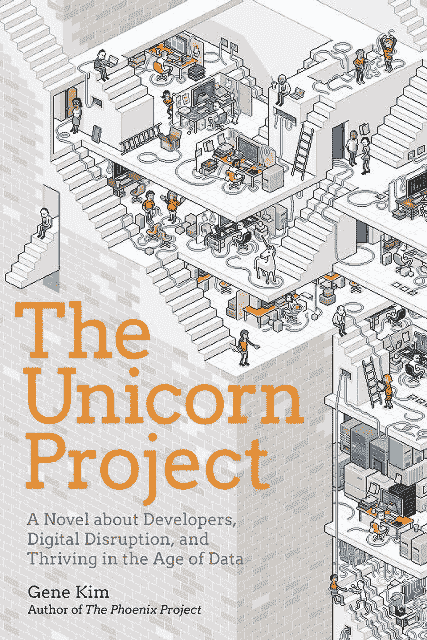

# 《独角兽项目》的作者吉恩·金解释了为什么管理层仍然没有“明白”

> 原文：<https://thenewstack.io/the-unicorn-project-author-gene-kim-on-why-management-still-doesnt-get-it/>

CloudBees 赞助了这个播客。

许多人可能认为，开发商正生活在一个 10 年前他们只能梦想的时代。随着开源工具的激增，软件工程师和获得许多新的和令人兴奋的方法来创建、部署和管理代码之间的唯一事情总是改进 Git 库。他们还经常分享对 DevOps 的持续改进，以及这些新工具如何转化为生产管道，从而对所有公司(如软件公司)的创建和运营产生深远影响。

然而……

作为一名开发人员，您的日常生活可能不像有些人认为的那样文艺复兴式。当然，你可能会在家里或工作中进行一些伟大的科学项目，但你工作的公司和 DevOps 结构——也就是说，如果你的公司甚至有一个工作的 devo PS——可能会培养一种根深蒂固的文化，通常无能的商业领导人会阻止开发人员应用他们的创造性魔法，让他们工作的企业提供伟大的东西。

然而，开发人员仍然有能力做出改变，尽管看起来并不总是如此。例如，在晚上回家坐在网飞面前，利用空闲时间为一个伟大的开源项目锤打代码时，你可能会觉得“做好自己的工作”和远离麻烦是你能做的最好的事情。但是，不管工作中的事情看起来多么令人沮丧，总会有希望的曙光。

在[吉恩·金](http://www.realgenekim.me/)的新书《[独角兽项目](https://itrevolution.com/book/the-unicorn-project/)》中的虚构人物玛克辛，可能和你一样是一名开发者。任何 DevOps 的利益相关者都应该对她感兴趣，当然包括商业领袖。在本期的 [The New Stack Makers](/podcasts/makers) 播客中，Kim 讨论了 Maxine 的日常奋斗和成功——但没有透露剧透——以及它们如何反映了当今开发人员的生活，他也是开创性和经典的 DevOps 指南“ [The Phoenix Project](https://www.oreilly.com/library/view/the-phoenix-project/9781457191350/) 的合著者。

[吉恩·金——“独角兽计划”](https://thenewstack.simplecast.com/episodes/gene-kim-the-unicorn-project)

Maxine 在这种矛盾的开源和 DevOps 复兴中分享了开发人员的现代焦虑。虽然她的困境是虚构的，但 Maxine 展示了开发人员如何在管理层的支持下，通过这种来自前线的虚构案例研究来转变企业的发展。

当然，这从来都不容易，无论你是试图说服管理层支持你或你的团队实施 DevOps，还是你是“独角兽项目”中的 Maxine 在这本书的前三分之一，玛克辛被困在一个岛上，“一切都需要一张票——不是一张票，而是 30 张，”金说。“她不得不纠缠人们，甚至获得许可证密钥或环境，”金说。

Kim 还讨论了许多其他主题，谈到了自“凤凰计划”出版以来的过去五年中 DevOps 的变化，该计划与“独角兽计划”一起，绝对应该是任何参与 DevOps 的人的必读书籍。无论你是开发人员、团队经理还是商业利益相关者，都是如此，他们可能对编程一无所知，但至少对成为一家技术公司对任何企业的生存都是至关重要的感到好奇。

换句话说，对于那些在讨论 DevOps 或相关内容时不一定“明白”的商业领袖来说，一个关键的要点是，他们应该意识到后果。正如金在《独角兽计划》(The Unicorn Project)中试图传达的那样，对于 DevOps 团队成员来说，“当你连续 30 天做错任何事情，每个小错误都受到惩罚”一点也不好玩，他说。“每个人都超额订阅了——没有人有时间帮助你入门和学习工具，甚至没有时间把工具给你，”Kim 说。

“这与我们想要的工作感觉相反。因此，我认为大多数商业领袖真的很关心工作场所的参与度，以及那种你想在工作中完成使命、从中获得快乐的感觉，”他说。

来自 Pixabay 的 Jill Wellington 的特写图片。

<svg xmlns:xlink="http://www.w3.org/1999/xlink" viewBox="0 0 68 31" version="1.1"><title>Group</title> <desc>Created with Sketch.</desc></svg>