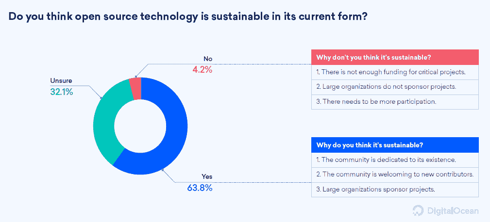
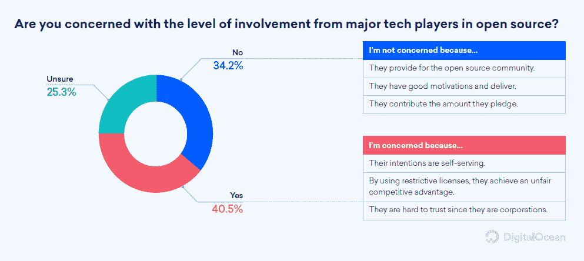
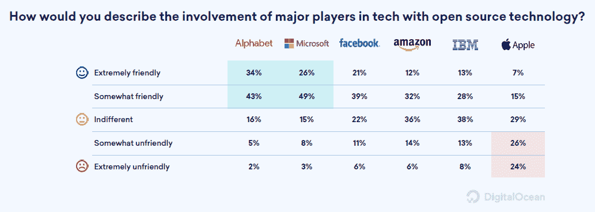
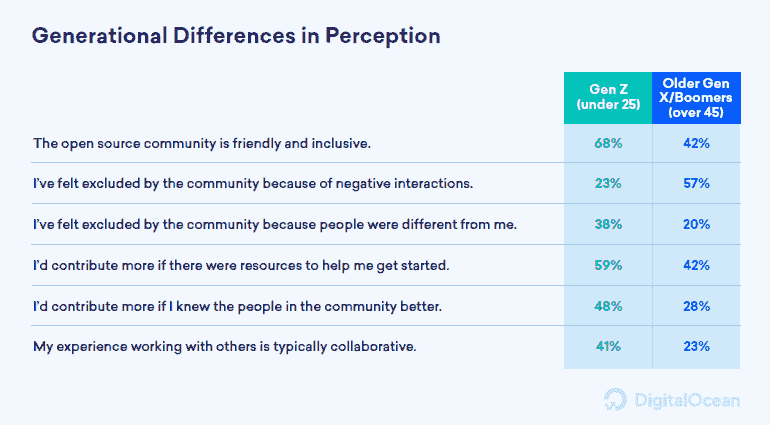

# 大技术在开源可持续发展中的价值

> 原文：<https://thenewstack.io/the-value-of-big-tech-in-open-source-sustainability/>

云服务提供商 DigitalOcean 最近对 5，800 人进行了调查，其中 64%的人认为开源技术在目前的形式下是可持续的。超过四分之三的乐观主义者(77%)提到了一个专门的社区作为预期可持续性的原因，52%提到了大型组织对开源项目的赞助。

来源:“数字洋流 2019 年第四季度。”认为开源是可持续的是不可持续的 15 倍。32%的人不确定，考虑到对大型科技公司的资金和威胁的担忧，这是合理的。

考虑到他们对许多大规模、广泛依赖的项目的资助和支持，34%的研究不关心主要技术公司参与开源的程度就不足为奇了。尽管如此，41%的研究担心大型科技公司在开源中的角色。在这一群体中，60%的人担心公司的意图，56%的人提到限制性许可证在创造不公平竞争优势方面的作用。只有 25%的人说这些公司没有贡献是他们担心的一个原因。这证实了新堆栈自己的 2019 年[调查](/survey-shows-how-developers-and-their-employers-measure-good-open-source-citizenship/)的结果，该调查发现，大型科技公司比平均水平更有可能为上游项目做出贡献。

来源:《数字洋流 2019 年第四季度》。

我们的研究还发现，就开源社区公民而言，谷歌、IBM(包括红帽)和微软在 11 家公司中名列前茅。DigitalOcean 的调查通过询问特定公司对开源的“友好”程度来涵盖这一主题。Alphabet(谷歌的母公司)和微软名列榜首，大约四分之三的人认为它们至少有些友好。在被问及的六家公司中，只有苹果被认为是负面的，一半的人说它对开源至少有些不友好。

来源:《数字洋流 2019 年第四季度》。

## 代沟

DigitalOcean 的样本偏向年轻参与者，43%的人不到 25 岁(Z 世代)，只有 5%的人超过 45 岁(X 世代/婴儿潮一代)。年轻一代对开源持更加积极的态度。随着他们经验的增加，他们有两倍的可能说因为负面的互动而被开源社区排斥。

我们计划在未来的一篇文章中跟进这一代沟，文章使用了最近 MongoDB [调查](https://www.mongodb.com/blog/post/research-developers-are-trusted-by-the-business-but-the-alignment-is-not-felt-evenly-across-different-generations)的数据。

来源:《数字洋流 2019 年第四季度》。

## 以前引用数字海洋调查的文章

MongoDB 是新堆栈的赞助商。

特写图片是蒂姆·格林拍摄的一张照片。

<svg xmlns:xlink="http://www.w3.org/1999/xlink" viewBox="0 0 68 31" version="1.1"><title>Group</title> <desc>Created with Sketch.</desc></svg>