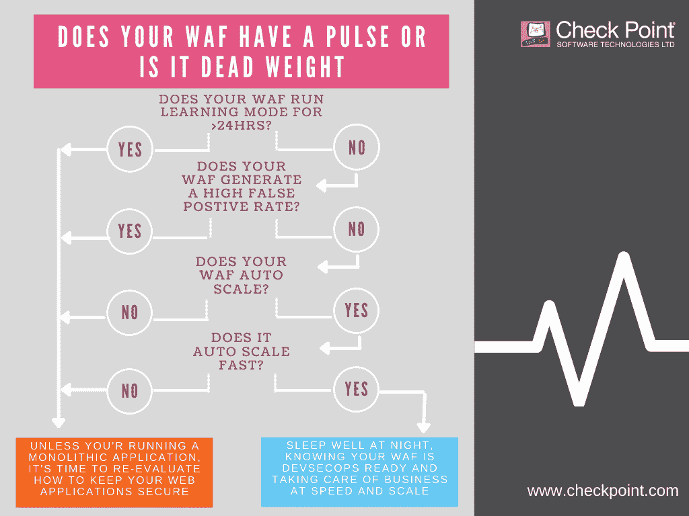

# 网络应用防火墙已经死了，我们知道是谁杀了它

> 原文：<https://thenewstack.io/the-web-app-firewall-is-dead-and-we-know-who-killed-it/>

 [TJ 戈宁

TJ 是 Check Point Software Technologies 的云安全产品战略主管。他是云安全方面的主题专家，拥有数十年用创新解决方案解决企业问题的经验。在加入 Check Point 之前，他是 Protego Labs(已被 Check Point 收购)的联合创始人兼首席执行官。](https://www.linkedin.com/in/tgonen/) 

在过去的几十年里，Web 应用防火墙(WAF)已经变成了一个无处不在的安全套件。任何拥有 web 应用程序的组织(包括大多数大型企业)都会安装 WAF，以保护他们的数据和资产不被利用和攻击。保护 web 应用程序的最佳实践已经发展到简单地在您的应用程序前部署一个 WAF。但是在目前的市场上，随着现代应用程序生命周期授权 [DevOps](https://www.checkpoint.com/cyber-hub/cloud-security/what-is-devsecops/) 以更高的频率发布更新，传统的 WAF 能跟上吗？

这是一个保守得最糟糕的行业秘密，WAFs 并不像他们在敏捷开发的现代世界中所吹嘘的那样。WAF 无法跟上定期发生应用程序更新，且维护 WAF 变得劳动密集且复杂。

如果 WAF 失效，安全专业人员应该做什么？什么会阻止你的 web 应用成为你的组织的堡垒的大门？知道 DevOps 将不断推出新的代码，你如何确定你的 WAF 是否值得维护，或者它是否已经死了？让我们更深入地了解一下，如何让您的 WAF 跟上 DevOps 的速度。

## 语境为王

网络安全就是监控静态网络，这些静态网络使用相同的协议，而 WAFs 是为保护彼此截然不同的 web 应用程序而设计的。每个应用都是独一无二的，每段代码都是不同的，都有自己的漏洞。甚至在引入云存储和 DevOp 的惊人速度之前，WAFs 就被认为是一个平庸的安全解决方案。不可避免的是，使用位于应用程序前面而不是内嵌的解决方案意味着上下文分析是不可能的。没有上下文来理解正在交互的应用程序中的内容，就不可能使 WAF 的发展与应用程序的发展并行。

## 教育教育教育

机器学习的进步只是在一定程度上解决了这个难题。虽然复杂的 WAFs“只”需要一个月的时间来安静地坐下来学习为应用程序创建基线，但一个月的时间对于让应用程序不受保护来说是很长的。不可避免的是，人类需要介入并帮助校准晶圆，这时维护工作变得繁重起来。如果每次内容或代码改变时 WAF 都需要时间来学习和创建基线，那么为了减少警告和创建异常，管理员就有很多繁重的工作要做。

## 自动化或分解

进入下一个问题:在没有人工干预的情况下，你的 WAF 真的能够保护 web 应用程序免受逻辑攻击吗？答案是，在持续交付的情况下，这是不可能的。事实上，大多数 waf 并不处于警报模式。允许他们过度阻塞是非常危险的，因为大量的警报会造成警报疲劳。也许管理员会做一些细微的调整，以便应用程序的敏感部分被阻止规则覆盖，但应用程序的其余部分将在警报模式下使用模式匹配和其他原始技术受到 WAF 的保护。这使得安全解决方案无法随着应用的发展而自动部署以防范新的逻辑攻击。

## 要么快走，要么回家

云计算关乎敏捷性。2015 年需要两周才能完成的事情，现在只需要几秒钟。通过利用微服务，您可以在几分钟内显著改变您的应用程序。在这种新环境下，考虑使用依赖学习或手动配置的标准预云应用安全解决方案是荒谬的。

每次开发人员修改代码并将其发布出去，都是没有与安全人员协商的单方面行动。

如果你使用的 WAF 依赖于这样一个假设，即你环境中的任何东西都是通用的，那么你的 WAF 就失效了，是时候召集承办人了。WAF 死了，是 DevOps 杀的。现在是运行[法医分析](https://www.checkpoint.com/products/web-application-api-protection/)的时候了，以确定你的 WAF 是否有脉搏，或者你是否携带了重物。

<svg xmlns:xlink="http://www.w3.org/1999/xlink" viewBox="0 0 68 31" version="1.1"><title>Group</title> <desc>Created with Sketch.</desc></svg>