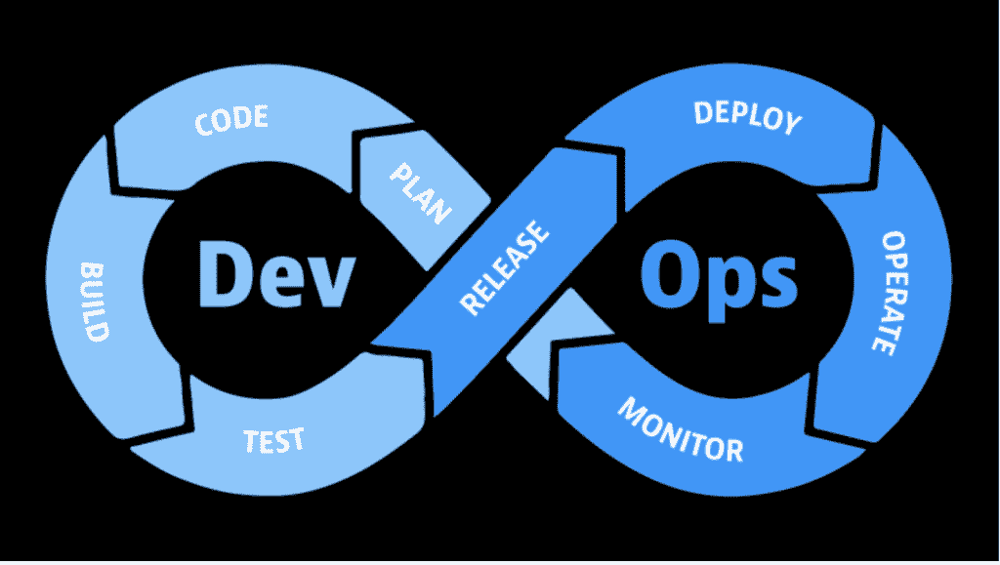

# DevOps 的内容、原因和方式

> 原文：<https://thenewstack.io/the-what-why-and-how-of-devops/>

*本帖是一个系列的第一篇。*

*卡斯滕的《迈克尔·凯德》带你穿越* [*九十天的 DevOps*](https://github.com/MichaelCade/90DaysOfDevOps) *。Michael 记录了三个月期间获得的资源和经验教训，为读者提供了对 DevOps 规程和工具的基本理解，这些规程和工具符合 DevOps 的理念。这篇博文系列总结了他的经历。在这第一篇文章中，我们将研究 DevOps 的定义及其在组织中的目的。*

DevOps 是开发人员和组织中的其他团队经常使用的术语。它到底是什么，我们为什么要使用它？这是我在“devo PS 90 天”探险的前几周解决的问题。在这篇文章中，我将探讨开发运维的定义、开发运维工程师的职责、开发运维与敏捷开发的关系以及开发运维的生命周期。我们将总结一些来自领先组织的真实故事，这些组织使用 DevOps 来提高软件开发的速度和质量。

## DevOps 是什么？

 [迈克尔·凯德

Michael 是 Veeam Kasten 公司的产品战略高级全球技术专家。他在英国工作，拥有超过 16 年的行业经验，主要专注于云原生、自动化和数据管理等技术。他在 Kasten 的职责是与社区合作，帮助有影响力的人和客户克服云原生数据管理的挑战并取得成功。](https://uk.linkedin.com/in/michaelcade1) 

DevOps 将软件开发和运营结合在一起。当软件开发人员编写应用程序并对其进行测试时，开发就开始了，一旦应用程序在服务器上部署和维护，操作就开始了。

DevOps 包含一系列实践，帮助组织缩短产品构思和在生产中发布给最终用户之间的时间。正确操作的话，DevOps 有助于消除孤岛，并通过引入更小、更频繁的版本来满足客户需求，最终缩短漫长的软件发布周期。

DevOps 工程师必须具备广泛的技能，包括:

*   对开发概念以及开发人员使用的系统、工具和过程有一个坚实的理解。
*   了解如何配置应用程序以与服务和数据交互，以及应该如何测试它。
*   创建和配置服务器以运行应用程序，无论是在本地还是在云中。
*   了解服务器操作系统，如 Linux。
*   网络知识，包括 DNS，DHCP，负载平衡等。
*   了解虚拟化、云基础架构即服务(IaaS)和容器化。

虽然 DevOps 工程师不需要成为这些领域的专家，但有些人可能是一个或多个领域的专家，这可以帮助他们在 DevOps 角色中取得成功。

DevOps 工程师的主要任务之一是以高效和自动化的方式将新的应用程序版本发布到生产环境中。让我们来看看 DevOps 以应用为中心的生命周期，以及 DevOps 工程师如何使用这种模式来成功发布。

## 应用程序生命周期

对于 DevOps，应用程序生命周期由五个主要阶段组成:开发、测试、集成、部署和监控。一旦应用程序被发布到生产环境中，这些就会无限循环地重复。以下是每个阶段的总结:

### 发展

在这个阶段，开发人员将与团队成员和潜在的客户合作，定义应用程序的需求。他们将决定 IDE(集成开发环境)和要使用的编程语言。DevOps 工程师应该熟悉 IDE 和语言，以便为应用程序做出最佳的基础结构决策。版本控制是至关重要的，也是存储和协作代码的代码库。存储库可以是公共的，也可以是私有的，例如创建在 GitHub 或 GitLab 上。

开发包括三个主要步骤:

*   **计划:**计划是团队合作开发下一个 sprint 要推出的特性和缺陷修复的过程。DevOps 工程师可以参与其中，了解流程，并根据基础设施需求影响开发人员的决策。
*   **代码:**规划后，开发人员编写代码。然后代码被合并到存储库中。
*   **构建:**这一步包括用选择的语言构建代码。它可能涉及编译它或创建 Docker 映像，这两者都需要持续集成/持续交付(CI/CD)管道。

### 测试

一旦设定了需求，开发了应用程序，下一步就是在各种环境中测试代码。在这个阶段，QA 测试 bug。容器将用于模拟测试环境，消除对物理或云基础设施的需求。这一阶段的自动化将有助于持续集成，并帮助 DevOps 避免让数十甚至数千名工程师手动完成工作。

### 集成和发布

就在 DevOps 生命周期的中间，集成涉及提交对源代码的更改，通常是每天或每周一次。对于每次提交，可以使用自动化测试来帮助在下一阶段之前检测问题或错误。发布新代码可能很简单，只需将它放入一个注册表或代码存储库中，您的生产服务器就可以访问它。

### 部署

现在是时候启动您的 [DevOps 部署策略](https://thenewstack.io/deployment-strategies/)了。这意味着您将把应用程序部署到生产环境中，供用户使用。在此阶段，代码被部署到生产服务器。不同的应用程序需要不同的硬件和配置，这就是应用程序配置管理和基础设施代码发挥作用的原因。如果您的应用程序是容器化的，但也可以在虚拟机上使用，那么就需要像 Kubernetes 这样的平台来编排这些容器，并确保最终用户可以获得所需的状态。

### 监视

一旦应用程序投入生产，持续的应用程序性能监控对于确保最终用户获得所需的体验至关重要。该流程的一部分是获取用户反馈，并将其纳入产品路线图。可靠性也很关键——应用程序需要在用户需要时对他们可用。为此，还应持续监测安全和数据管理。要监控的一些关键参数包括 CPU 利用率、磁盘空间和响应时间。保存日志使开发人员能够解决任何问题。

下图说明了这些阶段，并显示了它们如何在一个连续的无限循环中运行:

## DevOps 和敏捷开发

你知道 DevOps 和敏捷的区别吗？简而言之，敏捷开发是一种专注于交付小规模频繁变更的方法，而不是发布重大更新，目标是提供最佳的最终用户体验。DevOps 描述了基于软件开发人员和操作专家之间合作的软件开发和交付最佳实践，其目标是简化开发和最小化沟通错误。

这两个概念相似，但有重要的区别:

*   虽然敏捷的目标是缩短迭代，但这只有通过 DevOps 提供的自动化才能实现。敏捷侧重于优化最终用户和开发人员之间的沟通，而 DevOps 的目标是开发人员和运营团队。DevOps 工程师的能力在于开发、QA 和运营的交集。他们参与产品周期的所有阶段。
*   虽然敏捷提供了各种管理框架来实现灵活性和透明性——例如，Scrum、Kanban、Lean、Extreme、Crystal、Dynamic 和 feature-driven——devo PS 侧重于最佳实践，例如基础设施即代码、架构即代码、监控、自我修复、端到端测试和自动化，但没有具体的框架或方法。
*   在敏捷中，反馈的主要来源是最终用户，而在 DevOps 中，来自涉众和团队本身的反馈具有更高的优先级。
*   比起部署和维护，敏捷更关注软件开发。DevOps 也关注软件开发，但是它的价值和工具也涵盖了部署和发布后阶段，比如监控。
*   敏捷将灵活性和任务优先于文档，而 DevOps 将项目文档视为重中之重。
*   在敏捷中，项目很难预测或评估，因为优先级和需求是不断变化的。在 DevOps 中，风险来自于误解和缺乏合适的工具。
*   敏捷工具专注于管理、沟通、协作、度量和反馈——想想 JIRA、特雷罗、Slack、Zoom、SurveyMonkey。DevOps 使用工具进行团队沟通、软件开发和部署——想想 Jenkins、GitHub Actions、BitBucket。

将敏捷和 DevOps 结合起来会产生很多好处，包括灵活的管理和强大的技术、良好的沟通、自动化和更好的整体产品质量。合并敏捷和开发运维的最佳实践包括:

*   联合开发和运营团队。
*   创建构建和运行团队。
*   改变你的短跑方法。
*   将质量保证纳入所有开发阶段。
*   选择正确的工具。
*   尽你所能实现自动化。
*   通过使用有形的数字交付成果进行测量和控制。

## DevOps 在行动:亚马逊、网飞和 Etsy

DevOps 正在各行业的领先组织中流行，这些组织已经意识到了它的许多好处。以下是如何成功采用 DevOps 文化的三个真实例子:

*   [**亚马逊**](https://insights.sei.cmu.edu/blog/devops-case-study-amazon-aws/) **:** 通过采用持续部署流程，开发者可以随时随地将代码部署到他们选择的服务器上，亚马逊能够在平均 11.6 秒内将新软件部署到生产服务器上。
*   **网飞:**网飞的开发人员可以自动将代码构建成可部署的 web 映像，而无需依赖 IT 运营。随着图像的更新，它们将通过一个定制的基于网络的平台集成到网飞的基础设施中。持续监控到位，因此如果映像部署失败，新映像将回滚，流量将重新路由到以前的版本。这使得网飞能够以快速、灵活和注重质量的方式提供服务。
*   [**Etsy**](https://www.computerweekly.com/news/4500247782/Case-study-What-the-enterprise-can-learn-from-Etsys-DevOps-strategy)**:**这家公司还让开发者部署自己的代码——他们从 2009 年就开始这么做了。Etsy 意识到，当开发人员负责部署时，他们也要对应用程序的性能和正常运行时间负责。

## 本 DevOps 概述的摘要

总的来说，DevOps 是开发和运营的结合，允许单个团队管理整个应用程序开发生命周期:开发、测试、集成、部署和监控。它的目标是加速开发生命周期，同时交付创新的特性和修复，以取悦客户并与业务目标保持一致。

在本系列的下一篇博文中，我们将讨论为什么对于 DevOps 专业人员来说学习一门编程语言很重要，并探讨如何去做。

如果您刚刚开始使用组织中的 DevOps 功能，以下资源可能会有所帮助:

<svg xmlns:xlink="http://www.w3.org/1999/xlink" viewBox="0 0 68 31" version="1.1"><title>Group</title> <desc>Created with Sketch.</desc></svg>