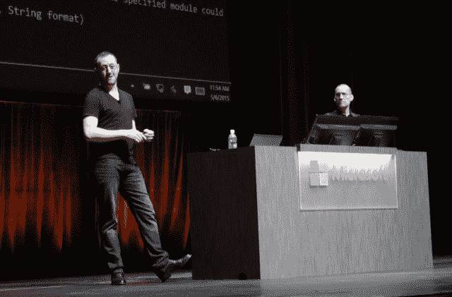

# Windows 和 Linux 容器时代已经到来

> 原文：<https://thenewstack.io/the-windows-and-linux-container-era-is-here/>

可能总会有一些好的理由来解释为什么没有一个头脑正常的开发人员会有意构建一个部分在 Windows Server 上运行、部分在 Linux 上运行的分布式应用程序。但是在当今时代，应用程序很少作为一个整体来构思、生产和部署。“新堆栈”的“堆栈”部分涉及开发人员构建新应用程序所需的服务和平台，这些新应用程序的规模超过了我们之前所知的任何规模。

> 在这个新世界里，种族隔离没有任何意义。这正是“Linux 应用程序”和“Windows 应用程序”之间真正的区别，在这个范围内:隔离。

周三上午，微软采取了下一步措施，打破了它帮助建造(说实话)并加固了多年的那堵墙。[正如去年 4 月](https://thenewstack.io/docker-just-changed-windows-server-as-we-know-it/)首次承诺的那样，该公司发布了 Windows 容器的预览版——本质上是打包 Windows 内容的 Docker 容器——以及在 Windows 环境中运行这些容器所需的 Docker 品牌的工具，这是该公司 Windows Server 2016 的第三个预览版。

Docker 负责产品营销的高级副总裁 Scott Johnston 在接受新堆栈采访时解释说:“如果运营团队已经准备好了工具，并围绕 Docker APIs for Linux 应用程序构建了部署、监控和管理工具，那么同样的工具将按原样用于 Windows 应用程序。“这是一个非常棒的‘一加一等于三’方案，您可以在我们的每个技术堆栈中获得统一的操作工具，同时仍然给应用程序所有者选择的权力，他们可以为正确的工作选择正确的堆栈。他们可以为 Windows 服务选择 Windows 堆栈(如果它是针对该使用情形的工具)，并为另一种使用情形选择 Linux 堆栈。”

## 让 Windows 工作负载在 Linux 上运行

这并不完全是这样一种情况，您可以将一个 Windows 容器放到一个 Linux 服务器上，无论是物理的还是虚拟的，然后突然发现自己在 RHEL 上运行 Exchange 或 SQL Server。尽管一个容器通常包括一个小的操作系统(Windows 容器的[，还有 Nano 服务器](https://thenewstack.io/microsofts-lightweight-os-and-its-deep-linux-connection/)，它也在周三公开亮相)，但它是 OS 主机的内核，为它托管的容器中的服务提供基本资源。

但在 4 月份的公司构建会议上，以及 5 月份的 Ignite 上，微软清楚地展示了在 Windows 上 Docker 容器中运行的 Linux 工作负载。这是通过在虚拟机管理程序上运行的 Linux VM 的帮助来完成的(微软自然建议使用自己的 Hyper-V，但 ESX 或 KVM 也应该可以)。使用 Docker 的命令行工具，可以从注册表中检索容器映像并将其推送到 VM。(在谈论 Windows 中的 Linux 工具时，你必须小心，因为在这里，“注册表”完全是别的意思。)

正如微软负责云营销的总经理迈克·史高斯向新堆栈证实的那样，相反的情况将会发生:

> 在基于 Linux 的主机上运行的 Windows 虚拟机可以运行 Windows 工作负载。

“作为一个例子，我们在 Azure 中让开发者能够构建这些基于微服务的复合应用变得非常容易，”史高斯说。“今天在 Azure 中，我们有一个预配置的 Ubuntu 映像，预装了 Docker 工具。类似地，我们将有一个 Windows Server 容器主机映像，预安装了 Docker 工具，并启用了容器功能。因此，只需几次点击，开发人员就可以在 Windows Server 上运行基于微服务的容器应用程序。他们也可以在 Linux 虚拟机上这样做；它将在这个共享的 Azure 基础设施中运行。”

不出所料，微软对自己的 Azure 云平台给予了些许尊重。预计 Visual Studio 将预配置为将容器化的 Windows 应用程序发布到 Azure 此外，微软的主要 Windows 服务器管理工具 System Center 也将首先利用 Azure 来部署基于 Windows 的容器库(对 Windows 用户来说，这是一个全新的术语)。

然而，正如史高斯向我们保证的那样，Windows 容器不会与 Azure 结合。它们将和 Docker 容器一样具有可移植性，因为它们使用完全相同的格式——我们现在称之为 OCI 格式。微软是开放容器倡议的创始成员。

第一批 Windows 容器的出现不会导致长期存在的 Windows 应用程序(如 Word 和 Excel)突然成为容器，并进入 Linux 的陌生水域。事实上，这些第一批容器本质上将是用 Visual Studio 构建的、与 Windows 兼容的应用程序的家，但是是为容器设计的。换句话说，虽然这些新应用程序可以在容器之外的 Windows 中运行，但它们与典型的 Windows 应用程序的架构并不完全相同……后者可能无法在这种类型的容器中运行。

这有一个不可避免的技术原因:Windows 应用程序需要注册表(大写“R”)和其他不容易小型化的基本 Windows 资源。如果可以的话，任何地方的笔记本电脑的硬盘驱动器都会有更多的空间。

## 另一个 Windows 容器

但将会有这些更传统的 Windows 应用程序的容器——只是不是周三首映的那种。微软所谓的“Hyper-V containers”将使用本质上相同的图像格式(它是否最终成为真正的 OCI 还有待观察)，尽管它将包括更多典型 Windows 应用程序需要的资源，以便有宾至如归的感觉……或者更准确地说，假装它在舒适的英特尔或 AMD 处理器中。

正如史高斯所证实的，这第二类容器将在 Windows Server 2016 的后续预览版(WS2016)中首次亮相。Hyper-V 容器能在多大程度上成功地将基于 Windows 服务器的应用程序移植到 Linux 环境中，还有待观察。

去年 5 月在芝加哥举行的 Ignite 2015 上，微软高级项目经理阿诺·米姆向开发者承诺，这两种风格的容器最终都将能够在“任何地方”运行。

“对于 Hyper-V 容器，我们所做的是，我们将 Windows 服务器容器放在 Hyper-V 分区包装器中，”Mihm 解释道。“通过这样做，我们获得了 Windows Server containers 在部署、分层和我们使用的工具方面的所有好处；与此同时，我们增加了一个额外的隔离层，甚至还受到硬件属性的支持。”

额外的隔离层实际上可能是不可避免的:

> 按照设计，传统的 Windows 应用程序是孤立的实体。它们不会成为微服务，我们也不应该期望 Hyper-V 容器成为基于微服务的应用的载体。

顾名思义，这类容器需要微软的 Hyper-V 管理程序。但是 Hyper-V 容器将把传统的 Windows 应用程序带入超大规模数据中心，并且在不久的将来，它们很有可能被合并到复合应用程序中。

正如同样是微软高级项目经理的泰勒·布朗(Taylor Brown)在同一个 Ignite 会议上告诉开发人员的那样，DevOps 专业人员在使用 WS2016 内置的 Docker 工具部署使用这两种格式的容器时应该注意的唯一区别是, **docker run** 命令上的单一标志。

从左至右:泰勒·布朗、阿诺·米姆——微软高级项目经理

“我们正在使用的所有容器管理工具，以及我们预计其他人将使用的所有工具，将能够以完全相同的方式处理 Windows Server 容器或 Hyper-V 容器，”Brown 说。

> “我们认为，让像您这样的 it 专业人员能够灵活地确定在 Hyper-V 容器中运行的正确工作负载非常重要，因为您有合规性需求，因为您需要这种级别的隔离，同时不必担心该工具或环境是否支持它。”

然而，正如 Brown 所言，任何品牌的能够托管基于 Windows 服务器的客户的虚拟机管理程序都可以有效地运行 Hyper-V 容器，尽管只差一步。Hyper-V 虚拟机管理程序本身由 Windows 来宾托管。

“这真的很重要。这意味着我们可以在任何地方运行 Hyper-V 容器。”布朗说。“我们可以在任何地方运行 Windows Server containers。对于这些容器类型可以在哪里运行，没有真正的限制。”

但 WS2016 的未来预览版(我们还不知道它是否是下一个版本)可能会给我们第一个线索，即第二类 Windows 容器可以运行的 Windows 应用程序工作负载类型是否会有限制。

<svg xmlns:xlink="http://www.w3.org/1999/xlink" viewBox="0 0 68 31" version="1.1"><title>Group</title> <desc>Created with Sketch.</desc></svg>