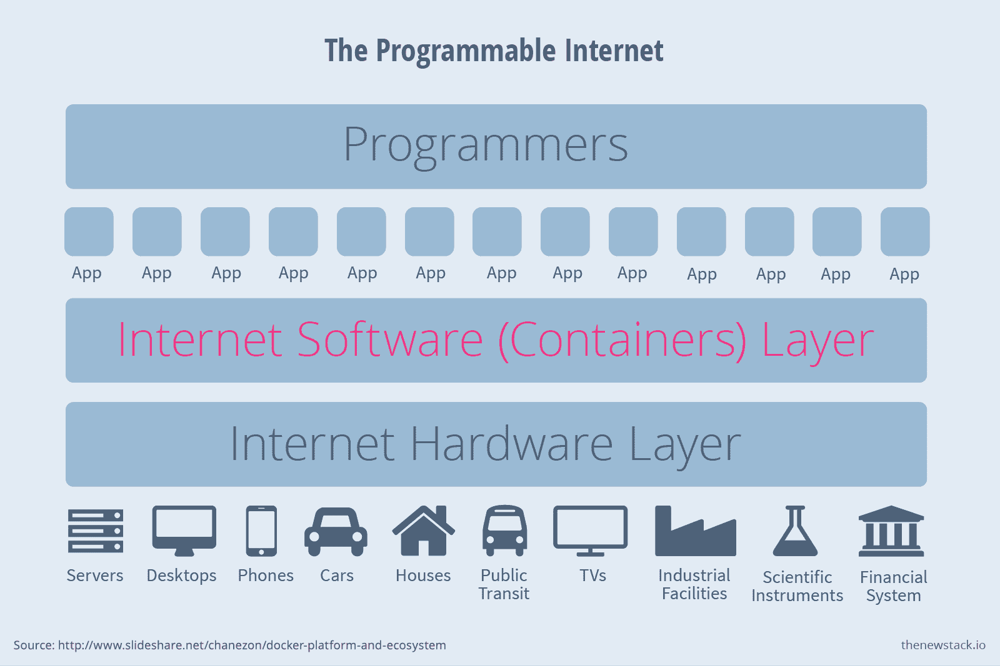
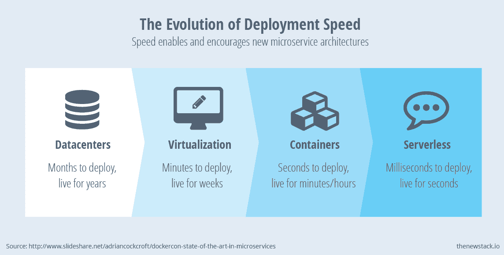

# 世界是可以用容器编程的

> 原文：<https://thenewstack.io/the-world-is-programmable-with-containers/>

Docker 和容器技术象征着一种新的经济现实，这种现实将开发人员置于从大型机器到应用驱动系统的转变的中心。从重量级技术到轻量级技术，从人工系统到自动化系统的转变，在 Docker 和容器生态系统中以多种方式表现出来:

*   互联网正在被编程，它需要管道才能工作。
*   **应用程序开发比以往任何时候都要快。**
*   **开源社区正在激增，变得越来越商业化。**
*   编程语言使得软件开发变得更加容易。
*   **自动化基础设施和横向扩展分布式资源的需求正在到来。**
*   **与兼容性相比，性能将越来越重要。**

容器技术有着悠久的历史。Docker 只是一个新的迭代，它使设计、部署和管理应用程序变得更加容易和方便。容器是单个进程，是系统的一部分，现在正变异成不同的形式。有新类型的容器、平台、开源项目、编排系统、服务发现工具、调度器和市场影响力的转变。

Docker 和 containers 的转变迫使公司重新思考平台和编排服务如何管理新的、更轻的工作负载。这表明从虚拟化基础设施到以容器为中心的分布式资源的变化，这些资源抽象出了过去在云服务和托管环境上开发应用程序所带来的复杂性。

Docker 运行在基础设施之上，并与开发人员的笔记本电脑同步。Docker 技术专家通常将 Docker 称为一种发布、构建、运行和部署应用程序的方式。这是一个面向分布式应用的开放平台。Linux 在哪里工作，它就在哪里工作，这实际上是在任何地方；它也适用于 Windows。Docker 不依赖于单独的操作系统；它只是利用了现有的技术。

Docker 是所罗门·海克斯(Solomon Hykes)的作品，他创立了平台即服务(PaaS)公司 dotCloud。Hykes 将 Docker 构建为一个隔离进程的 API。它使用隔离技术，比如 cgroups 和 namespaces，允许容器在 Linux 内核上独立运行，而没有启动虚拟机的开销。它允许 Docker 容器独立运行，这使得移动代码变得很容易。VMware 等公司的虚拟化技术位于操作系统之下，虚拟化服务器，而不是应用程序。虚拟机走到哪里，操作系统就跟到哪里。必须将其拆除，然后重新启动，并配置为与数据库和它所依赖的堆栈的其余部分一起运行。

[cyclone slider id = " ebook-1-赞助商-2 "]

虚拟化并不独立于容器技术。例如，VMware 开发了一个使用虚拟机隔离容器的平台。现在称为 Photon OS 的操作系统将作为一个代理，让 VMware 的 vSphere 管理系统能够了解容器内部的操作。这意味着包含 Photon OS 的容器和不包含它的容器会有些不同。它是 vSphere 的替代平台。这个新的 Photon 平台(VMware 称之为 Photon Platform)仅面向“云原生”容器，即那些打算提供软件即服务(SaaS)的数据中心，而 vSphere 尚未建立，也不打算建立。

以应用程序为中心的基础架构的前提说明了一种转变，这种转变与机器无关，而与让世界运转的复杂软件和服务有关。

正是这种复杂的基础设施使得初创公司能够更快、更便宜地构建服务。这就是为什么新堆栈在很多方面都很重要。它允许公司比其他使用依赖专有软件和高 It 开销的重量级技术的公司更加敏捷。

市场现在正在见证一场变革，这场变革将影响那些过去一直致力于开发专为台式机和数据中心设计的技术的公司。

## **不变基础设施的新效率**

**市场现实**:世界上有几十亿人，几乎每个人都接触过互联网，即使他们可能没有意识到。数百万开发人员正在为我们的生活和工作方式构建新的基础。与此同时，他们的业务伙伴正在做管道工程，使互联网更具可编程性。

结果是:强调效率、便利和性能而非兼容性的软件和系统的出现。

Patrick Chanezon 是 Docker 的一名技术人员。他在 2015 年 6 月的 DockerCon 上发表了自己的观点，即数百万程序员意味着新的创新。正是这些创新将改变我们今天对软件的几乎所有认识。

“容器技术已经成为给互联网编程的软件层”，本质上是 Docker 的观点。它的技术是软件层。这不是一个容器技术游戏；这是一个软件平台，为数百万程序员编写互联网程序，为一个拥有无限数量可编程节点的世界提供服务。根据这种观点，任何东西都可以是节点。几乎任何东西都可以成为可以被编程的数字对象。

Docker 将容器技术视为物理互联网之上的可编程层。

认为容器会是让世界可编程的那一层，是不是很牵强？更现实的做法是将集装箱视为一个连续体的一部分，这一点在当前市场的发展中显而易见。作为一种抽象分布式系统复杂性的方式，无服务器架构越来越受到青睐。Unikernels 因为比容器技术更轻量级而受到青睐。

容器生态系统中的其他公司正在宣布他们自己的方式来定义这个不断发展的连续体。Amazon Web Services 拥有一个新的注册平台，可以与它的 EC2 容器服务集成在一起，因此处于有利地位。用户指定使用哪个 Amazon EC2 Container Registry (ECR)存储库，它将检索适当的图像。它与 AWS 身份和访问管理(IAM)相集成，以简化授权并提供细粒度控制。

尽管使用容器技术的人有巨大的需求，但基础设施并没有得到改造。安全策略、负载平衡、存储管理、服务发现、服务管理、资源管理和本机容器支持在很大程度上缺失，或者仍然不足以应对生产工作负载。

正如 [Darren Rush](https://medium.com/@darrenrush/after-docker-unikernels-and-immutable-infrastructure-93d5a91c849e) 在《后容器世界》中指出的那样，虚拟机膨胀、大型攻击面、遗留可执行文件和基础操作系统碎片是一个普遍问题。

需要的是[不可变的基础设施](https://thenewstack.io/a-brief-look-at-immutable-infrastructure-and-why-it-is-such-a-quest/)。这意味着创造一些东西，然后让它保持不变。不要更新，创造新的就好。一旦映像开始工作，就只部署一个工作映像。例如，如果需要回滚环境，旧版本的映像可以保存在容器中。整个基础架构都可以打上时间戳，这使得横向扩展变得更加容易——不仅仅是通过更快的部署，还可以通过实际添加更多的机器来加快处理速度。

这种新一代的不可变基础设施反映了易变环境变得如何难以管理。管理服务器的系统管理员需要登录和帐户。他们必须管理具有可变更新的软件，这些更新可能成功也可能失败。这些技术有不同的修复或失修状态。设置不可变的服务器，将其配置为工作一次并按原样部署，可以消除许多此类问题。它消除了手动更新的负担。让机器来控制。

这种变化将如何发生？电池风险投资公司[的阿德里安·科克罗夫特认为 DevOps 是这种转型的结果](http://www.slideshare.net/adriancockcroft/when-developers-operate-and-operators-develop?qid=69297583-eaf2-4b2b-a43c-2ba3001c5781&v=qf1&b=&from_search=10)，这实质上意味着大多数公司的重组。但是使用微服务方法，不可变的基础设施可以大幅降低成本并实现高变化率。开发人员可以在几秒钟内构建和部署服务:Docker 打包它们，微服务环境以相当于快速工具的方式运行它们，支持许多微小变化的连续交付。

这些新的微服务环境不容易管理。想想所涉及的速度，跨越各大洲、地区和地带所需的规模——然后你就会明白它有多复杂。这个流程看起来更像一团缠结的纱线，而不是传统的流程图。需要跨区域了解故障模式。

## **集装箱组合**

Docker 和 containers 提供了可移植性、速度、配置和一个 hub，就像 GitHub 一样，科克罗夫特再次表示，他为新的堆栈撰写了主题为的文章。

科克罗夫特写道，可移植性来自 Docker 的打包，它定义了任何 Linux 应用程序或服务的包。使用任何语言或框架在开发人员的笔记本电脑上创建和测试的包可以在任何公共云、任何私有云或裸机服务器上不加修改地运行。这类似于 Java 的“编写一次，在任何地方运行”的思想，但是更健壮，并被概括为“构建任何东西一次，在任何地方运行”

然后是速度。Docker 容器可以在几秒钟内启动，而虚拟机可能需要几十秒甚至几分钟。配置并不是一个真正需要关注的问题，因为每个更新都变成了一个新版本，或者换句话说，变成了一个新容器。

这种速度是最具变革性的。速度意味着尝试新方法来加快应用程序开发和管理的风险降低。然而，我们几乎还没有理解这种新能力的外部维度对我们所有人意味着什么。

约翰·威利斯(John Willis)在今年早些时候发表的一篇关于新堆栈的文章中说:“在短时间内运行的大量计算方面，你将看到一个新的数量级。威利斯和他的同事后来把他们的公司 Socketplane 卖给了 Docker。

“现在是纳米计算机的问题了。它可以在一周内从 1，000 个实例增加到 10 亿个实例。”

加快部署速度意味着降低尝试新方法来进一步加快应用程序开发和管理的风险。

一个容器的启动时间大约是一秒钟。公共云虚拟机(VM)需要几十秒到几分钟的时间，因为它们每次都要启动完整的操作系统，而在笔记本电脑上启动 VM 可能需要几分钟。

Docker 还简化了部署。Dockerfiles 用更高层次的抽象来管理服务。Dockerfile 文件使用链接，链接是特定 IP 之上的抽象。这使得部署更加通用和松散耦合。Dockerfiles 指定了一组松散的服务及其连接，这是一种更轻便、更灵活的抽象。

Docker 容器在 Docker Hub 的公共注册表中共享。它的组织类似于 GitHub，已经包含了数万个容器。因为容器的可移植性很强，这为应用程序和可以组装成应用程序的组件微服务提供了一个非常有用的跨平台“应用程序商店”。其他建立“应用商店”的尝试都依赖于特定的平台(如 AWS Marketplace 或 Ubuntu 的 Juju Charms)或工具(如 Chef 超市)，Docker Hub 似乎有可能成为现成软件组件和盈利机会的更大来源。

## **总结**

总之，以应用程序为中心的方法在 Linux 生态系统中根深蒂固。考虑到兼容性市场，工具有着丰富的历史。Linux 无处不在，一切都在上面运行。但是这些系统不是为了效率而建造的。系统中有大量的代码和复杂性，包括对操作系统的权限检查，这可以追溯到大规模单片系统被构建到单台机器中的时代。

今天，性能正在成为容器的键值驱动因素，但是它们仍然有相关的复杂性。这就是为什么会有这样一个多样化的生态系统:用户需要建立现代架构，可以将容器从笔记本电脑转移到分布式环境中，这种环境可以管理任何数量的快速、高效并以最高性能运行的微服务。

Docker、IBM 和 VMware 是新堆栈的赞助商。

<svg xmlns:xlink="http://www.w3.org/1999/xlink" viewBox="0 0 68 31" version="1.1"><title>Group</title> <desc>Created with Sketch.</desc></svg>