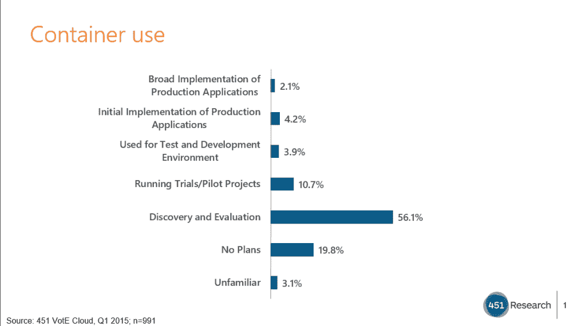

# 未来一年:集装箱服务的兴起

> 原文：<https://thenewstack.io/the-year-ahead-ops-and-the-rise-of-container-as-a-service/>

根据 Docker 的说法，2016 年将是容器即服务(CaaS)的一年。不仅如此，还有“运营主导的容器即服务”

正如该公司在 2016 年[预测](http://vmblog.com/archive/2015/12/16/docker-2016-predictions-the-rise-of-containers-as-a-service-caas-and-the-defining-role-of-applications-in-2016.aspx#.VoPg0lJ1o0U)中所说:

“Ops 主导的容器即服务架构将极大地简化容器在生产中的部署和使用，该架构专注于使 IT 能够解构整体应用架构，以支持微服务。CaaS 无需像开发运维的兴起那样进行组织变革就能取得成功，通过重新关注运维能为开发做些什么来消除重组和重新掌握技能的需要……”

正如[企业战略集团](http://www.esg-global.com/)的高级分析师科尔姆·基冈所说:

“开发人员在很大程度上推动了容器的使用，并且在某种程度上是独立完成的。运营人员辩解说，他们过去没有接触过太多的容器技术，也不太确定该如何使用它们。因此，开发人员出于需要，开始自己管理这些环境。…因此，出于必要，他们不得不承担起对这些东西的运营控制。这就成了一个问题，因为如果他们花一部分时间戴着运营的帽子，而不是开发人员的帽子。”

他说，提供“it 即服务”意味着 IT 部门可以将它认可为一项已启用的服务，并围绕它进行安全和治理等所有必要的控制，不仅在本地数据中心提供服务，还可能跨公共云提供服务。

Docker 产品管理部门的 SVP Scott Johnston 表示，2015 年，运营组织对如何最好地部署和管理容器产生了广泛的兴趣。他说，这导致了许多供应商，包括 Rackspace、Joyent、微软以及 Docker，将集装箱服务作为“真正的产品类别”提供。

“这不仅仅是我们需要管理这些容器的认识，而是提供一套产品，并对成功管理这些产品所需的东西有一个非常固执的观点，”约翰斯顿说。

> “如何从开发人员的笔记本电脑一直到生产过程中管理它，真的没有人讨论或了解过。”

“运营部门正在建立这些自助服务门户，让开发团队从一开始就能拥有一个端到端的解决方案。与一些以运营为中心或仅运营的解决方案相比，虽然运营是买方，但他们建立的基础架构将由应用交付渠道中的所有参与者使用和消费。它以运营为主导的原因是，运营往往拥有服务器、数据中心和底层计算、存储和网络资源。”

他说，应用程序正在推动下一波浪潮，而 Ops 不想妨碍它，而是要支持它。

他们需要能够提供对这些计算、网络、存储资源的治理，同时提供开发团队正在开发的应用程序的灵活性、敏捷性和可移植性的产品。Johnston 说:“Ops 正在编写检查，但他们试图成为主要由应用程序开发团队驱动的工作流中的一员。

他以安全性为例，称 2016 年将带来更多对端到端安全解决方案的要求。

“您希望从一开始就从安全性入手；你不会想在投入生产之前就这么做，因为这只是权宜之计。我们看到，在我们的生态系统中，一项越来越受欢迎的技术是图像签名。当他们打算与他人分享他们的应用程序时签署。签名后，您可以让安全团队在上面签名，QA 团队在上面签名…随着时间的推移，您会清楚地了解这个特定容器经历了哪些步骤。

“这使得运营团队能够就如何部署该应用程序做出实时决策，并最终实现自动化决策。比如，“这个容器有超级机密的 IP，所以它只能部署在本地数据中心，”或者“这是一个简单的测试应用程序，可以部署到公共云。”这是一个很好的例子，说明在管道的开始做事情会给你的下游带来巨大的好处。这只是容器即服务如何提供开发人员所寻求的敏捷性和运营人员所寻求的控制的一个例子。"

他认为网络和存储也有类似的发展。

“企业在说，‘不要让我在应用程序从开发到 QA 再到生产的各个阶段中断我的应用程序。让我的应用程序保持其逻辑关系，并在经历这些阶段时替换掉实际的实现。这给存储和网络供应商带来了生产实施插件的压力，并从应用程序的角度为我们提供了大量关于网络和存储 API 的反馈。因此，您将看到对应用层更干净的 API 的关注，以及网络和存储堆栈越来越多的不同实现。"

Joyent 首席技术官布莱恩·坎特里尔说，这些事情已经发生了。他认为真正的挑战是[清理围绕容器](https://thenewstack.io/cloud-native-computing-foundation-seeks-clarity-world-container-confusion/)的混乱，这项工作由云计算原生计算基金会承担。

“我和从业者谈得越多，我就越相信这一点，容器的最大障碍[是在堆栈的所有不同部分的所有这些看似对立的解决方案，并且没有真正理解这些部分如何相互竞争或相互适应。互操作性已经成为第三大关注点。我认为我们将在 2016 年看到的是互操作性成为一个更重要的问题。我们需要把我们的思维从这种抢地盘的心态转移到这个互通的世界。我们需要定义一些界面边界，然后人们可以在它们下面进行创新。](https://www.joyent.com/blog/bringing-clarity-to-containers)

“对于微服务，我们不会转向某个垂直集成的整体堆栈，由一家提供商提供一切。”

他说这不是供应商们想听到的，因为他们愿意认为他们可以提供下一个“神奇的堆栈”

“它将变得更加异构，更加可组合，更加可互操作。”

451 Research 的云管理和容器研究经理 Jay Lyman 也注意到 Ops 对容器管理越来越感兴趣。

他的组织 2015 年在 Q1 对 991 名企业 IT 专业人士进行的企业之声(VOTE)调查发现，超过一半的企业表示他们正处于容器的发现和评估阶段，但它还发现除了实验之外，人们对应用容器也有浓厚的兴趣，超过 20%的企业表示在试验和试点、测试和开发以及生产应用的初始或广泛实施中使用容器。

“鉴于亚马逊和其他公共云是不断增长的企业云采用的重要组成部分，在 SaaS 模式中看到用户需求和供应商对容器的反应就不足为奇了，正如 Shippable 和 now Docker 等公司所提供的那样，”他说。

> 我们还看到，除了开发人员之外，今年更多的关注来自容器的 it 操作方面的供应商，这表明尽管应用程序容器趋势仍处于相对早期的发展阶段，但它已经在企业 IT 市场中成熟。

“最后，虽然我们从一开始就有了 Docker 应用程序容器格式的事实上的标准，但它仍然是容器管理和编排层的开放游戏，Amazon EC2 Container Service、CoreOS structural、Docker Swarm、Google Container Engine、Kubernetes 和 Mesosphere 等软件和提供商都获得了极大的兴趣和使用，但也在真正的开源合作竞争中一起使用。

“这是企业的下一个大问题，因为他们在更多的基础设施管理和应用程序发布中采用了应用程序容器:我在大规模和生产中使用什么来管理这些容器？我预计，在 2016 年，我们将开始看到其中一些企业成为明显的企业领导者。”

Keegan 上个月进行的研究还指出，容器在企业中逐渐被采用，在生产中很少使用，这与之前的报告相反。

在对 308 名 IT 决策者的调查中，36%的人说他们在有限的容量中使用容器，比如在 VM 中的开发环境中；32%的人目前正在测试它们，16%的人说他们计划使用容器；8%的人说他们对集装箱感兴趣，但目前没有计划。

他说，与他交谈过的大多数企业人员仍然希望在虚拟机中使用容器。

“我仍然认为这是一个很大的教育因素，试图弄清楚容器将如何与虚拟化环境共存，以及长期的影响是什么。我交谈过的大多数人并不认为它们是相互排斥的。你可以两者兼得。这并不是说容器将统治宇宙，虚拟机也将消失。”

Joyent 和 Docker 是新堆栈的赞助商。

专题图片:[日本园](https://www.flickr.com/photos/deanhochman/14779546027/in/photolist-ow2386-kSXVvu-oo5yqg-rc6y9D-qF4ckP-qmKVWy-r5fZYo-piAaPh-qjdSXR-kFnWsH-qVNafR-BRwEJa-94mJ7L-ocdwMH-o27BV3-opnSpM-qRy6f1-qzsRgx-r6kuLa-qWPxax-qSt95i-qVKLJW-6vgoVR-51nzkB-rJomFK-rGpkX8-ra86m1-riMQgx-quzCPw-pY3fjj-qfPr6K-s2WJvE-njzxGP-qCVBCH-t6oJd3-qJzqf4-rs5P33-bDdSbi-qaQf6X-pJP7vN-r5kgGW-fB2CDb-qQaSt6-qQ3t3w-oThcyS-nYACm2-46f6QK-dnGN9J-qoJmMW-atzeCH)由[院长霍奇曼](https://www.flickr.com/photos/deanhochman/)制作，2.0 授权 [CC 下。](https://creativecommons.org/licenses/by/2.0/)

<svg xmlns:xlink="http://www.w3.org/1999/xlink" viewBox="0 0 68 31" version="1.1"><title>Group</title> <desc>Created with Sketch.</desc></svg>