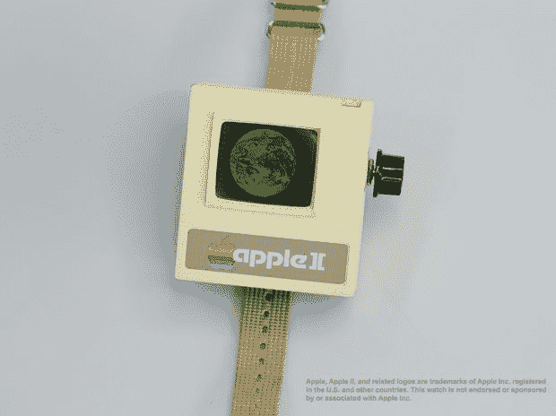
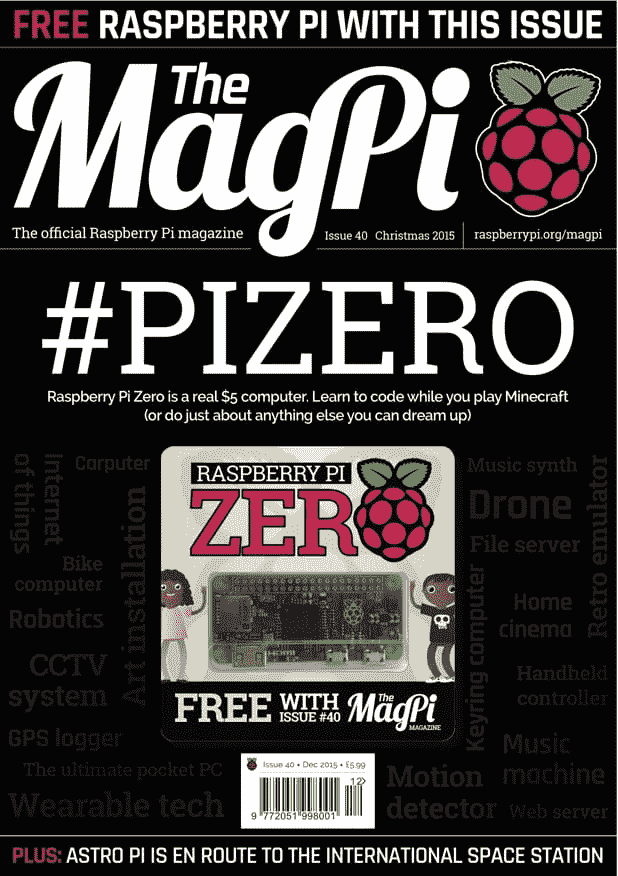
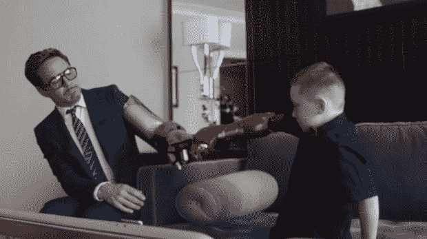

# 过去的一年:回顾 2015，缅怀 Debian 创始人伊恩·默多克

> 原文：<https://thenewstack.io/the-year-behind-looking-back-at-2015-with-remembrance-of-debian-creator-ian-murdock/>

我们能对一年中过去的每一刻进行大规模的 MapReduce 吗？元旦总是让我们面对终极大数据问题:过去 12 个月发生了什么？它是否预示了未来一年的趋势？

庆祝新年前夜最重要的一步总是首先为我们可能已经遗忘的记忆举杯。但是，如果每个时刻都是一个装满记忆的容器，这里尝试从 2015 年的伟大 Hadoop 集群中梳理出一些意义。

周一 Docker [宣布](http://blog.docker.com/2015/12/ian-murdock/)Debian 项目的创始人伊恩·默多克去世，享年 42 岁，“对他的家庭、Docker 社区以及更广泛的开源世界来说，这是一个悲剧性的损失。”作为一名 20 岁的大学生，他在 1993 年创建了 Debian 项目，然后看着它在接下来的 20 年里越来越受欢迎。Debian.org 在《T2》的一篇纪念文章中将其描述为“世界通用的操作系统”，文章总结道“伊恩的梦想依然存在，Debian 社区仍然非常活跃，成千上万的开发人员工作了无数个小时，为世界带来了一个可靠和安全的操作系统。”Docker 补充说，Ian“帮助倡导了真正开放的项目和社区的概念，拥抱开放的设计和开放的贡献；事实上，开源运动本身的形成文件(开源定义)最初是 Debian 的立场声明。”即使在遥远的天堂，伊恩的操作系统仍在运行，它在 2013 年被国际空间站采用[。](http://www.computerweekly.com/blogs/open-source-insider/2013/05/international-space-station-adopts-debian-linux-drop-windows-red-hat-into-airlock.html)

但 2015 年可能会被人们记住，因为这一年，微软似乎终于对开源开发者的世界产生了兴趣。去年 12 月，他们宣布微软现在将在其 Azure 云计算平台上提供 Debian GNU/Linux，以及他们与 Linux 基金会共同开发的新的“Azure 上的 Linux”[认证计划](http://www.fiercecio.com/story/microsoft-further-embraces-open-source-partnering-linux-foundation-linux-az/2015-12-09)。他们还宣布了[开源 ChakraCore](https://blogs.windows.com/msedgedev/2015/12/05/open-source-chakra-core/) 的计划，他们将其描述为支持微软 Edge 的 JavaScript 引擎的所有关键组件。随着微软匆忙完成 Windows 10 的开发，他们甚至为极客们准备了一款特殊的 [Windows 10 版《我的世界》](https://support.xbox.com/en-US/xbox-on-windows/game-titles/minecraft-windows-10-edition-beta-faq)，于 7 月 29 日在 Windows 商店推出。

这一年也可能会被人们记住，因为这一年科技开始离我们的身体更近了。“2015 年，我们看到一名癌症患者接受了 3D 打印的胸骨和胸腔……”科技网站[3Ders.org](http://www.3ders.org/articles/20151230-3d-printing-year-in-review-the-biggest-3d-printing-news-stories-of-2015.html)报道称，并指出 2015 年一名消防员也接受了“世界上最广泛的面部移植，这要归功于 3D 打印的指南。”虽然今年年初谷歌在 1 月份停止了他们的谷歌眼镜原型，但 12 月 28 日谷歌提交了新的 FCC 文件，内容是关于[的改进版本](http://time.com/4163067/google-glass-2-photos-2015/)，这加剧了人们的猜测，即他们现在仍在前进，目标是新的[利基市场](http://www.scientificamerican.com/article/google-glass-redux-high-tech-wearable-gets-ready-for-business/)，如医疗保健、制造业和能源。四月，苹果发布了他们的第一款智能手表——最终为消费者提供了一个在手腕上佩戴 iOS 兼容屏幕的机会。

然而，5 月份也迎来了兼容安卓系统的 Pebble Time 智能手表。Pebble Time 由有史以来最大的 Kickstarter 活动资助(78741 名支持者承诺了 2040 万美元)。但是到了 2 月份，甚至我的朋友 Evangelo Prodromou 也已经在滔滔不绝地谈论 Neptune Pine 智能手表，这是另一款 Android 可穿戴设备，早在 2013 年就已经成功地得到了[Kickstarter 活动](https://www.kickstarter.com/projects/neptune/neptune-pine-smartwatch-reinvented)的资助。今年 3 月，一名业余爱好者甚至创造了他们自己的讽刺性 [Apple II 手表](http://www.instructables.com/id/Apple-II-Watch/)——试图模仿苹果 1977 年最初的个人电脑的外形，配有一个微型腕戴式 CRT 显示器……以及一个更小的前置软盘驱动器。

除了侵犯我们的个人空间之外，数据集中的某个地方还隐藏着关于技术项目民主化的信息。2015 年，极客们还承诺投资 652，001 美元用于制作新的[手工键盘](https://thenewstack.io/heres-artisanal-keyboard-didnt-know-wanted/)，另外投资 570 万美元用于《神秘科学剧场新一集的制作。Kickstarter 在 2015 年资助最多的活动中有三个是视频游戏，还有三个是极客棋盘游戏——它们都在创建之前筹集了超过 300 万美元。今年第八大最受欢迎的活动是 Zano“自主、智能群集纳米无人机”，最终引发了新的 Kickstarter first——委托一名记者[调查该项目失败的原因](http://techcrunch.com/2015/12/11/kickstarter-hires-journalist-to-probe-collapse-of-zano-drone-project/)。

但是大众仍然设法得到真正的无人机技术。八月，俄亥俄州有人真的用无人机将一包毒品送进了一所监狱，引发了操场上所有囚犯的打斗。根据美国联邦航空局的数据，这项新技术导致了 2015 年无人机和有人驾驶飞机之间的 241 次“近距离接触”，到 9 月份，美国联邦航空局发布了一项预警，“今年人们的圣诞树下将有 100 万架无人机。”到 12 月,“消费者事务”估计新无人机拥有者的最终数量将接近 [40 万](http://www.consumeraffairs.com/news/estimated-400000-drones-to-be-sold-during-the-holidays-120315.html)，并指出美国联邦航空局现在有一个专门的无人机任务组正在制定新的法规。上周，当美国联邦航空局宣布无人机注册时，仅在头两天就有超过 45000 名[无人机所有者](http://www.syracuse.com/politics/index.ssf/2015/12/how_to_register_drones.html)出现。

Kickstarter 并不是唯一一个帮助制造商制造。今年 2 月，Raspberry Pi 基金会发布了价值 35 美元的 Raspberry Pi 2，型号 B——一种可编程片上系统，具有 1g RAM 和 900MHz 四核处理器。11 月，他们发布了 5 美元的 Raspberry Pi Zero(T9)，只有 65 毫米宽，配有 1GHz ARM11 内核处理器。为了庆祝，他们将一台价值 5 美元的电脑与《树莓派》的官方杂志《MagPi》杂志 12 月号的每一份捆绑在一起。

 
事实上，2015 年可能会被铭记为一个与我们已经拥有的技术搏斗的时代。10 月，美国国家航空航天局(NASA)发布公告，要求一名 Fortran 程序员继续维护他们的旅行者号太空探测器。1977 年发射的探测器仍然在宇宙中飞行，现在从星际空间发回数据。项目经理苏珊·多德[在接受“大众力学](http://www.popularmechanics.com/space/a17991/voyager-1-voyager-2-retiring-engineer/)”采访时解释说，利用美国宇航局最早的机载计算机和 64 千字节的内存，探测器已经捕获数据超过 38 年了“它有一个循环的活动例程，它会在船上自动执行，然后我们每三个月发送一次序列来增强它。”

美国国家航空航天局正面临着我们所有人都面临的同样问题:我们将如何利用所有这些技术？一个怀旧的极客甚至在他的厨房里安装了路边付费电话。)Archive.org 宣布他们现在正在收集 20 世纪 90 年代的美国在线软盘。而在圣诞节那天，经过 15 年的等待，Perl 6 [终于](https://perl6advent.wordpress.com/2015/12/24/an-unexpectedly-long-expected-party/) [发布](https://perl6advent.wordpress.com/2015/12/25/christmas-is-here/)。

2015 年，我们也告别了一些令人讨厌的童年英雄——比如发明蝙蝠战车的人和来自星舰进取号的科学官员斯波克。但 83 岁的演员伦纳德·尼莫伊活得足够长，足以与新一代《星际迷航》演员一起出现，因为该系列在首次亮相后持续了近 50 年。尼莫伊去世后的几周内，加拿大银行不得不敦促《星际迷航》粉丝停止“挥霍”他们的五美元钞票。

当然，尼莫伊的前《星际迷航》联合主演，78 岁的竹井乔治，仍然是无可争议的脸书国王。

但这里隐藏的趋势可能是科学和技术图标正在悄悄进入文化对话的方式。索尼花了 3000 万美元制作了一部关于史蒂夫·乔布斯生平的大预算电影。亚当·桑德勒将电脑动画推向了一个新的高度，它实际上发布了一部由吃豆人 T4 主演的电影。甚至皮克斯的电脑动画《Inside Out》也将大脑描绘成一个巨大的数据操作中心，情节围绕一个关键节点故障展开。在《前任玛奇纳》中，哈利·波特系列中的一名演员与一个名叫艾娃的神秘女性机器人的魔法搏斗，在另一部大预算大片中，复仇者联盟与一个名叫奥创的超级智能人工智能对抗。但我最喜欢的 2015 年科技故事似乎以某种方式将这一年的一切美好联系在了一起。

今年 3 月，佛罗里达州的一名 6 岁男孩在医院接受了钢铁侠[的探视——或者至少是小罗伯特·唐尼的探视，这位演员在至少五部不同的大片中扮演亿万富翁发明家托尼·斯塔克。这位演员正在给一个 6 岁的男孩交付一个真正的仿生手臂，这是一项由佛罗里达志愿者基金会用 3D 打印机以 350 美元的价格制作的技术。“当它变得太大时，新的部件可以便宜地打印出来，”Today.com 的一名记者指出，“一只新的手只需 20 美元，一只新的前臂大约 40 到 50 美元。”](http://hothardware.com/news/tony-stark-delivers-3d-printed-bionic-arm-to-7-year-old-iron-man-fan)

毕竟，也许我们会知道用我们所有的技术做什么是正确的…

# WebReduce

专题图片:的《时光流逝》的《乔·迪亚兹的《T2》**CC BY-SA 2.0 授权。**

<svg xmlns:xlink="http://www.w3.org/1999/xlink" viewBox="0 0 68 31" version="1.1"><title>Group</title> <desc>Created with Sketch.</desc></svg>