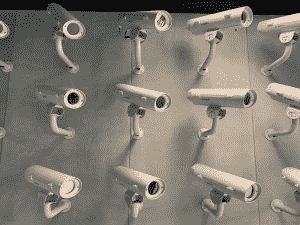
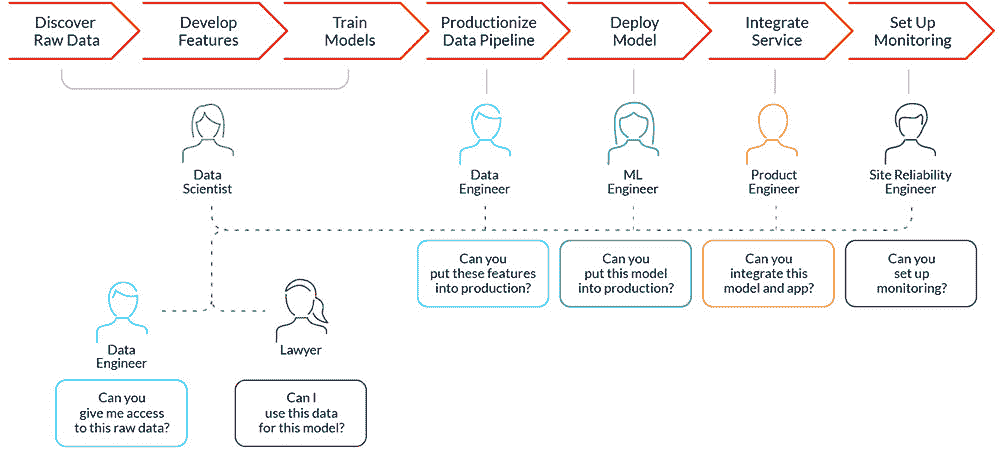

# 人工智能的一年:2020 年，什么在后面，什么在前面

> 原文：<https://thenewstack.io/the-year-in-ai-whats-behind-in-2020-and-whats-ahead/>

对于机器学习和人工智能来说，这是不可思议且充满争议的一年。在过去的几年里，我们目睹了人工智能逐渐渗透到我们的日常生活中，但特别是 2020 年，人工智能在分析语言、[、精准医疗](https://thenewstack.io/deep-learning-ai-detects-rare-genetic-disorders-by-scanning-faces/)以及更邪恶的应用(如对普通人的自动大规模监控)方面都是不同寻常的一年。

随着人工智能准备进一步侵入我们日常生活的各个领域，重要的是回顾一下这一年的巨大收获和发现，同时也要着眼于未来可能等待我们的新可能性。

### 人工智能加速自然语言处理

今年一些最大的突破围绕着自然语言处理 (NLP)新模型的开发，这是人工智能的一个子领域，它赋予机器阅读、理解和提取人类语言含义的能力，无论是可听语音还是书面文本。NLP 的可能应用范围很广，从语言翻译应用程序(如谷歌翻译)，到聊天机器人和个人虚拟助理，如 Siri、Alexa 或 Cortana。

特别是，OpenAI 的 GPT-3 的推出是 NLP 的一个巨大飞跃，这要归功于其 1750 亿训练参数的巨大规模，这远远超过了以前最先进模型的至少 10 倍。与需要大量手动微调的早期 NLP 模型不同，GPT(生成式预训练变压器)依赖于"[变压器](https://towardsdatascience.com/transformers-141e32e69591)"深度学习神经网络，能够学习和理解文本中单词之间的上下文关系。GPT-3 的重要之处在于，在它能够自己产生输出之前，它只能从少数几个例子中学习，无论是机器生成的长篇文本、摘要，还是与人类写的难以区分的短篇故事——解读文字、解决简单的数学问题，甚至是编写代码。

随着 NLP 模型的不断发展，我们将看到更多有趣的用例，如能够智能地回答深刻哲学问题的[机器](https://thenewstack.io/ai-trounces-philosophers-in-answering-philosophical-questions/)，能够自动学习对与错之间的区别的所谓的[道德选择机器](https://thenewstack.io/the-moral-choice-machine-an-ai-that-learns-right-from-wrong/)，以及像[自动事实检查器](https://thenewstack.io/deep-learning-ai-tool-identifies-fake-news-with-automated-fact-checking/)这样的有用工具的增强，以打击在线虚假信息的扩散。

当然，仍然有很多问题需要解决。但是除了少数例外情况之外，随着这些 NLP 模型的规模和性能的增长，将需要更多的计算能力和时间——因此也需要更多的预算——来训练它们，这意味着较大的科技公司可能会比寻求在该领域取得进展的较小机构更有优势。

### 人工智能加速科学研究

随着越来越多的研究出版物采用机器学习方法，人工智能今年也在进一步推动化学、医学和生物学的研究。值得注意的是，机器学习正被用于自动化许多对人类研究人员来说可能是乏味甚至不可能的任务，例如[预测量子力学波函数](https://thenewstack.io/deep-physics-ai-helps-predict-quantum-molecular-wave-functions/)，或者[分析、解构和分类动物的多方面行为](https://thenewstack.io/ai-can-analyze-and-deconstruct-animal-behaviors-better-than-humans/)——其中一些行为可能太微妙，人眼无法察觉。

此外，人工智能还被用来帮助纠正临床研究试验中长达几十年的性别偏见问题，这些试验测试新药的安全性。由于男性受试者人数较多，此类试验的数据通常会严重失真。由于男性和女性的身体有不同的生理特征，这种差异可能意味着任何一个性别都可能经历药物或剂量的不良反应，而这些药物或剂量可能被认为对另一个性别是安全的。除了纠正这种数据失衡，机器学习还被用于支持“[规定性分析](https://thenewstack.io/ai-powered-prescriptive-analytics-could-reduce-hospitalization-rates-cut-costs/)，可以分析患者数据以建立预防性措施，最终帮助降低医院再入院率。

### 人工智能扩大大规模监视

今年更值得质疑的进展之一是人工智能在大规模监控中的使用越来越多。特别是，Clearview 和亚马逊等公司向世界各地的执法机构出售面部识别技术，引发了人们对隐私和公民自由可能受到侵犯的担忧。更糟糕的是，支持这些工具的生物特征数据——正如 [Clearview](https://thenewstack.io/clearviews-controversial-facial-recognition-ai-automates-mass-surveillance/) 的情况一样——有时是在用户不知情或不同意的情况下从社交媒体网站上大量搜集的。

这种强大的技术可以帮助自动识别和跟踪个人，这意味着解决更多的犯罪。然而，该行业在很大程度上不受监管，这意味着[面部识别技术也可能被滥用](https://thenewstack.io/clearviews-controversial-facial-recognition-ai-automates-mass-surveillance/)，使警方更容易识别和监控守法公民行使其自由抗议和集会的权利，或者基于不正确的面部识别匹配拘留[无辜的人](https://www.npr.org/2020/06/24/882683463/the-computer-got-it-wrong-how-facial-recognition-led-to-a-false-arrest-in-michig)。

鉴于公众对大规模扩大大规模监控可能被滥用的强烈抗议，看到一些大型科技公司[宣布暂停开发和向执法部门销售面部识别技术](https://thenewstack.io/industry-facial-recognition-ai-moratoriums-dont-address-flaws-privacy-concerns/)令人振奋——但这可能太少，太晚了，除非在联邦层面加强隐私法规。

### 百万富翁的崛起

各种人工智能模型的快速发展已经转化为越来越多的需要，以确保它们也准备好进行大规模生产。机器学习操作的出现——也被称为 [MLOps](https://thenewstack.io/machine-learning-for-operations/) 或 ai ops——围绕着一系列最佳实践，这些最佳实践是关于实验室训练的机器学习模型如何在现实世界中有效地操作和管理。由于数据科学家、数据工程师、IT 专业人员、ML 工程团队经常在自己的孤岛中工作，导致创建、管理和部署 ML 模型面临复杂的挑战，有时甚至是在同一家公司内，因此这种过渡往往效率低下且组织混乱。

与从中获得灵感的 [DevOps](https://thenewstack.io/what-is-devops/) 方法类似，MLOps 旨在将开发、集成、测试和部署流程自动化并集成到一个高效的管道中。为了应对这种日益增长的需求，像用于机器学习的[特征库](https://thenewstack.io/qa-bridging-data-and-ml-models-with-feast-the-open-source-feature-store/)这样的工具最近突然出现，提供了一个中央界面，不同的团队可以在这里创建、发布、存储和消费新的特征(即，正在观察的任何事物的个体、可测量的属性或特征)。[不断增长的 MLOps 工具列表](https://thenewstack.io/how-kubernetes-could-orchestrate-machine-learning-pipelines/)将有助于简化机器学习模型开发和使用的生命周期，特别是随着该领域的成熟和投入生产的 ML 模型数量的增长。

### 2021 年新兴的人工智能趋势

除了 2020 年的这些显著趋势之外，未来一年可能会看到越来越大的语言模型被构建，专家宣布 10 万亿参数模型有可能在 2021 年首次出现。人工智能将继续加速生物学和医学的新发现，无论是建立在以前难以解决的问题上，如[蛋白质如何折叠](https://www.nature.com/articles/d41586-020-03348-4)，还是为个性化医疗开发定制药物。鉴于现有的[算法偏差](https://thenewstack.io/hidden-gender-racial-biases-algorithms-can-big-deal/)和众多隐私问题的存在，[伦理](https://thenewstack.io/responsible-tech-in-a-world-of-continuous-delivery/)和人工智能中的数据隐私将继续成为主要问题，这意味着对像[去偏差算法](https://thenewstack.io/a-practical-approach-to-detecting-and-correcting-bias-in-ai-systems/)、[匿名算法](https://thenewstack.io/deepprivacy-ai-uses-deepfake-tech-to-anonymize-faces-and-protect-privacy/)和[联合学习](https://thenewstack.io/brain-computer-interfaces-expose-us-hacking-manipulation/)这样的潜在解决方案的兴趣只会继续增强。

图片:Markus Winkler、Bill Oxford 和 Nick Loggie via Unsplash 泰克顿

<svg xmlns:xlink="http://www.w3.org/1999/xlink" viewBox="0 0 68 31" version="1.1"><title>Group</title> <desc>Created with Sketch.</desc></svg>