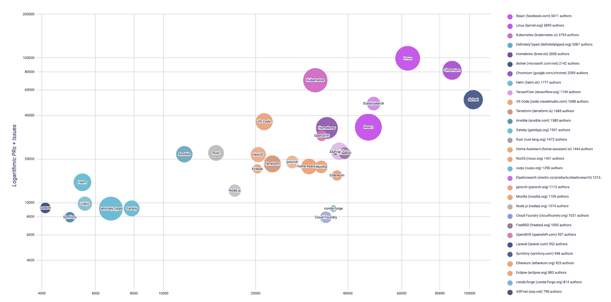

# 过去和现在:比较 Kubernetes 和 Linux

> 原文：<https://thenewstack.io/then-and-now-comparing-kubernetes-to-linux/>

[VMware](https://www.vmware.com/company.html) 赞助了这篇文章。

 [苏珊娜·安比尔

Suzanne 是 VMware 开源营销和战略总监。她从 2011 年开始加入 VMware，经历了从 VMware View 到 vSAN，再到现在的开源软件的公司发展历程。](https://www.linkedin.com/in/suzanne-ambiel-a77807/) 

一个项目“启动”了这一切；另一个推动了 IT 采用并将其主流化。两个项目形成于几十年前，相距甚远。但是每一个都被集体精神的火焰所推动。Kubernetes——一个出于编排抽象应用程序的需要而诞生的开源项目——能从 Linux 这个有几十年历史的操作系统内核中学到什么？大师可以向早熟的暴发户库伯内特斯传授什么经验？

有些人认为，Linux 是开源概念的起源。由于对 UNIX 的成本和唯一可免费获得的兼容 Unix 的操作系统 Minix 的局限性感到沮丧，芬兰的一名年轻开发人员自己解决了问题。Linus Torvalds 在 1991 年向一小群 MINIX 用户发布了一个操作系统内核。1994 年发布了 1.0 版本，1998 年，Oracle 宣布 Linux 支持他们的 SQL 数据库。这时候动量转移了。

随着对 Linux 的认知和采用的增长，主要的技术公司不得不关注它。其中一些关注是为了打压 Linux，而另一些则是为了促进其继续被采用。自尊心、未来和财富(损失或收益)都岌岌可危。随着时间的推移，争论逐渐平息，Linux 逐渐被更多人接受。当然不再像过去那样成为不和的避雷针。

> “如果我们做好自己的工作，在未来五年内，人们将不再谈论 Kubernetes。不是因为它消失了，而是因为它变成了一个正常而无聊的基底，支撑着它上面的新创新浪潮。”
> –克雷格·麦克卢奇， [@cmcluck](https://twitter.com/cmcluck)

2000 年，Linux 在开放软件开发实验室(OSDL)找到了一个家，这是一个非营利组织，负责加速 Linux 在企业计算中的部署。不足为奇的是，那些被 Linux 的流行和迅速采用吓了一跳的公司也为 OSDL 提供了资金。2007 年，OSDL 与自由标准组织合并，成立了 [Linux 基金会](http://linuxfoundation.org)。这个基础为 Linux 内核的开发和持续支持提供了一个[厂商中立的家。(LF 现在开发了 Linux 之外的各种各样的技术——区块链、安全，甚至电影行业都指望 LF 开发厂商中立的技术。)根据最近的统计，来自 1400 多家不同公司的大约 25000 名个人开发者为内核做出了贡献。今天，内核包含超过 2700 万行代码](https://www.linuxfoundation.org/projects/linux/)，每 9 到 10 周发布一个稳定的版本。及其支撑技术？数以千计的演员:C 库，工具链，数据库，web 服务器，桌面环境，仅举几例。主要的、活跃的[分布范围](https://distrowatch.com)有数百个。

就采用程度而言，Linux 继续快速流行。根据 Linux 基金会的数据，Linux 操作系统现在运行着 90%的公共云工作负载，拥有 62%的嵌入式市场份额，以及 99%的超级计算机市场份额。全球超过 82%的智能手机和十大公共云中的九个都依赖于 Linux。如果有什么软件“吃掉了世界”，那就是 Linux。(来源: [2017 年内核发展状况](https://www.linuxfoundation.org/publications/2017/10/2017-state-of-linux-kernel-development/)报告。)

但是，虽然变化是不断的，Linux 继续蓬勃发展，其创始人 Linus Torvalds 追求一个更温和的目标:[“我想让它变得无聊。”](https://www.zdnet.com/article/linus-torvalds-im-not-a-programmer-anymore/)

进入 Kubernetes。它于 2014 年由谷歌作为 GitHub 上的开源项目发布，迅速在云原生空间获得关注。到 2015 年 7 月，1.0 版本可用，[云本地计算基金会(CNCF)](https://www.cncf.io/) 承担了该项目的管理工作。Kubernetes 很快成为一项令人瞩目的、颠覆性的开源技术——与 Linux 并无不同。有什么不同？变革和采用的速度，包括广泛的企业支持。

在首次亮相五年多一点后，Kubernetes 今天拥有一个贡献社区和项目速度，可与有 29 年历史的 Linux 相媲美(来源: [CNCF 旅程报道](https://www.cncf.io/cncf-kubernetes-project-journey/))。如下图所示，Linux、React 和 Kubernetes 享有顶部和右侧位置，较大的气泡周长代表社区大小。所有这些都指向高速度，并证明了一个多元化、参与性和充满活力的社区。对于许多人来说，Kubernetes 已经成为“云的 T2 Linux”。

像 Linux 一样，在 Kubernetes 之外还有一个支持开源技术的庞大生态系统。Kubernetes 周围的景观包括来自 2000 家不同公司的 1200 多个项目。VMware 对这一生态系统的贡献包括 [Harbor](https://goharbor.io/) 、 [Sonobuoy](https://sonobuoy.io) 、 [Velero](https://velero.io) 、 [Contour](https://projectcontour.io) 、[Antrea](https://blogs.vmware.com/opensource/2019/11/18/announcing-project-antrea/)——以及对其他项目的无数贡献，如 Cluster API、TUF 和 Istio。这些项目通过解决独特的用例、挑战或功能差距来增强 Kubernetes。这些项目的开发和采用进一步推动了一个充满活力的社区，使定制和独特的组合能够满足特定的生产要求。

当提到 Kubernetes 时，这个社区的作用是不可低估的:今天它拥有超过 35，000 个贡献者社区。通过建立和维护社区规范，致力于可预测的发布节奏，实践开放、透明的沟通，并确保项目负责人的健康渠道，Kubernetes 项目遵守形成采纳者社区可以依赖的强大核心的属性。

但是，在所有这些变化和采用的狂热中，是对完全不同的东西的追求。Kubernetes 联合创始人、现任 VMware 高管 Craig McLuckie 表示:“如果我们工作做得好，人们将在未来五年内不再谈论 Kubernetes。不是因为它消失了，而是因为它变成了一个正常的、令人厌烦的、支持新创新浪潮的基础。”听起来很熟悉。

这一切有什么教训呢？不止一个；但这里有几个:

*   [社区事务](https://blogs.vmware.com/opensource/2020/04/27/building-a-community-part-1-openness-and-transparency/)。这是维持一个项目的基础，有助于缓和意见和批评的极端性。分担负担就是减轻负担。这两个项目都依赖于一个核心社区来维持和管理变化。对于 Linux，它是[内核维护者和内核贡献者](https://www.kernel.org/doc/html/latest/process/maintainers.html)社区；对于 Kubernetes 来说，它是 SIG 的集合和核心贡献者社区。
*   看着一颗共享的北极星。知道问题和把你们绑在一起的目的。当那颗星星开始变暗时，向社区报到；他们会告诉你的。
*   了解什么需要成为核心，以及在哪里事情可以分叉以满足独特的需求、用例或技术路径。紧紧抓住每一件事只会减缓进步和采用。只有一个 Linux 内核，但是它的许多应用程序和发行版都建立在它的基础上——根据维基百科，有超过 700 个 Linux 发行版。同样，建立在 Kubernetes 核心[之上的](https://www.youtube.com/watch?v=fcQROXxHsvs)[整合分布](https://github.com/cncf/k8s-conformance/)继续增加。Kubernetes 通过 1，200 多个支持和实现各种各样的实现的项目变得更加完整。这种集中化和分散化的双重模式既有利于稳定，也有利于变革。
*   竞争者可以是合作者；好的想法和伟大的领导者可以来自任何地方。开源是创新以闪电般的速度蓬勃发展的地方，变革是民主化的。来自任何地方的任何人，无论是否与公司有关联，都可以成为社区的一部分。

最后，也是最后一课:如果你想忍受，那就为了无聊而开枪。这是你到来的新信号。

*在我们的博客上阅读更多关于 [VMware 开源](http://blogs.vmware.com/opensource)社区、项目和领导力的信息。*

Linux 基金会是新堆栈的赞助商。

通过 Pixabay 的特征图像。

<svg xmlns:xlink="http://www.w3.org/1999/xlink" viewBox="0 0 68 31" version="1.1"><title>Group</title> <desc>Created with Sketch.</desc></svg>