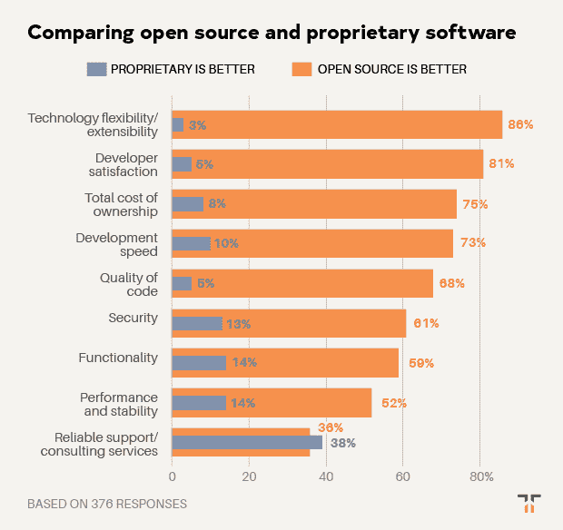

# 有一件事阻止了开发者更多地使用开源软件

> 原文：<https://thenewstack.io/theres-one-thing-stopping-developers-from-using-open-source-even-more/>

 [克里斯克

克里斯是 Tidelift 的营销主管。Chris 在创建开源技术公司方面拥有超过 20 年的经验，包括在 Red Hat 和技术品牌代理 New Kind 各工作了 10 年，在那里他帮助创建了 Ansible、NGINX 和 Anaconda 等品牌。](https://tidelift.com/) 

2019 年 6 月，Tidelift 和 New Stack 联合开展了一项专业软件开发人员调查。近 400 人回答了他们今天如何使用开源软件，是什么阻碍了他们，以及什么工具和策略可以帮助他们更有效地使用它。特别是，通过这次调查，我们有兴趣了解一个[管理的开源策略](/how-managed-open-source-boosts-developer-productivity-and-saves-money/)如何帮助开发人员节省时间、加快开发速度并降低风险。

在本帖中，我们分享了八个关键发现中的第一个，这些发现将在未来几周内公布。如果你不想等待，你可以点击下面的链接下载完整的调查报告。

**调查结果#1:尽管有压倒性的优势，但对可靠支持可用性的担忧抑制了开源的采用。**

在之前的调查中，我们了解到如今专业开发人员对开源软件的使用有多普遍，92%的应用程序使用开源组件。开源已经成为现代开发者的默认堆栈。

在这项调查中，开发人员在许多不同的领域比较了开源软件和专有软件。结果全面证实了为什么开发者更喜欢开源。除了一个领域——可靠的支持和咨询服务——开源软件领先于专有软件。

根据回答者的说法，开源的最大好处是技术的灵活性和可扩展性，令人震惊的是 86%的人认为开源更好。紧随其后的是开发者满意度，81%的人说开源是他们的选择。

当谈到总拥有成本(开源为 75%，专有为 8%)、开发速度(开源为 73%，专有为 10%)、代码质量(开源为 68%，专有为 5%)、安全性(开源为 61%，专有为 13%)和功能性(开源为 59%，专有为 14%)时，开源也是首选。

> 专有软件被认为稍微好一点的唯一领域是可靠的支持和咨询服务的可用性。

在性能和稳定性方面，结果更为复杂。虽然只有 14%的人认为专有软件更好(相比之下，52%的人认为开源软件更好)，但整整 30%的人认为两者差不多。

专有软件被认为稍微好一点的唯一领域是可靠的支持和咨询服务的可用性。近 40%的受访者认为专有软件在这一类别中更强，相比之下，开源软件的这一比例为 36%。

鉴于开源在所有其他调查领域的巨大优势，通过创建与技术感知质量相当的开源支持和咨询服务来缩小这一“支持差距”是开源完全超越专有软件之前的最后一个障碍。

幸运的是，通过将专有模式的最佳元素(如合同服务水平协议下的支持和维护)与开源的所有现有优势相结合，像向受管理的开源发展这样的努力正在缩小差距。该行业正在取得进展，但这些结果表明仍有更多的工作要做！

想在一份报告中获得完整的调查结果吗？[现在就把他们带过来。](https://tidelift.com/subscription/managed-open-source-survey)

<svg xmlns:xlink="http://www.w3.org/1999/xlink" viewBox="0 0 68 31" version="1.1"><title>Group</title> <desc>Created with Sketch.</desc></svg>