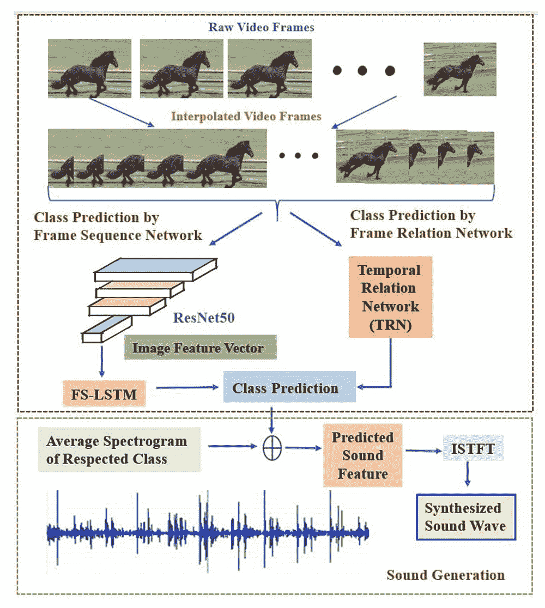

# 这些人工智能合成的音效足够逼真，可以愚弄人类

> 原文：<https://thenewstack.io/these-ai-synthesized-sound-effects-are-realistic-enough-to-fool-humans/>

电影通常是身临其境的体验，目的是用引人入胜的情节和令人眼花缭乱的特效给观众留下深刻印象。虽然有些声音可能是在拍摄时录制的，但电影也依赖于令人信服的音效——通常是由被称为[福利艺术家](https://www.vulture.com/2019/09/the-hardest-sound-i-ever-created.html)的人在后期制作期间制作的——来填充那些非常重要的背景噪音，如脚步声、沙沙的树叶声或落下的雨滴声，以在电影中创造一种真实感。毫不奇怪，创造和整合这样的声音效果是任何电影预算中既费时又费钱的部分。

现在，来自圣安东尼奥德克萨斯大学研究团队的新工作表明，Foley 过程可以自动化——使用人工智能分析给定视频中的运动，然后生成自己匹配的人工声音效果。

## 一个“深度声音合成网络”

该团队的系统被称为 [AutoFoley](https://arxiv.org/pdf/2002.10981.pdf) ，使用[深度学习人工智能](https://thenewstack.io/demystifying-deep-learning-and-artificial-intelligence/)来创建他们所谓的“深度声音合成网络”，它可以分析、分类和识别视频帧中正在发生的动作，然后产生适当的声音效果来增强可能已经有声音或可能没有声音的视频。

“与现有的声音预测和生成架构不同，我们的算法能够精确识别快速移动视频剪辑中的动作和帧间关系，”研究人员在他们的论文中解释道，该论文最近发表在 *[IEEE 多媒体汇刊](https://ieeexplore.ieee.org/xpl/RecentIssue.jsp?punumber=6046)上。*

为了实现这一点，AutoFoley 系统首先识别视频剪辑中的动作，然后从定制的数据库中选择与该动作匹配的合适声音。然后，AutoFoley 会尝试确保声音与每个视频帧中的运动时间相匹配。该系统的第一部分通过提取颜色等特征来分析视频帧图像中运动和时间的关联，使用多尺度[递归神经网络](https://towardsdatascience.com/recurrent-neural-networks-d4642c9bc7ce) (RNN)和[卷积神经网络](https://towardsdatascience.com/a-comprehensive-guide-to-convolutional-neural-networks-the-eli5-way-3bd2b1164a53) (CNN)。然而，对于视频剪辑中的快速移动动作，在连续帧之间可能会有丢失的视觉信息，使用 CNN 和[时间关系网络](http://relation.csail.mit.edu/) (TRN)的插值技术被利用，以便系统可以先发制人地“填充”任何丢失的间隙并平滑地链接它们，以便它仍然可以准确地对动作和预测的声音进行计时。

AutoFoley 的架构图，显示声音预测和声音生成的各个阶段。

接下来，AutoFoley 会合成一个声音，与前面步骤中从视频中识别的动作相对应。为了帮助训练，该团队策划了他们自己的常见声音效果数据库，按不同的“声音类别”进行分类，包括降雨、噼啪作响的火焰、奔腾的马匹、打碎物体和打字等。

“我们的兴趣是使我们的福利一代网络能够用特定电影场景中产生的准确自然声音进行训练，”研究人员说。“要做到这一点，我们需要用特定类别的视听场景来明确地训练系统，这些场景与手动生成的无声电影剪辑的福利轨道密切相关。”

数据库中的一些声音是该团队创作的，而其他声音则是从在线视频中挑选出来的。总之，研究人员的自动 Foley 数据集(AFD)包含来自 12 个不同类别的总共 1000 个视频的声音，每个视频平均持续时间约为 5 秒。正如下面所见所闻，应用于样本视频剪辑的人工智能合成音频听起来非常真实。

https://youtu.be/uTSff5p-v1M

https://youtu.be/QZGqLlsNArg

https://youtu.be/c–LhOG8TRc

为了测试结果的说服力，研究小组向 57 名志愿者展示了人工智能生成的声音效果的最终视频。令人惊讶的是，73%的参与者认为合成的 AutoFoley 声音实际上是原始的音轨——这是对同样从视觉输入中产生声音的可比方法的重大改进。

为了改进他们的模型，研究人员现在计划扩展他们的训练数据集，以便除了进一步优化时间同步外，还包括更广泛的听起来逼真的音频剪辑。该团队的目标是提高系统的计算效率，使其能够实时处理和生成声音效果。随着人工智能现在能够生成相当令人信服的音乐片段、文学片段、信息文本、甚至伪造的政客视频、著名的艺术作品，它们几乎无法与真实的东西区分开来，机器用人工创造的声音愚弄人类只是时间问题。

更多阅读团队[论文](https://arxiv.org/pdf/2002.10981.pdf)。

图片:爱德华多·桑托斯·冈萨加 via Pixabay 圣安东尼奥德克萨斯大学

<svg xmlns:xlink="http://www.w3.org/1999/xlink" viewBox="0 0 68 31" version="1.1"><title>Group</title> <desc>Created with Sketch.</desc></svg>