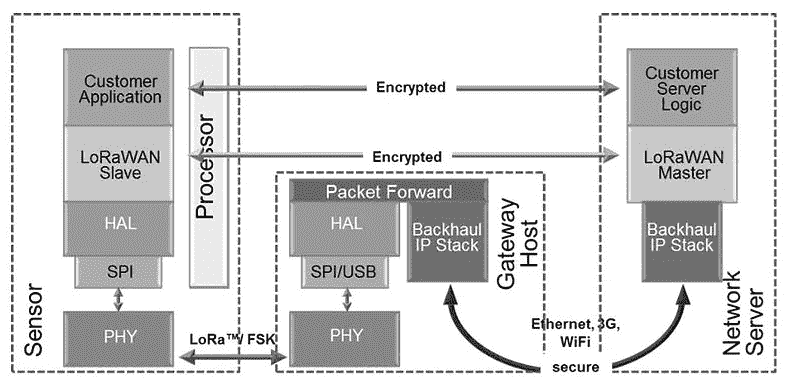

# 通过 LoRaWAN 无线技术实现物联网民主化的努力

> 原文：<https://thenewstack.io/thingmonk-ttn-lorawan/>

困扰物联网设备应用的一个问题是连接成本。对于网络上的多台设备，存在如何连接它们的问题。由两位荷兰企业家牵头的一项倡议可能会有答案。

他们的概念“物联网”的运作原理与互联网类似:它由一个分布式网关网络组成，每个网关都单独运行和管理。该网络基于一种名为 LoRaWAN 的技术，这是一种“[低功耗广域网](https://docs.wixstatic.com/ugd/eccc1a_20fe760334f84a9788c5b11820281bd0.pdf)”，使用不同的频道和数据速率进行通信。该技术使用 0.3kbps 至 50kbps 的数据速率，并创建一组虚拟通道来增加网关的容量。

LoRaWAN 的使用已经改变了公司使用物联网设备的方式:由于网关的低成本，可以非常便宜地覆盖大城市地区；例如，整个阿姆斯特丹市都有全面的 LoRaWAN 覆盖，仅使用 10 个网关，每个网关花费 1200 美元。

据联合创始人 [Johan Stokking](https://twitter.com/johanstokking) 称，物联网背后的想法是试图将为物联网设备供电的方式民主化，而不是被电信公司勒索。“运营商拥有的——而世界其他地方没有的——是授权频谱。我们的愿景是建立一个开放、分散、众包、由用户自己拥有和运营的网络。”今年早些时候，Stokking 在伦敦举行的 RedMonk 会议上提交了一份这项工作的进展报告。

具有讽刺意味的是，这种协议的选择是由 Stokking 在荷兰电信公司 KPN 使用它时发现的。但在早期，它被一家大型运营商使用是一大进步。“我们不必解释什么是 LoRaWAN，因为这些大公司部署了它。这意味着我们对它进行了市场验证，否则，它可能会被视为一个外来的协议。”

考虑到移动技术的广泛可用性，真的需要另一种技术吗？Stokking 说成本是一个真正的驱动因素。他说:“我认为首先需要特别针对物联网的无线技术。”“如今，许多物联网解决方案:WiFi、蓝牙和蜂窝并非设计用于使用远程、低功耗、低成本设备的情况，这些设备依靠部署在偏远地方的电池运行。在这些情况下，WiFi 不是一个选择，蜂窝网络，尤其是 4G 网络太贵了。”

目前，物联网有两个部分，一个非常类似于开源发行版的设置。有一个 TTN 基金会，它运营着免费的社区网络并发布开源的授权代码。然后是 TTN 公司，所有的开发都在这里进行，但它也为客户开发私人网络。

“对于需要服务水平协议的公司，我们将建立一个专用网络。这是一种类似于公共网络的技术，但有额外的扩展，”他说。“一家企业需要一个这样的系统有不同的原因。有时是因为没有稳定的互联网连接，有时是因为法律原因，有时是因为需要 SLA —我们不为公共网络提供服务保证。”

Stokking 说，TTN 目前也在研究一种新的混合模式。“这是在版本 3 中发布的东西，”他说。“这个想法是，用户将能够在公共和私有网络之间进行对等操作，这样你就可以完全控制你的基础设施。LoRaWAN 流量在空中传播，但经过加密，因此你只能使用正确的加密密钥，但它有一个公共报头，告诉你它属于哪个网络。”

LoRaWAN 干扰其他网络的危险也很小，用户也不会面临监管问题。“LoRaWAN 是一种 ISM 频段，长期以来被用于多种应用——工业、科学和医疗(因此有了首字母缩写)。它还使用啁啾扩频来减少来自其他信道的干扰。

物联网自 2015 年推出以来发展迅速。Stokking 说，它目前有 24000 名注册用户。“这些人大多是小企业、独立爱好者和学者。绝大多数是中小企业，但我们有很多用户根本没有注册。”他补充说，他也希望与地方当局合作，但不会直接参与这些对话。

LoRaWAN 的使用为许多组织提供了一个真正的选择，这些组织已经走上了物联网的道路，并且发现支持这样一个网络的成本超出了他们的预期。这些网关的价格可以低至 150 美元，因此它们确实为一些小公司提供了一种连接方式。

TTN 无疑从 KPN 的眼皮底下抢走了生意，是他第一次把劳拉万介绍给世界。斯托克金认为他抢走了他们的生意吗？“也许他们没有预料到我们会把网络免费带给人们，但是，从另一方面来说，他们从来没有打算用这项技术赚很多钱。”

也许，TTN 仍然带着互联网早期的精神，但快速的增长清楚地表明，斯托克和他的团队正在做一些事情。如果物联网的预期繁荣成为现实，企业将寻求更廉价的方式来连接这些设备；两位荷兰企业家可能已经找到了前进的方向。

<svg xmlns:xlink="http://www.w3.org/1999/xlink" viewBox="0 0 68 31" version="1.1"><title>Group</title> <desc>Created with Sketch.</desc></svg>