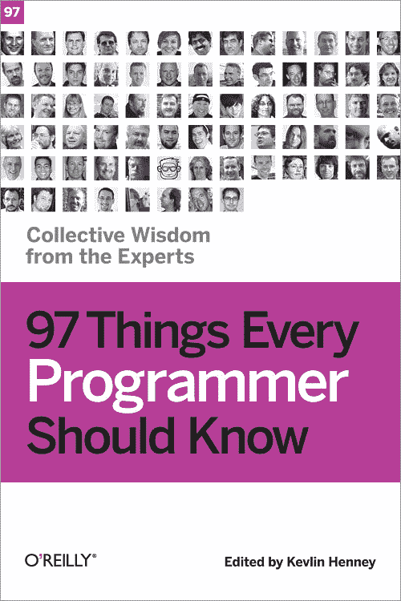

# 每个程序员都应该知道的另外 68 件事

> 原文：<https://thenewstack.io/things-every-programmer-know/>

2010 年，O'Reilly Media 出版了“[每个程序员都应该知道的 97 件事:来自专家](https://www.amazon.com/Things-Every-Programmer-Should-Know/dp/0596809484)的集体智慧”，这本书被证明在开发社区具有很高的影响力。但是七年后，[书的网站](http://programmer.97things.oreilly.com/wiki/index.php/97_Things_Every_Programmer_Should_Know)获得了第二轮的名声，因为它的网址上周末在 Reddit 的编程论坛开始吸引新的投票。

除了最初的 97 个技巧之外，网站上还增加了 68 篇文章，将每个程序员应该知道的事情增加到了 165 个。“总有更多的东西需要学习[，](http://programmer.97things.oreilly.com/wiki/index.php/There_Is_Always_Something_More_to_Learn)，”一个论文标题建议，而另一个提醒读者“[让你的项目自己说话](http://programmer.97things.oreilly.com/wiki/index.php/Let_Your_Project_Speak_for_Itself)。”

该网站的“[投稿进行中](http://programmer.97things.oreilly.com/wiki/index.php/Contributions_in_Progress)”页面上还有八篇文章，承诺“该网站将继续增长并接受新的项目。”

但讽刺的是，事实并非如此。“几年前，在这本书出版后，我就不再接受新的投稿了，”这本书的编辑 Kevlin Henney 本周在 Twitter 上告诉我。这本书的网页甚至列出了一个不再活跃的 Twitter 账号——Henney 说，“这个账号已经移到了 [@97_Things](https://twitter.com/97_Things) ”(尽管自去年 4 月以来，这个更新的 Twitter 账户只显示了一条推文和两条转发。)

由于几年前的一次垃圾邮件攻击，这本书的整个网站早已被出版商锁定，无法进行任何进一步的编辑，所以即使是亨尼本人也无法更新任何内容——甚至是题为[不要碰那段代码的文章也不行！](http://programmer.97things.oreilly.com/wiki/index.php/Don%27t_Touch_that_Code%21)“在任何情况下——无论如何——开发者都不应该访问生产服务器，”文章建议道。

当然，代码和文本是有区别的。但是这个页面在 Reddit 上的新名声仍然给 Henney 上个月的一次演讲蒙上了一层幽默的余晖，他警告说已经被抛弃的“死亡代码”可能会意外地被重新激活。他对处理死代码的建议？“找到了。删除它……”他上个月告诉一位采访者。

尽管如此，很明显对这本文集倾注了很多心血——这可能是为什么它仍然吸引着今天的程序员的注意。它的独特之处在于几乎每篇文章都有不同的作者。Henney [在 2010 年](https://www.slideshare.net/Kevlin/97-things-every-programmer-should-know-48608983)将这本书描述为“基于程序员和其他参与软件开发过程的人的自愿贡献的集体和开放项目”，并指出其“众包”氛围，“整体的多样性和丰富性成为魅力、可读性和实用性的一部分。”

“是的，我希望结果是有用的。他写道:“不是一本手册，而是思想、讨论甚至灵感的源泉。”。"每个贡献者都有对编程的热情和个人联系."

“每个程序员都应该知道的 97 件事”是 O'Reilly Media 系列的第三本书，是继“[每个软件架构师都应该知道的 97 件事](https://www.amazon.com/Things-Every-Software-Architect-Should/dp/059652269X)”和“[每个项目经理都应该知道的 97 件事](https://www.amazon.com/Things-Every-Project-Manager-Should/dp/0596804164)”(都在 2009 年出版)之后发布的。Henny 在 Twitter 上告诉我们，该系列的第四本书——《每个 Java 程序员都应该知道的 97 件事》[*——正在“筹备中”。该书的网页显示，它计划于今年 9 月发行，亨尼将担任编辑。*](https://www.chapters.indigo.ca/en-ca/books/97-things-every-java-programmer/9781491952696-item.html)

 *当然，O'Reilly Media 出售这本书的印刷版本，但它的全文也可以在这本书的网站和 GitBook 上在线获得，git book 是一个开源图书和文档出版平台，根据非商业使用的知识共享许可。去年，有人甚至将书中的文章改编成了 iPhone 应用程序。

也许他们受到了文章#72 的启发——“经常[重新发明轮子](http://programmer.97things.oreilly.com/wiki/index.php/Reinvent_the_Wheel_Often)”

但很高兴看到这些建议在 Reddit 上找到了新的欣赏者。一位评论者在 Reddit 上写道:“我很高兴我读到了第 47 号，[丹·伯格·约翰森](http://programmer.97things.oreilly.com/wiki/index.php/Dan_Bergh_Johnsson)的《[知道你的下一个承诺](http://programmer.97things.oreilly.com/wiki/index.php/Know_Your_Next_Commit)》。“这确实有助于澄清我在一个副业项目中遇到的一些问题……”

到周日下午，一位评论者发帖称他们[特别喜欢](https://www.reddit.com/r/programming/comments/60av7i/97_things_every_programmer_should_know/df65akm/)提示#69 中的建议，“[放下鼠标，离开键盘](http://programmer.97things.oreilly.com/wiki/index.php/Put_the_Mouse_Down_and_Step_Away_from_the_Keyboard)”

“这一个在钱上！”

* * *

## WebReduce

通过 Pixabay 的特征图像。

<svg xmlns:xlink="http://www.w3.org/1999/xlink" viewBox="0 0 68 31" version="1.1"><title>Group</title> <desc>Created with Sketch.</desc></svg>*