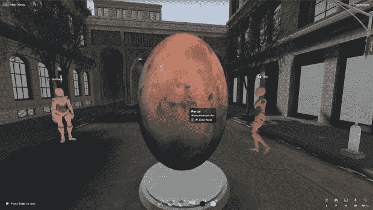

# 第三个房间取笑用户为元宇宙生成的内容

> 原文：<https://thenewstack.io/third-room-teases-user-generated-content-for-the-metaverse/>

"这让我想起了网景公司第一次将 JavaScript 加入网络时的感觉."Matthew Hodgson 如是说，他是 Matrix network 的创始人，现在正在建立一个名为 Third Room 的基于网络的元宇宙客户端。他认为他和他的团队已经破解了为元宇宙创建用户生成内容(UGC)的解决方案。

去年八月，我对 Matrix 做了简介，这是一个分散式聊天网络，为 Slack 和 Meta 的 WhatsApp 等商业即时通讯(IM)产品提供了另一种选择。从那时起， [Matrix](https://matrix.org/) 就一直在持续增长——它现在在 Matrix 网络上拥有 7200 万用户(总用户数，非活跃用户)和大约 100，000 台服务器。根据[霍奇森](https://www.linkedin.com/in/matthew-hodgson-22535b2/)在接受《新堆栈》采访时的说法，该网络“规模大约每年翻三倍”。

但正如我们所知，互联网上的时间过得很快，在线交流和社交的新模式不断涌现。2021 年，元宇宙只是马克·扎克伯格眼中的一个亮点，现在它是最受炒作的范式转变之一。像 Meta 创始人一样，霍奇森已经决定跳入虚拟世界——而且是用双脚。“我们的化身甚至有腿，这显然是完全革命性的，”他用他滑稽的英国口音告诉我。

第三个房间，由 [Robert Long](https://twitter.com/arobertlong) (之前是 Mozilla Hubs，以及之前的 Altspace VR)创建，承诺“建立在 Matrix 基础上的开放、分散、沉浸式世界。”正如《黑客帝国》对关注隐私和强大科技力量的互联网用户有吸引力一样，《第三房间》要求我们“想象一个没有 Meta 和脸书的元宇宙，在那里你的数据不会被挖掘出来，也不会卖给出价最高的人。”像黑客帝国一样，第三个房间有“端到端加密”只是为了证明所有形式的商业化都是禁止的，加密货币和 NFT 不是第三空间愿景的一部分。

## 与槌球相比的第三间房

霍奇森解释说，第三个房间“完全在 web 浏览器上的 WebGL 中运行，使用我们基于 Three.js 编写的名为 Manifold 的新游戏引擎，它提供了非常好的性能。”该产品还使用了 [bitECS](https://github.com/NateTheGreatt/bitECS#readme) 实体组件系统和[剑杆物理引擎](https://rapier.rs/)，并通过其 [Hydrogen SDK](https://github.com/vector-im/hydrogen-web) 连接到 Matrix 以提供 Matrix 聊天和 VoIP 功能。



第三间房；图片通过其网站

当霍奇森向我演示第三个房间时，它让我想起了我在 5 月份看到的槌球演示——另一个基于网络的虚拟世界。这两种产品有明显的共同点；两者都是基于 WebGL、Three.js 和 Rapier 构建的。霍奇森还表示，大卫·a·史密斯(David A. Smith)和艾伦·凯(Alan Kay)在 20 世纪 90 年代和 21 世纪初对槌球的最初构想是《第三房间》的灵感来源。

“从概念上讲，这个[第三个房间]非常类似于 Alan Kay 和他的同事在过去提出的最初的 Croquet 愿景，即通过网络分发的 Smalltalk 对象，基本上你有无限的画布来构建更丰富的体验。老实说，这样做给了我很大的启发。”

第三个房间即将推出的新功能是一个世界编辑器，它将使开发人员能够直接操纵第三个房间内部的虚拟对象。换句话说，不需要单独的创作环境。尽管这个项目仍处于早期阶段；与此同时，第三空间正在使用 Unity 创作世界，并发布了[一个出口商](https://github.com/matrix-org/thirdroom-unity-exporter)来支持这一点。

Croquet 的方法是有一个单独的 IDE，叫做[微浏览器 IDE](https://www.croquet.io/microverse-ide)——尽管它也有一个“内置文本编辑器”

## 元宇宙大学教育资助委员会

元宇宙的一个未知数是普通人将如何在其中创建内容——也就是用户生成内容(UGC)。在今天的网络中，人们使用博客和脸书、YouTube 和抖音等社交媒体应用来创建内容。今年有很多传言说，生成式人工智能软件将使人们能够轻松地创建在元宇宙使用的 3D 内容。这很有可能发生，但与此同时，矩阵团队正在为第三个房间制定自己的解决方案。

霍奇森希望第三个房间中的世界编辑控件用于创建 UGC。他的同事罗伯特·朗负责这个项目。

“我们目前正在努力工作，”他说，“使用 Wasm 沙箱作为 UGC 的底层执行环境，QuickJS 作为一个 UGC 脚本环境(或者 Rust、Zig、C 或其他任何可以编译成 Wasm 的环境)。沙盒至少会暴露一个 scenegraph API，让 UGC 直接操纵组成世界的 glTF。”

霍奇森说，第三空间将发布 scenegraph API 作为开放标准，“暂定名为 WebSceneGraph 或 WebSG。”他补充说，它不会具体到第三个房间或多方面的游戏引擎。

当我写这篇文章时，霍奇森给我回了邮件，兴奋地告诉我，“我们让[Wasm]引擎工作起来，第三个房间的第一个 UGC 开始运行。”你可以看到下面的动画短片。

[https://www.youtube.com/embed/I_BDalgvhYA?feature=oembed](https://www.youtube.com/embed/I_BDalgvhYA?feature=oembed)

视频

他还附上了一段代码，以及进一步的解释:

```
const code  =  `
  ${glMatrixText}

  const node  =  new WebSG.Node();

  node.position[1]  =  1.6;

  onUpdate  =  (dt)  =>  {
    glMatrix.quat.rotateY(node.quaternion,  node.quaternion,  dt *  0.5);
  };
`;

await loadJSScript(ctx,  code);

```

“它将 JavaScript 的一个小片段定义为一个字符串，它从 WebSG glTF 场景中抓取一个节点，定位它，并旋转它，”他解释道。“然后，我们将该脚本作为 JS 加载到 UGC 引擎中，嘿，很快:世界就被编写好了。”

他补充说，“这是我们第一次拥有客户端可以自己执行的任意沙盒脚本化功能。这让我想起了网景第一次在 Web 上添加 JavaScript 时的感觉。下一步显然是使用相同的原语实现一个简单的 in-world IDE，然后每个人都可以疯狂地构建 UGC。”

## 网络在元宇宙的地位

我的一个嗜好是确保当谈到元宇宙时，网络总是[的一部分](https://thenewstack.io/metaverse-standards-forum/)，因为一些主要供应商(如 Meta 和 Epic Games) [很少提到网络技术](https://thenewstack.io/meta-metaverse-developers/)。

不出所料，霍奇森看好互联网。他认为 Meta 和 Epic Games 等公司的目标是“纯粹的供应商锁定”

“他们希望人们被锁定在一个二进制应用程序中，这是他们有围墙的花园，”他说。“此外，他们似乎莫名其妙地痴迷于虚拟现实，而实际上硬件仍然不存在。而在网络浏览器窗口中的体验是很棒的。如果你看看今天存在的成功的 metaverses，无论是 Roblox 还是《我的世界》，VR 在很大程度上是一种怪异的可选实验性的东西；我只是不明白 Meta 为什么要把农场押在这上面，”

如果元宇宙将成为互联网上的下一个大平台，那么霍奇森希望在其上有分散的、开源版本的通信软件——就像 Matrix 对于当前的网络一样。

“我们建立 Matrix 的原因是为了对抗即时消息和 VoIP 的围墙花园，并为网络提供开放的通信。我们看到整个事情可能在我们眼前再次发生(元宇宙)，只是我们实际上从一开始就在这场游戏中。事实上，这一次我们可以说是领先于一些把关者。”

<svg xmlns:xlink="http://www.w3.org/1999/xlink" viewBox="0 0 68 31" version="1.1"><title>Group</title> <desc>Created with Sketch.</desc></svg>