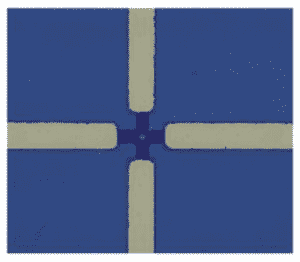
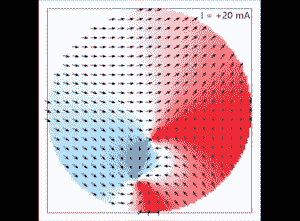
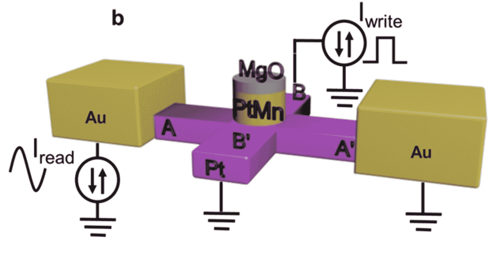

# 这种反铁磁装置可以解决计算机的“内存瓶颈”问题

> 原文：<https://thenewstack.io/this-anti-ferromagnetic-device-may-solve-computers-memory-bottleneck-problem/>

随着大型数据集变得越来越大，复杂人工智能应用程序的计算需求也在增长，对更快、更强大、更节能的存储和处理所有这些数据的方法的需求也在增长。针对这一问题，来自意大利西北大学和 T2 墨西拿大学的电气工程师开发了一种新的小型但功能强大的存储设备，这种设备使用创新的反铁磁(AFM)材料，运行所需的电能创下历史新低。

虽然这不是专家们第一次用反铁磁材料进行实验，但这项工作是第一次开发出如此紧凑的设备，而且是第一次采用与传统半导体制造技术兼容的材料。

## 对“普遍记忆”的探索

“处理这些大型数据集——例如在人工智能中——需要大量的内存来存储数据——例如在 GPU[图形处理单元]芯片中，”西北大学电气和计算机工程副教授 [Pedram Khalili](https://www.mccormick.northwestern.edu/research-faculty/directory/profiles/khalili-pedram.html) 解释道，他领导了[研究](https://www.nature.com/articles/s41928-020-0367-2)。

“重要的是，我们需要将这些数据放在更靠近芯片逻辑核心的地方，以获得更快、更节能的内存访问，以及更快的整体应用。因此，需要高密度的嵌入式高速缓存(片上)存储器。现在的缓存技术是[静态随机存取存储器](https://computer.howstuffworks.com/question452.htm) (SRAM)，从面积上来说效率非常低。”

> 与传统类型的存储器不同，在反铁磁存储器件中不需要电流来保持存储的数据

除了 SRAM——只要有电就能保留数据——其他现有的存储技术包括成本较低但耗能较高的动态随机存取存储器(DRAM ),这种存储器常用于个人电脑。虽然 DRAM 可以存储比 SRAM 更多的数据，并允许更高的[位密度](https://www.yourdictionary.com/bit-density)，但其电容器也必须定期刷新。这些缺点是人们正在探索反铁磁材料等替代存储技术的部分原因，因为它们的特殊属性可能意味着创造一种“[通用存储器](https://www.sciencedaily.com/releases/2016/01/160114162547.htm)，它结合了 SRAM 的速度、DRAM 的可负担性和位密度以及[闪存](https://www.techopedia.com/definition/24481/flash-memory)的非易失性，所有这些都可以轻松地封装在一个密集区域中，从而轻松应对与处理大量数据相关的计算挑战。

具有 4 微米柱直径的器件结构的光学图像。

Khalili 说:“[磁阻随机存取存储器](https://en.wikipedia.org/wiki/Magnetoresistive_random-access_memory) (MRAM)引起了半导体行业的极大兴趣，因为它可以解决这一‘存储瓶颈’，因为 MRAM 单元只有一个晶体管，从而提高了位密度。”。

特别是，反铁磁材料很有吸引力，因为它们的电子在原子层面上可以像磁铁一样工作，这要归功于量子力学中称为“自旋”的属性。但是，因为反铁磁材料中的这些电子自旋在亚原子水平上以交替、反平行的模式排列，所以在宏观水平上的结果是总的净磁化为零。与传统类型的存储器不同，在反铁磁存储设备中不需要电流来保留存储的数据，因为这是通过交替的磁性有序自旋来完成的。此外，磁场不会影响 AFM 存储设备，这意味着它们比铁磁存储设备更安全(想想信用卡如何通过将强磁体放在磁条上来擦除数据)。

专家们之前已经对反铁磁材料进行了实验，但之前的研究揭示了可靠地控制底层磁序的难度。为了解决这个问题，该团队首次利用 800 纳米高的铂和锰柱，同时利用电流在磁状态之间切换。

“我们的工作表明，电流可以用来可逆地切换在重金属底层(由钽或铂组成)上形成的反铁磁存储位，重要的是，这是第一次在与现有半导体制造技术兼容的材料(铂-锰)中实现，”哈利利说。此外，该工作实现了迄今为止报道的操纵反铁磁有序的最低电流密度。最后，我们还展示了该设备除了双稳态元件之外，还可以作为模拟([忆阻](https://en.wikipedia.org/wiki/Memristor))元件运行，这意味着它可以在[神经形态计算](https://thenewstack.io/scientists-create-artificial-synapses-brain-like-computing/)中找到应用

该团队的设备表现出模拟记忆行为的事实——类似于 how 是一个意外的发现，他们认为这一特性可能在人工神经网络中用于存储突触权重。该团队目前正致力于为他们的反铁磁存储设备开发一种更好、更有效的“读出”方法，此外还将进一步缩小其规模。

包括读/写信号源的设备草图

在 [*自然电子*](https://www.nature.com/articles/s41928-020-0367-2) 看完论文。

图片:Michael Dziedzic via Unsplash 西北大学和墨西拿大学

<svg xmlns:xlink="http://www.w3.org/1999/xlink" viewBox="0 0 68 31" version="1.1"><title>Group</title> <desc>Created with Sketch.</desc></svg>