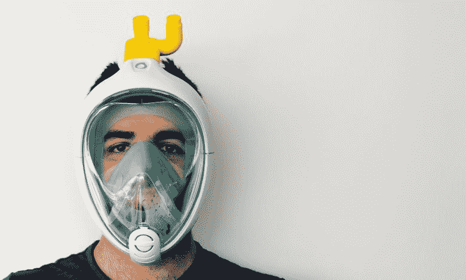
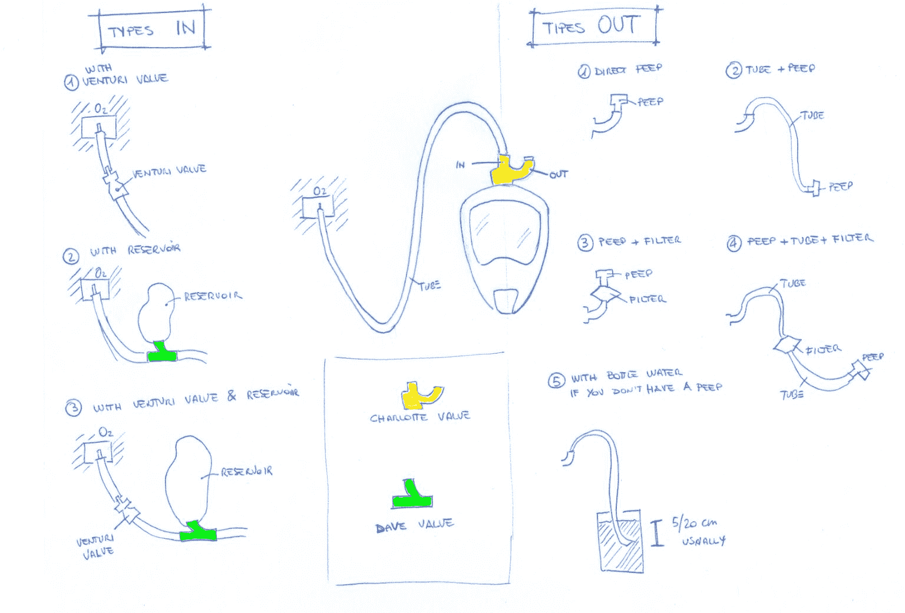

# 这家公司是 3D 打印新冠肺炎危机的救命装备

> 原文：<https://thenewstack.io/this-company-is-3d-printing-life-saving-gear-for-the-covid-19-crisis/>

随着新冠肺炎危机的加剧，越来越多的人患重病，我们在世界各地听到越来越多令人担忧的消息，即医院正在耗尽医疗用品和呼吸机等救生设备。在大范围封锁和其他旨在遏制疫情蔓延的严厉措施造成的混乱中，全球供应链现在正努力跟上步伐，这也于事无补。结果，我们不仅看到了对[高需求消费品的恐慌性购买和哄抬价格，还看到了医疗专业人员和他们的重病患者所需的必需品的短缺。](https://www.kinaxis.com/en/blog/preparing-covid-19-and-bullwhip-effect-what-happens-supply-chain-when-you-buy-100-rolls-toilet)

面对这些可怕的现实，一些公司贡献他们的专业知识来帮助解决这些日益增长的短缺。在意大利，不堪重负的医院正在耗尽关键部件，意大利初创公司 [Isinnova](https://www.isinnova.it/) 通过 3D 打印替代呼吸器阀门来应对挑战，这种阀门用于所谓的“[文丘里](https://en.wikipedia.org/wiki/Venturi_mask)”(或空气夹带)面罩。这些阀门至关重要，因为它们调节与室内空气混合的氧气量，新冠肺炎患者可以在机器的帮助下吸入这些氧气。如果没有这样的组件，表现出极度呼吸窘迫并且需要机械帮助呼吸的新冠肺炎患者很可能会死亡。

在布雷西亚的一家当地医院公开呼吁帮助后，Isinnova 能够在仅 24 小时的时间内制造 100 个瓣膜。他们通常的供应商告诉他们，他们无法及时生产足够的一次性阀门——只能使用 8 小时——用于医院重症监护病房的 250 名患者。

“有人有生命危险，我们采取了行动。期，”Isinnova 创始人克里斯蒂安·弗拉卡西[告诉](https://www.healthcareitnews.com/news/europe/volunteers-use-3d-printing-support-italian-covid-19-effort) *医疗保健 IT 新闻*。“如果我们行动迅速，那只是因为有了 3D 打印，你可以快速尝试小规模生产，而这在工业规模上是不可能的。”

## 用开源设计制作面具

为了制造瓣膜，Isinnova 团队使用了一种细丝挤压系统，将一种坚硬的塑料材料熔化，一层一层地放下设计。Isinnova 必须对设计进行逆向工程，以创建三个不同的原型，因为他们无法从专利持有者那里获得原始文件。Isinnova 版本的阀门制造成本仅为 1 美元；然而，该团队现在可能面临专利持有者 Intersurgical 的法律诉讼，inter surgical 是价值 11，000 美元的 CPAP 头罩系统的制造商，该系统包括作为其设计一部分的瓣膜。

尽管如此，Isinnova 团队仍然毫不畏惧。除了快速原型化和制造瓣膜，并在布雷西亚医院安装 3D 打印机，以便医务人员可以按需打印它们，该公司现在还通过使用 3D 打印来帮助另一家医院改造浮潜面罩，以解决 [CPAP 面罩](https://www.mayoclinic.org/diseases-conditions/sleep-apnea/multimedia/cpap-masks/sls-20076986)(持续气道正压通气)的短缺，这种面罩也用于需要帮助呼吸的患者。

在这种情况下，拥有 [Easybreath](https://www.decathlon.com/products/surface-snorkeling-mask-easybreath?) 浮潜面罩设计的迪卡侬公司选择与 Isinnova 合作，向他们提供原始的计算机文件，然后通过 3D 打印组件将全脸塑料面罩连接到呼吸机，对这些文件进行修改以适应这一增强的功能。这种开源设计被称为“夏洛特”，现在可以免费下载，这样那些拥有 3D 打印机的人就可以根据需要生产这些救生组件。

[https://www.youtube.com/embed/w4Csqdxkrfw?feature=oembed](https://www.youtube.com/embed/w4Csqdxkrfw?feature=oembed)

视频

随着全球医疗设备短缺的加剧，许多医院现在转向众包、3D 打印和其他替代方法来满足飙升的需求。随着数十名医护人员在全球范围内动员起来应对疫情冠状病毒的真实威胁，他们和他们的患者的安全意味着我们可能不得不重新考虑监管规定和当地安全审批程序的速度(例如，夏洛特口罩尚未被认证为生物医学设备，但随着意大利的情况变得更加绝望，已经在医院进行测试)。最终，我们需要思考如何重新设计全球供应链和产业目前的结构，以使它们在像我们现在面临的这种前所未有的紧急情况下更具适应性和灵活性。

在[is inova](https://www.isinnova.it/)阅读更多信息。

图片:Isinnova

<svg xmlns:xlink="http://www.w3.org/1999/xlink" viewBox="0 0 68 31" version="1.1"><title>Group</title> <desc>Created with Sketch.</desc></svg>