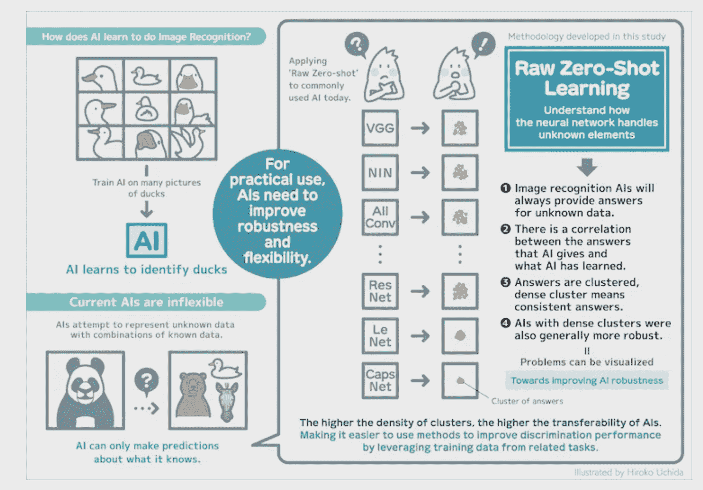

# 这个工具保护人工智能模型免受恶意攻击

> 原文：<https://thenewstack.io/this-tool-defends-ai-models-against-adversarial-attacks/>

随着人工智能模型变得越来越[强大](https://thenewstack.io/openais-gpt-3-makes-big-leap-forward-for-natural-language-processing/)，机器学习的潜在应用数量在过去几年中有了巨大的增长。机器学习已经被用于日常生活的许多领域，无论是在[推荐算法](https://thenewstack.io/40-something-dude-asks-for-music-recommendation-redditors-point-to-the-algorithms/)、[无人驾驶汽车](https://thenewstack.io/deep-learning-algorithm-helps-driverless-cars-recognize-pedestrians-better/)，还是在[研究](https://thenewstack.io/ai-makes-new-scientific-discoveries-by-analyzing-old-research-papers/)或[金融](https://thenewstack.io/the-promising-duo-five-use-cases-for-natural-language-processing-in-fintech/)等领域以新颖的方式使用。更有希望的是，机器学习模型可能会在某一天彻底改变医疗保健，甚至可能帮助我们应对难以想象的复杂问题，如缓解气候变化。

但是，尽管机器学习模型有巨大的潜力，但它们并不是万无一失的，可能会出错——有时会带来灾难性的后果。当图像识别算法越来越多地用于评估人们的生物特征数据时，这些意想不到的影响就更加令人担忧。然而，与此同时，人们也越来越清楚，当图像被修改时，这些相同的机器学习模型[很容易被欺骗](https://thenewstack.io/camouflaged-graffiti-road-signs-can-fool-machine-learning-models/)。不幸的是，人工智能的“[黑盒](https://thenewstack.io/explainable-ai-looking-into-the-black-box/)”性质使得很难确定为什么模型会做出决策——或犯错误——从而凸显了让模型更强大的重要性。

来自日本九州大学的一组研究人员正在这样做，他们开发了一种新的方法来评估神经网络在图像识别任务中如何处理不熟悉的元素。这项被称为 Raw Zero-Shot 的技术可以成为一种工具，帮助研究人员查明导致人工智能模型犯这些错误的潜在特征，并最终找出如何创建更具弹性的人工智能模型。

“图像识别神经网络有一系列现实世界的应用，包括无人驾驶汽车和医疗保健中的诊断工具，”[研究的](https://journals.plos.org/plosone/article?id=10.1371/journal.pone.0266060)首席作者 Danilo Vasconcellos Vargas 在[的一份声明](https://www.kyushu-u.ac.jp/en/researches/view/234/)中解释道。“然而，无论人工智能训练得多么好，它都可能因为图像的微小变化而失败。”

通常，用于图像识别的 AI 模型最初是在大量图像上训练的。虽然这些[较大的型号](https://www.infoq.com/news/2021/06/google-vision-transformer/)由于它们的尺寸可能相当强大，但最近的工作表明[改变输入图像](https://thenewstack.io/google-develops-adversarial-example-images-that-fool-both-humans-and-computers/)——即使只有一个像素——也可能使系统失控。这些故意改变的图像被称为敌对图像，可以用作对人工智能系统的协同攻击的一部分。

“敌对样本是受噪声干扰的样本，可能会使神经网络无法完成图像分类等任务，”该团队解释道。“自从它们在几年前被发现以来，对抗性样品的质量和种类都有所提高。这些对抗性样本可以由一类被称为[对抗性攻击](https://thenewstack.io/brute-ratel-c4-when-pentests-go-bad/)的特定算法生成。”

为了调查这些失败背后的根本原因，该团队专注于 12 个最常见的图像识别系统，测试它们，看它们在面对不属于初始训练数据集的样本图像时会如何反应。该团队假设，在他们随后的预测中会有相关性——也就是说，人工智能模型会出错，但它们会以同样的方式出错。

该团队的测试结果最终表明，当面对这些改变的图像时，这些人工智能模型事实上以同样的方式一直是错误的。该团队假设，一些人工神经网络的线性结构是它们以类似方式失败的主要因素之一，此外还有其他工作表明，这些模型正在学习更容易学习的“错误结构”，而不是预期的结构。

“如果我们理解了人工智能在处理未知图像时正在做什么和它学到了什么，我们就可以用同样的理解来分析为什么人工智能在面对单像素变化或轻微修改的图像时会崩溃，”Vargas 解释道。“利用我们获得的知识，试图通过将它应用于一个不同但相关的问题来解决一个问题，这被称为可转移性。”

在他们的工作过程中，研究人员发现，在所有测试的神经网络中，一个名为[胶囊网络(CapsNet)](https://thenewstack.io/deep-learning-capsule-neural-network-uses-analog-tech-to-predict-extreme-weather/) 的人工智能模型提供了最大的可转移性，而另一个名为 LeNet 的模型位居第二。

最后，该团队表示，人工智能开发不应该只关注准确性，还应该增加模型的鲁棒性和灵活性。据该团队称，Raw Zero-Shot 等工具可以帮助专家查明为什么他们的模型中可能会出现问题，以便未来的系统可以被设计为不太容易受到敌对攻击。

“这些对抗性攻击中的大多数也可以转化为现实世界的攻击，”该小组指出，“这给当前的神经网络应用带来了一个大问题和安全风险。尽管对这些对抗性攻击存在许多防御变体，但没有已知的学习算法或程序能够一致地防御[这些攻击]。这表明，需要对对抗性算法有更深刻的理解，以制定一致和稳健的防御。"

<svg xmlns:xlink="http://www.w3.org/1999/xlink" viewBox="0 0 68 31" version="1.1"><title>Group</title> <desc>Created with Sketch.</desc></svg>