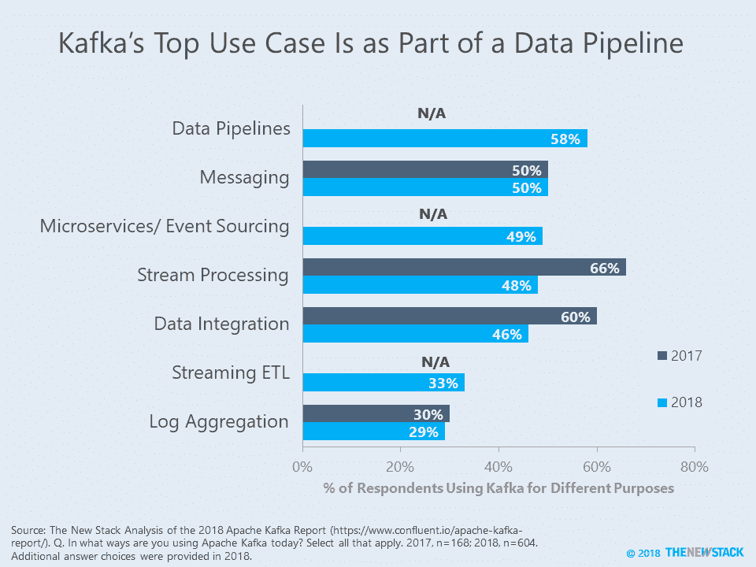
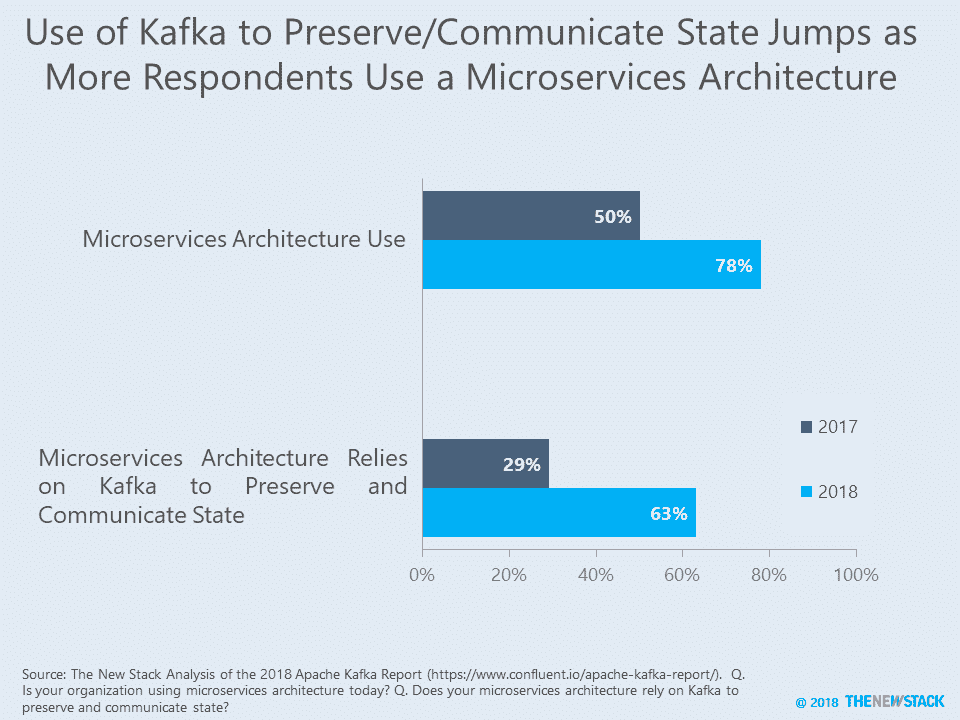
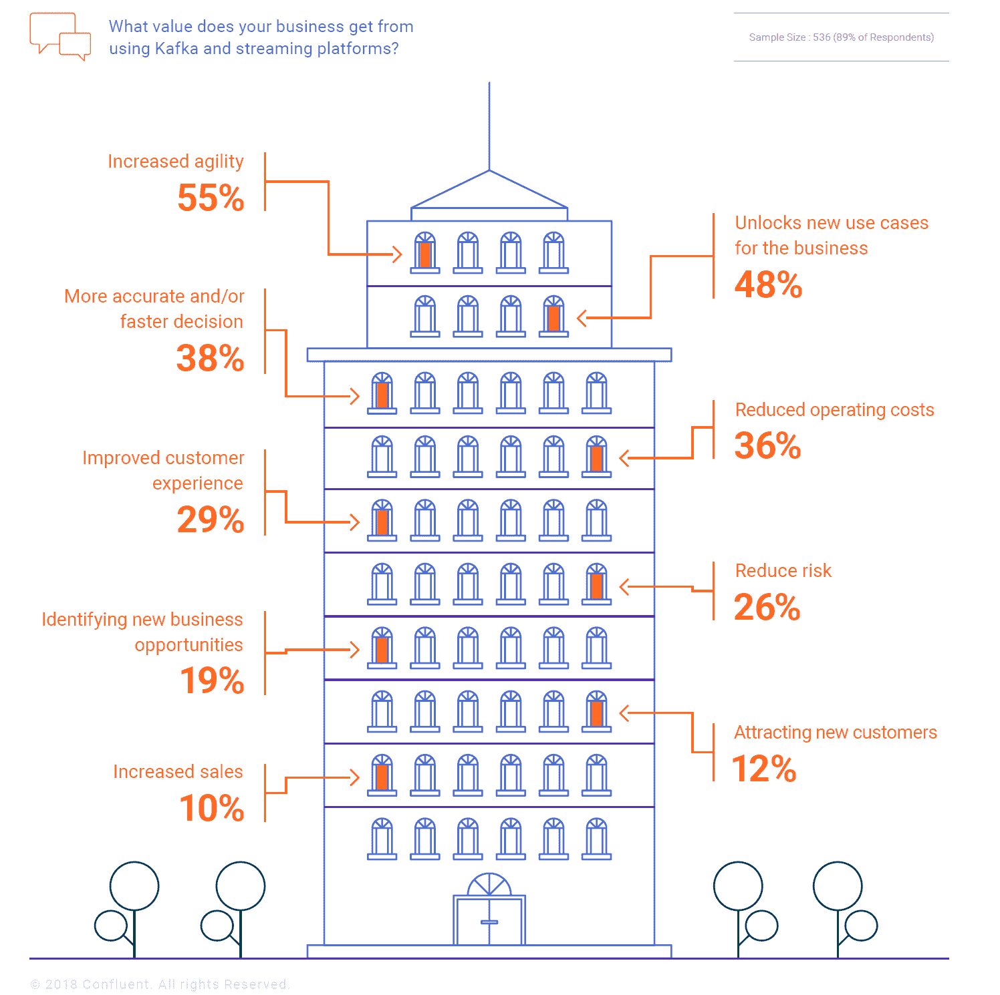

# 本周数字:阿帕奇·卡夫卡的蜕变

> 原文：<https://thenewstack.io/this-week-in-numbers-apache-kafkas-metamorphosis/>

Apache Kafka 分布式流媒体平台没有发生变化，但其典型用例发生了变化。阿帕奇商业发行商 [Confluent](https://www.confluent.io/) 发布了其第三份年度[阿帕奇卡夫卡报告](https://www.confluent.io/apache-kafka-report/)，该报告调查了 600 多名该技术的用户，与去年的样本相比增长了 71%。看似日益扩大的用户群体对 Kafka 的商业价值有了更好的理解。对该技术更细致的定义以及微服务的日益普及，导致了对卡夫卡与术语“流处理”的关联的不同看法。

数据管道和消息传递现在是 Kafka 的两大用途，其次是微服务/事件处理和流处理。几个答案选项的增加部分解释了 Kafka 在流处理(2017 年的 66%到 2018 年的 48%)和数据集成(60%到 46%)方面的使用大幅下降。下面的图表显示，人们区分了 Kafka 功能在事件处理和流 ETL 中的使用，导致广泛的流处理类别得到的响应较少。

对这些变化的另一种解释是，Kafka 不再被视为与 Apache Spark 和 Storm 竞争的流处理后端，也不再被视为与 Hadoop 连接的后端。因此，Spark 可用于实时分析，而 Kafka 是实时数据的来源。

当人们被问及具体使用的 Kafka 流媒体功能而不是广泛的类别时，数据变得更加有趣。那些使用 Kafka 流处理能力和异步应用程序的人从 2017 年的 25%(当时的术语是“Kafka Streams API”)跃升至 2018 年的 44%。它对后端分析的使用也从 22%上升到 30%。随着微服务架构的采用越来越多，Kafka 的事件驱动方面也越来越受关注，而不是实时功能。

至少在 Kafka 世界，微服务架构的采用率已经从 2017 年的 50%上升到 2018 年的 78%。虽然微服务的实际使用在过去一年中可能没有太大的增长，但数据表明 Kafka 正在成为现有微服务架构不可或缺的一部分。只看那些拥有微服务架构的人，Kafka 被用于保存和交流状态的可能性是两倍——2017 年，29%的人这样做，2018 年，这一数字跃升至 63%。

通过 Kafka 与事件通信，微服务创建一个共享日志，保存它们共享的状态。随着 Kafka 成为微服务的支柱，Confluent 认为组织获得了更多的组织灵活性。

如果是这样的话，那么 Kafka 正在解决其用户所认为的该技术的最高商业价值。当被问及 Kafka 等流媒体平台的商业价值时，55%的人说灵活性提高了，另有 48%的人说它开启了新的用例。由于 2018 年的问题增加了“敏捷性”和“新用例”选项，2017 年“更准确和/或更快的决策”和“降低运营成本”的排名分别下降了 11 和 9 分。更新的选择表明，企业关心的是在基础架构中快速、敏捷地做出改变的能力，而不是基于分析做出快速、实时的决策。

最后，尽管 Kafka 允许新的用例，但这并不意味着它只是对现有技术的补充。事实上，62%的人认为这将取代一项技术，而消息和发布/订阅是最有可能受到影响的领域。

通过像素的特色图像。

<svg xmlns:xlink="http://www.w3.org/1999/xlink" viewBox="0 0 68 31" version="1.1"><title>Group</title> <desc>Created with Sketch.</desc></svg>