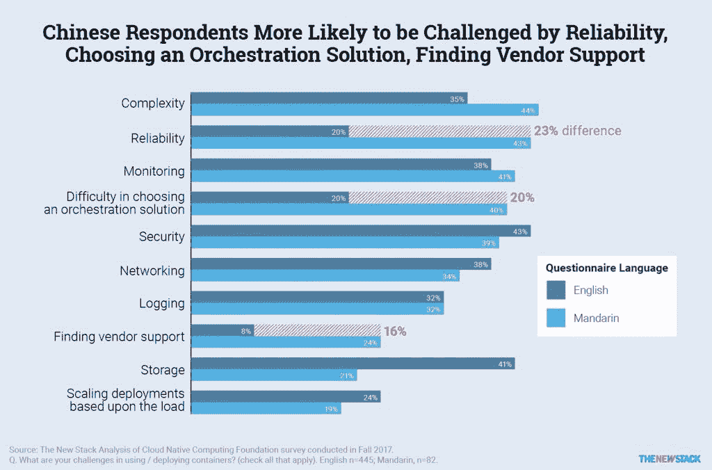

# 本周数字:中国采用 Kubernetes

> 原文：<https://thenewstack.io/this-week-in-numbers-chinese-adoption-of-kubernetes/>

根据我们从中文翻译版本的[云本地计算基金会](https://www.cncf.io/)调查中读取的数据，中国开发者在容器和 Kubernetes 的生产部署方面总体上进展不太顺利。

例如，44%的普通话受访者使用 Kubernetes 管理集装箱，而在英语样本中，这一数字跃升至 77%。与英国受访者相比，他们也更有可能将容器部署到阿里云和 OpenStack 云提供商。普通话受访者认为可靠性是一个挑战的可能性也是两倍。这些发现的完整记录可以在帖子“[中国与世界:库伯内特和集装箱透视](https://thenewstack.io/china-vs-the-world-a-kubernetes-and-container-perspective/)”中找到

值得注意的是，46%讲普通话的受访者在选择流程编排解决方案时面临挑战，这一比例比调查中的其他人高出 20 个百分点。很可能这些受访者要么是在 Kubernetes 采用的早期，要么仍然在质疑他们使用 Kubernetes 的决定，因为他们中很少有人在容器采用和成熟度方面走得这么远。此外，普通话受访者将可靠性视为挑战的可能性是其他人的两倍。

尽管中国受访者在集装箱之旅中走得不太远，但他们可能会从西方同行已经经历的反复试验中受益。这是值得进一步调查，以确定他们是否面临具体的可靠性问题，或者是否可能有一个不同的文化观念围绕这个主题。

云本地计算基金会是新堆栈的赞助商。

通过 Pixabay 的特征图像。

<svg xmlns:xlink="http://www.w3.org/1999/xlink" viewBox="0 0 68 31" version="1.1"><title>Group</title> <desc>Created with Sketch.</desc></svg>