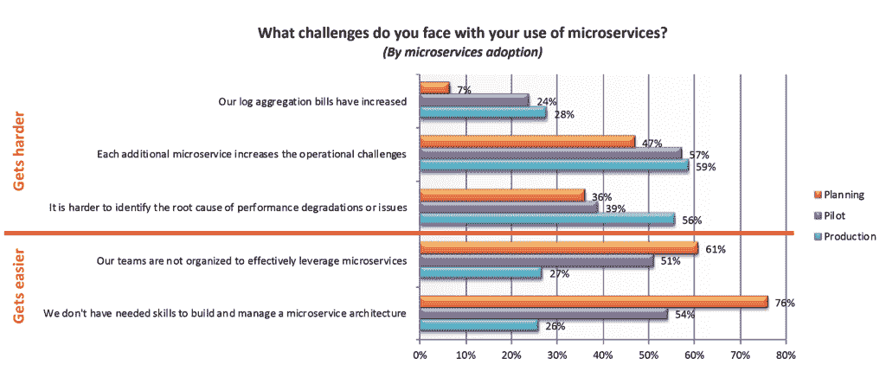

# 本周数字:由微服务引起的数据和故障排除问题

> 原文：<https://thenewstack.io/this-week-in-numbers-data-and-troubleshooting-problems-caused-by-microservices/>

根据应用性能管理(APM)供应商 [Lightstep](https://lightstep.com/) 最近发起的一项由 Dimensional Research 进行的调查，在其路线图中包含微服务的开发人员正在推动采用，但他们面临着与监控相关的几项挑战。

[的研究](https://lightstep.com/blog/microservices-trends-report-2018/)基于 322 份来自人们的回复:1)使用或计划使用微服务，2)负责软件开发和架构，以及 3)在超过 500 名员工的公司工作。样本在生产中使用微服务、运行试点或仅计划使用微服务的用户中几乎平均分配。

受访者似乎最近对微服务变得狂热起来。事实上，如果我们包括那些正在测试微服务但尚未部署的公司，36%的样本在去年才开始使用微服务。此外，当被问及微服务架构何时将成为他们开发团队的默认架构时，16%的人说已经是了，另外 19%的人说将在今年年底成为。对此有所保留，但只有 2%的微服务永远不会成为默认服务。最后，在生产中使用微服务的人感到满意，63%的人说微服务已经取得了成功。

> 在已经在生产中使用微服务的企业中，59%的企业表示每个微服务都会增加运营挑战，如数据管理。

尽管前景乐观，但人们对微服务的副作用有很大的担忧。在已经在生产中使用微服务的企业中，59%的企业表示每个微服务都会增加运营挑战，如数据管理。在生产中使用微服务的企业中，58%的企业表示生成的应用数据大幅增加。

56%的受访者表示，微服务在生产中面临的第二大挑战是确定性能问题的根本原因。此外，当被要求比较不同环境的故障排除难度时，73%的人认为微服务更难，而只有 21%的人认为微服务比整体服务更容易。

这项研究得出的结论是，微服务解决了某些问题，但也产生了新的问题，尤其是对于那些更多地处于 DevOps 钟摆的 Ops 侧的人。

<svg xmlns:xlink="http://www.w3.org/1999/xlink" viewBox="0 0 68 31" version="1.1"><title>Group</title> <desc>Created with Sketch.</desc></svg>