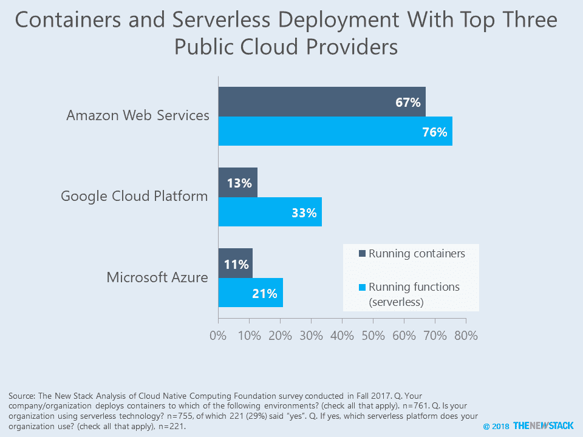

# 本周数字:AWS Lambda 赢了无服务器吗？

> 原文：<https://thenewstack.io/this-week-in-numbers-did-aws-lambda-win-serverless/>

上周，我们看到一个标题宣称亚马逊网络服务赢得了无服务器服务。我们已经写了那篇文章中的所有数据，但是我们得出了一个不同的结论。为了澄清问题，我们重新运行了[云本地计算基金会](https://www.cncf.io/)的调查数据，以纳入来自对讲普通话的受众的补充调查的 187 个回复。然后，我们研究了云提供商对容器的使用与这些公司的功能即服务(FaaS)产品相比有何不同。

CNCF 调查的 761 名受访者中几乎每一个人都已经使用过容器，所以我们知道样本至少是相对早期的采用者。其中，三分之二的人将容器部署到 AWS 环境中。如果只看 29%使用无服务器的样本，大约四分之三的人说他们使用 AWS Lambda。这比其最接近的竞争对手谷歌云功能高出 43 个百分点。

这种类型的统计让前沿论坛的[西蒙·沃德利](https://blog.gardeviance.org/)到[发推文](https://twitter.com/swardley/status/986945732228861953)说亚马逊已经定位于拥有所有未来软件的最大份额。这太夸张了。数据证明的是，AWS 被云原生从业者广泛使用。我们预计，随着无服务器的扩展和深化，企业将继续利用多种云，AWS 通常是组合的一部分。在这种情况下，无服务器路线图看起来更接近我们在三月份写的 SlashData 报告。尽管这些数据表明了对谷歌云功能的一些不满，但总体而言，这是一个积极的迹象，表明微软和谷歌都不会因为寻求使用无服务器架构的开发者而流失大量客户。

毫无疑问，AWS 是公共云领域遥遥领先的领导者。然而，这并不意味着第二和第三的争夺不重要，也不意味着个别提供商将在特定服务类型上胜过 AWS。我们更感兴趣的不是前面提到的赛马，而是将使用 FaaS 的工作负载的百分比，以及是否将在内部提供[无服务器计算](https://stacksense.io/krishnan/platforms/serverless-on-premises-does-it-make-sense/)？

云本地计算基金会(T4)是新堆栈的赞助商。

专题图片:哥本哈根 Kubecon + CloudNativeCon 的 Simon Wardley。

<svg xmlns:xlink="http://www.w3.org/1999/xlink" viewBox="0 0 68 31" version="1.1"><title>Group</title> <desc>Created with Sketch.</desc></svg>