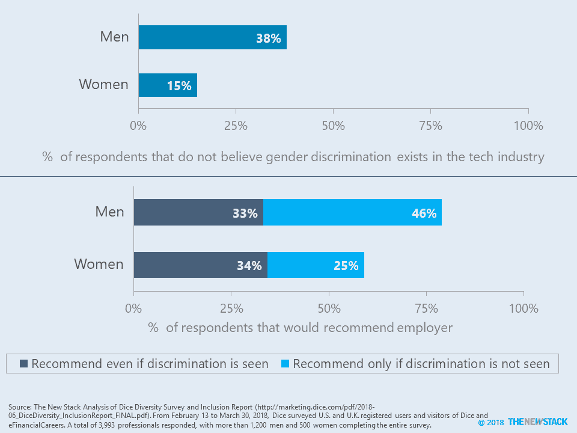

# 本周数字:科技行业的歧视

> 原文：<https://thenewstack.io/this-week-in-numbers-discrimination-in-the-tech-industry/>

不管性别如何，三分之一的人会推荐一个雇主，即使他们在那里工作时看到了歧视。这是从 [*Dice 多样性和包容性报告 2018*](http://marketing.dice.com/pdf/2018-06_DiceDiversity_InclusionReport_FINAL.pdf) 中总结出来的。基于对美国和英国科技专业人士使用 Dice 或电子金融职业的调查，该报告着眼于基于性别、年龄和政治的歧视。

该研究发现，85%的女性认为科技行业存在性别歧视，而只有 62%的男性持相同观点。换句话说，两倍的男性没有看到性别歧视。这一结果反映了许多其他研究，这些研究显示男性不太可能将性别歧视视为一个问题。这种动态也体现在种族主义方面，黑人和棕色人种更容易受到关注。这让我们不禁要问，为什么没有讨论基于种族的歧视？遗漏很惊人！

可能是因为性别歧视的个人经历，只有 59%的女性愿意推荐她们的雇主作为工作场所，而 79%的男性会这样做。深入研究这个问题，许多男人会改变主意，如果他们认为雇主允许歧视继续下去。事实上，几乎相同比例的女性和男性(分别为 33%和 44%)会推荐他们的雇主，即使他们在工作场所看到了歧视。换句话说，大约三分之一的技术社区愿意接受歧视是生活的现实。

## 技术年龄歧视

根据 Dice 的调查，与性别、政治派别或性取向相比，更多的技术专业人员经历或目睹了年龄歧视。虽然我们知道许多年轻的专业人士参与了调查，但确切的比例不得而知。如果样本中年龄较大的专业人士过多，那么年龄歧视可能不会像性别歧视那样成为一个重大问题。只是不要告诉 40 岁以上的人——这个群体中超过一半的人担心他们的年龄是他们找新工作的障碍。事实上，在 55 岁或以上的人中，88%的人担心他们的年龄会影响他们的职业生涯。

几乎十分之九的 50 岁以上的受访者担心他们的年龄会成为找新工作的障碍。

由[萨曼莎·索菲亚](https://unsplash.com/photos/r1OQfUIw3ns?utm_source=unsplash&utm_medium=referral&utm_content=creditCopyText)在 [Unsplash 上拍摄的专题图片。](https://unsplash.com/search/photos/discrimination?utm_source=unsplash&utm_medium=referral&utm_content=creditCopyText)

<svg xmlns:xlink="http://www.w3.org/1999/xlink" viewBox="0 0 68 31" version="1.1"><title>Group</title> <desc>Created with Sketch.</desc></svg>