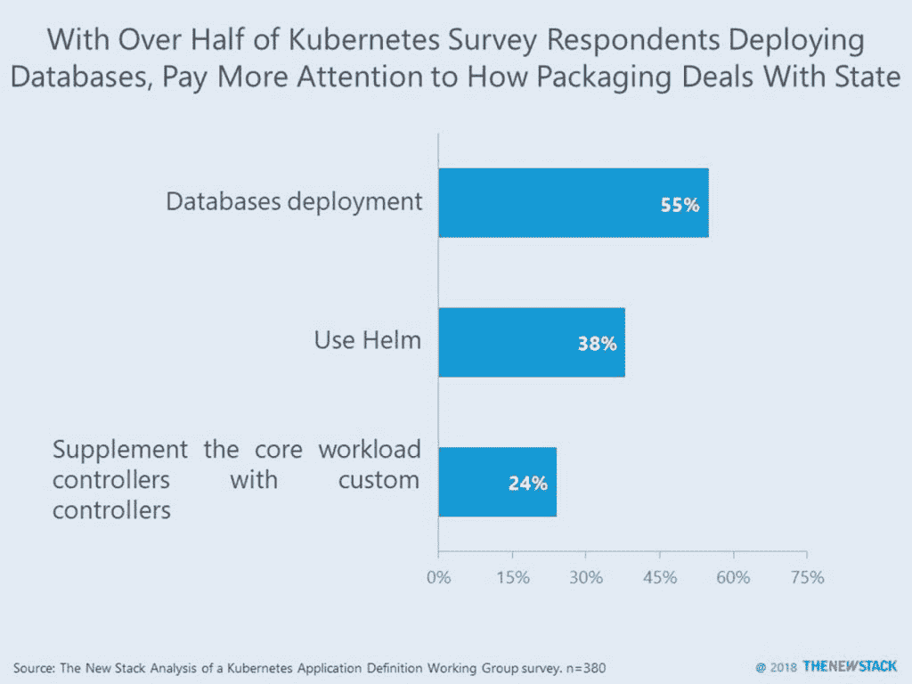

# 本周数字:随着 Kubernetes 打包的改进，更多的有状态应用程序

> 原文：<https://thenewstack.io/this-week-in-numbers-more-stateful-apps-as-kubernetes-packaging-improves/>

三年前，容器承诺了在不同环境之间移动应用程序的能力。然而，跨云的不同配置的现实，特别是对于有状态的应用程序，减缓了 Kubernetes 作为应用程序部署平台的采用。根据对 380 名 Kubernetes 用户的调查数据和 KubeCon + CloudNativeCon EU 2018 的讨论，这种情况可能不会持续太久。

由 Kubernetes 应用程序定义工作组进行的调查发现，55%的参与者正在部署数据库。这一采用水平明显高于去年新堆栈[调查](https://thenewstack.io/week-numbers-state-cloud-foundry-vs-kubernetes-workload/)生产 Kubernetes 用户时的 32%。这让我们相信，组织在 Kubernetes 上管理有状态应用程序的能力更强。

截至今天，38%的 Kubernetes 用户也在使用 Helm，另有 24%的用户在“评估”它。随着 Helm 使用的增加，人们可能会转向运营商而不是定制控制器来帮助部署 Kubernetes 相关的基础设施和有状态应用程序。

Helm 已经存在，可以帮助打包应用程序，但是它对于通常与云基础设施相关联的有状态应用程序有一些困难。这就是“运营商”发挥作用的地方。基于 CoreOS 和现在的 Red Hat 的工作， [Operator Framework](https://thenewstack.io/red-hat-releases-a-framework-to-easily-package-applications-for-kubernetes/) 建立在 Helm charts 的概念上，使打包和管理 etcd、Prometheus、Rook 和 Vault 等基础设施组件变得更加容易。

值得注意的是，根据调查，不到 12%的人使用 Red Hat OpenShift 模板管理 Kubernetes 上的应用程序。只有 9%的 OpenShift 模板用户也使用 Helm。也许现在这种情况会改变，因为红帽正在推广运营商框架的好处。

云原生计算基金会、T2、Kubecon + CloudNativeCon 和 T4 红帽是新堆栈的赞助商。

由 [Vítor Santos](https://unsplash.com/photos/GOQ32dlahDk?utm_source=unsplash&utm_medium=referral&utm_content=creditCopyText) 在 [Unsplash](https://unsplash.com/search/photos/packaging?utm_source=unsplash&utm_medium=referral&utm_content=creditCopyText) 上拍摄的特征图像。

<svg xmlns:xlink="http://www.w3.org/1999/xlink" viewBox="0 0 68 31" version="1.1"><title>Group</title> <desc>Created with Sketch.</desc></svg>