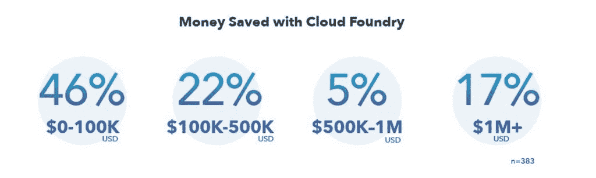
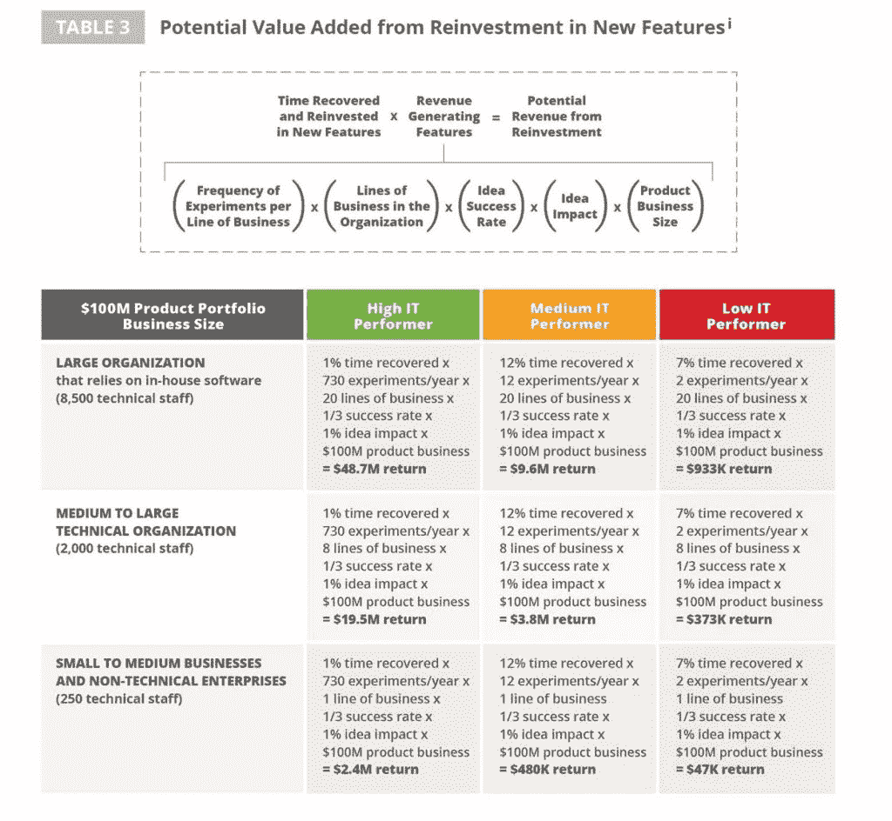

# 本周数字:用 Cloud Foundry 和其他应用平台节省时间和金钱

> 原文：<https://thenewstack.io/this-week-in-numbers-saving-time-and-money-with-cloud-foundry-and-other-application-platforms/>

用户因此节省了时间和金钱，其他应用平台的用户也是如此。无论您在考虑什么解决方案，都要确保评估与软件开发生命周期相关的 ROI、TCO 和 KPI 等一系列因素。

【2018 年 4 月 Cloud Foundry 用户调查报告称，受访者平均每个应用开发生命周期节省了 10 周。此外，54%或更多的人报告了每个应用程序生命周期。没有人报告成本增加，但这是因为他们在调查中没有选择报告。

Cloud Foundry 用户正在减少开发时间和降低成本的结论得到了许多其他研究结果的支持。这恰恰证明了应用平台都在做自己声称要做的事情。例如，在 IDC 为 Red Hat OpenShift 的商业价值*进行的 9 个案例研究中，应用程序开发生命周期在采用 OpenShift 后从 28 周下降到 10 周。*

其他类型的应用程序平台也减少了创建应用程序所需的时间。例如，OutSystems 的一项调查报告称，低代码平台的用户在不到六个月的时间内交付完整的移动应用程序的可能性增加了 20 个百分点。

虽然平台带来了巨大的好处，但通常伴随平台部署而启动的相关实践也是如此。正如我们在过去的中提到的[，采用 DevOps 流程和微服务架构与持续交付和容器部署平台密切相关。](https://thenewstack.io/week-numbers-devops-favor-microservices/) [2017 年 DevOps 状态报告](https://puppet.com/resources/whitepaper/state-of-devops-report)显示，DevOps 通过降低部署频率、变更的交付时间、MTTR 和变更失败率来帮助提高 IT 绩效。这份报告和 CA Technologies 委托进行的一项调查 T14 仅仅是两份报告，表明通过提高产品开发效率，节省的时间可以对业务产生直接影响。

*资料来源: [2017 年发展状况报告](https://puppet.com/resources/whitepaper/state-of-devops-report)。*

云铸造基金会是新堆栈的赞助商。

通过 Pixabay 的特征图像。

<svg xmlns:xlink="http://www.w3.org/1999/xlink" viewBox="0 0 68 31" version="1.1"><title>Group</title> <desc>Created with Sketch.</desc></svg>