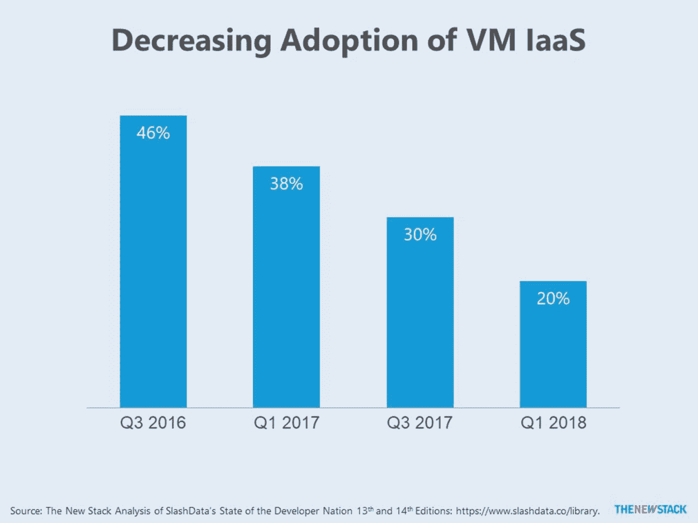
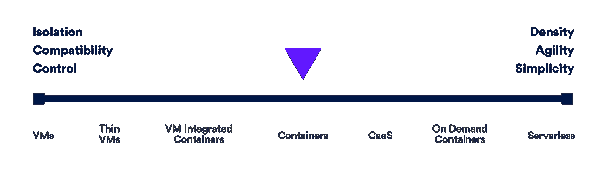
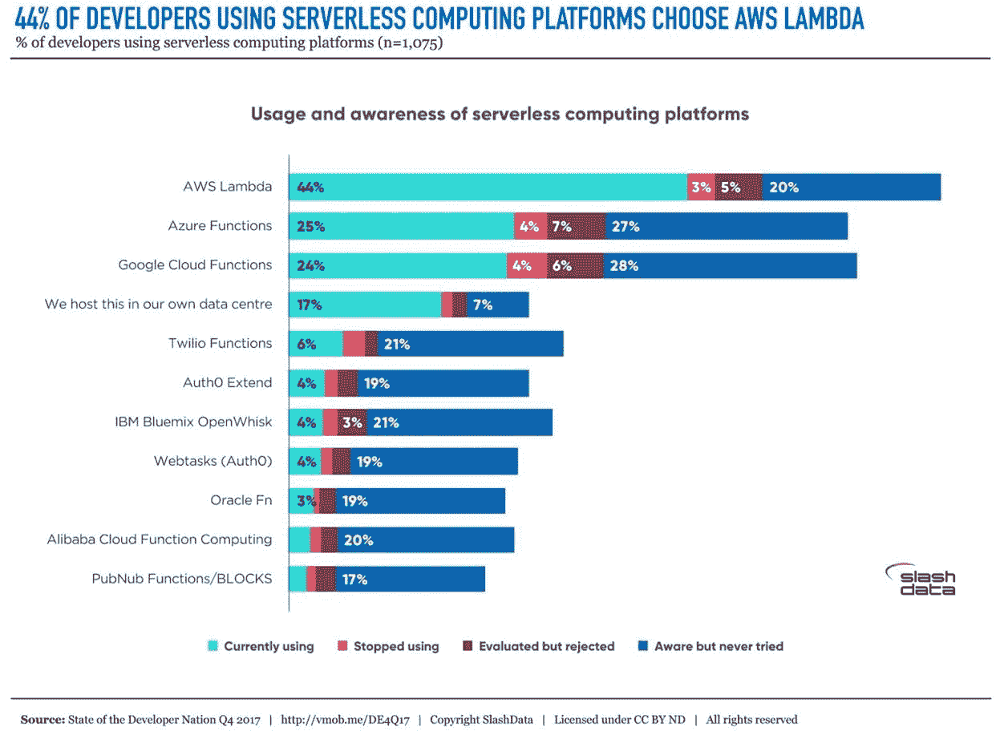

# 本周数字:无服务器现在可以与作为服务交付的虚拟机相媲美

> 原文：<https://thenewstack.io/this-week-in-numbers-serverless-now-rivals-vms-delivered-as-a-service/>

还记得云计算意味着付费启动虚拟机(VM)实例的时代吗？根据 SlashData 进行的调查，后端开发人员对虚拟机基础架构即服务(IaaS)的使用持续下降。在 2018 年第一季度，只有 20%的开发人员利用了按需虚拟机服务，低于 2016 年第三季度的 46%。同时，19%的后端开发者已经采用了无服务器计算平台。虽然这看起来很高，但与我们之前报告的无服务器调查数据相比，这实际上是一个适中的数字。

读者应该知道，我是 Slashdata 2017 年第三季度报告的合著者。本分析中仅参考公开可用的数据。

虽然虚拟机 IaaS 服务的使用率正在下降，但这并不一定意味着部署的虚拟机数量已经减少。相反，可以说开发人员的注意力正在向容器即服务(CaaS)、按需容器和无服务器倾斜，正如最近在 [Twistlock](https://www.paloaltonetworks.com/prisma/cloud) 的云连续体[native topology post](https://thenewstack.io/continuum-cloud-native-topologies/)中针对新堆栈所描述的那样。在下图中，按需容器指的是像 AWS Fargate 或 Azure 容器服务这样的服务。

需要进一步调查，以确定裸机、虚拟机或容器是否是开发人员关注的计算抽象下的直接基础架构。

## FaaS 是云提供商产品组合的一部分

随着云提供商超越虚拟机，他们越来越成为自己的平台，提供的产品组合还包括按需容器和功能即服务(FaaS)。使用无服务器平台的后端开发人员被问及他们使用或知道的特定无服务器计算平台。毫不奇怪，领导者的定位反映了更大的云市场的定位。44%使用 AWS Lambda，25%使用 Azure 功能，24%使用谷歌云功能。

Twistlock 是新堆栈的赞助商。

通过 Pixabay 的特征图像。

<svg xmlns:xlink="http://www.w3.org/1999/xlink" viewBox="0 0 68 31" version="1.1"><title>Group</title> <desc>Created with Sketch.</desc></svg>