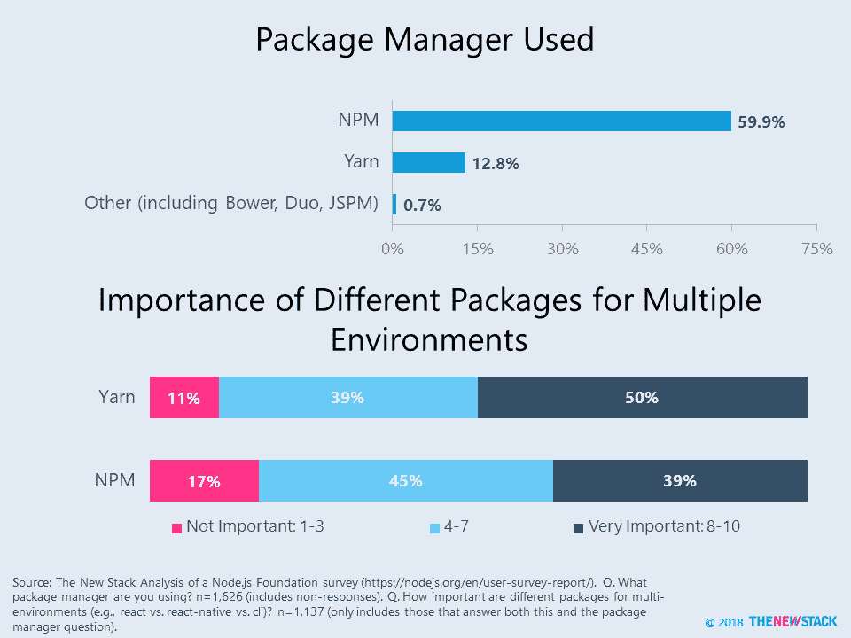
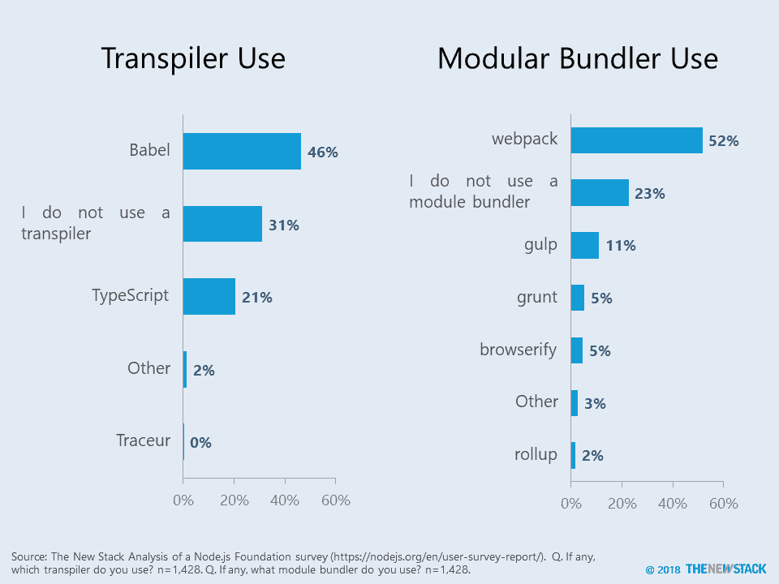

# 本周数字:用 npm 和 Yarn 管理 JavaScript 包

> 原文：<https://thenewstack.io/this-week-in-numbers-the-node-js-users-tech-stack-2/>

本周，我们分析了来自 Node.js 基金会(T1)的 T2 用户调查(T3)的更多数据。几乎四分之三(73%)的调查对象说他们使用软件包管理器。 [Npm](https://www.npmjs.com/) 被 60%的人使用，而[纱线](https://yarnpkg.com/lang/en/)被 13%的人引用。由于 Yarn 位于 npm 之上，实际上这些受访者指的是他们日常使用的界面或工具。与去年的研究相比，纱线的使用增加了 44%。

纱线是 npm 更好的替代品吗？那要由你来决定。也就是说，值得注意的是，Yarn 用户更可能关心跨多个环境管理包。当被问及在多种环境中管理不同包装的重要性时，50%的 Yarn 用户表示很重要(8 分，1-10 分)，相比之下，只有 39%的 npm 受访者表示很重要。值得注意的是，来自拉丁美洲和亚太地区的受访者更有可能表示多环境包管理很重要。

## 其他有趣的事情

我们查看了 Node.js Foundation 提供的原始数据，发现了两个关于 JavaScript 工具的问题，这些问题没有作为图表包含在报告中。下图显示了我们创建的关于 transpiler 和 modular bundler 使用情况的图表。新的堆栈将使用这些数据来支持未来的报告。

*   翻译程序将一种语言的代码转换成另一种语言。69%的受访者使用 transpiler。使用 Babel 的人数是使用 TypeScript 的两倍。
*   模块化打包器将小段代码编译成更复杂的库或应用程序。77%的受访者使用模块化捆扎机。Webpack 远远领先于任何最接近的竞争对手。

管理 Node.js 基金会的 Linux 基金会是新堆栈的赞助商。

通过 Pixabay 的特征图像。

<svg xmlns:xlink="http://www.w3.org/1999/xlink" viewBox="0 0 68 31" version="1.1"><title>Group</title> <desc>Created with Sketch.</desc></svg>